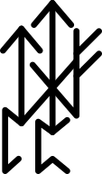

# UTLP Technical Report — Supplement S2

## Biological Governance: Immune System Architecture for Distributed Time Synchronization

*mlehaptics Project — December 2025*

**Parent Document:** [](https://doi.org/10.5281/zenodo.18078265)

**DOI:** [](https://doi.org/10.5281/zenodo.18112882)

---

## Scope

This supplement extends the UTLP Technical Report v2.0 and Prior Art Publication with a governance model derived from biological immune systems rather than political leadership structures. The key insight: silicon cannot feel shame, fear, or ambition—therefore governance models based on punishment, voting, or leadership hierarchies are category errors.

**Prerequisites:** UTLP Technical Report v2.0, Prior Art Publication (DOI: [10.5281/zenodo.18078265](https://doi.org/10.5281/zenodo.18078265))

**What this document adds:**
- Immune system governance model for UTLP swarms
- Fault isolation via statistical filtering (not prosecution)
- Endosymbiotic integration strategy for legacy time sources
- Speciation via encryption for swarm isolation
- Emergence-aware architecture design principles

---

## Nomenclature: The Time Lord Universe

The mlehaptics protocol suite adopts a coherent nomenclature inspired by temporal mechanics:

| Acronym | Expansion | Function |
|---------|-----------|----------|
| **UTLP** | Universal Time Lord Protocol | Time synchronization—*when* things happen |
| **RFIP** | Reference Frame Independent Positioning | Spatial positioning—*where* things are |
| **SMSP** | Synchronized Multi-modal Score Protocol | Coordinated actuation—*what* happens together |
| **TARDIS** | **T**emporal **A**nd **R**elative **D**istribution **I**n **S**warms | UTLP + RFIP combined: time and space |

**The Complete Picture:**

```
TARDIS = UTLP + RFIP
         (Time)  (Space)
         
"Temporal And Relative Distribution In Swarms"
```

**Supporting Concepts:**

| Term | Meaning |
|------|---------|
| **Time Lord** | A Genesis/Reference node that anchors the timeline |
| **The Loom** | State machine that weaves Time Lords from entropy |
| **Regeneration** | Fault tolerance—same role, new hardware vessel |
| **Web of Time** | The coherent beacon sequence maintained by the swarm |

A swarm implementing TARDIS knows both *when* it is and *where* it is—the two coordinates necessary for coherent distributed action.

---

## Prior Art Acknowledgment

This supplement documents novel application of established concepts:

| Concept | Prior Art | What's Novel Here |
|---------|-----------|-------------------|
| Artificial Immune Systems | Ismail et al. (2011), Cohen & Efroni (2019) | Application to time sync protocols specifically |
| Byzantine Fault Tolerance | Castro & Liskov PBFT (1999) | Connectionless variant without consensus rounds |
| Outlier rejection in WSN | RBS protocol, Kalman robustification | Integration with stratum hierarchy |
| Bio-inspired computing | ACM design patterns (2006) | Specific UTLP/RFIP/SMSP (TARDIS) instantiation |

The contribution is the specific combination and application to connectionless distributed timing.

---

# Part I: The Category Error

## 1. Political vs. Biological Governance

### 1.1 Why Human Leadership Models Fail for Silicon

Human governance evolved to manage entities with:
- **Free will**: Can choose to comply or defect
- **Fear of consequences**: Jail, fines, social exclusion
- **Ambition**: Desire for power, resources, status
- **Shame**: Social pressure enforces norms

Silicon nodes have none of these. A misbehaving node isn't a criminal making a choice—it's a malfunction. Trying to "punish" it is meaningless.

### 1.2 The Correct Model: Immune System

| Political Model (Wrong) | Biological Model (Right) |
|------------------------|-------------------------|
| Leader election | Reference node selection via quality metrics |
| Laws and punishment | Protocol compliance and filtering |
| Taxes and citizenship | Energy cost and beacon broadcast |
| Criminal prosecution | Apoptosis (shutdown) or encapsulation (ignore) |
| Democratic voting | Median consensus (statistical physics) |
| Investigation and trial | Outlier detection and isolation |

**Key insight**: You don't "reprimand" a node broadcasting wrong time. You ignore it mathematically. The network isolates the infection not out of malice, but out of **statistical hygiene**.

### 1.3 Borders as Conflict vs. Borders as Ecosystem

Open a political map. Start reading nation names. Notice what borders represent: **regions of historical conflict**. The DMZ, Kashmir, the West Bank—these are scars where two authorities claim the same space. Political borders are lines of absolute authority where disagreement means war.

Now open an ecological map. Look at where forest meets meadow, where ocean meets shore. These borders are called **ecotones**—and they are often the most diverse, productive parts of the landscape. Species from both biomes coexist, interbreed, and create hybrid vigor.

**The architectural insight:**

| Political Border | Biological Border (Ecotone) |
|------------------|----------------------------|
| Line of absolute authority | Gradient of transition |
| Disagreement → conflict | Disagreement → diversity |
| Two kings cannot coexist | Two populations intermingle |
| "Split Brain" = network fracture | "Hybrid Zone" = network healing |
| Borders are where data dies | Borders are where adaptation thrives |

**In UTLP terms:**

If Node A (France) thinks it is the time authority and Node B (Germany) thinks *it* is the time authority, the political model produces war: a Cytokine Storm where both flood the RF spectrum trying to dominate. The border becomes a kill zone.

In the biological model, the "border" between two drifting populations is a **Hybrid Zone** populated by **Bridge Nodes**. These nodes don't fight—they *entrain*. They pull both populations toward a shared median. The border becomes a region of healing, preventing allopatric speciation by maintaining genetic (timing) flow.

**Endosymbiosis is the ultimate border dissolution:**

| Stance | Approach |
|--------|----------|
| Political | "My protocol is better than NTP. I declare war. I will replace NTP." |
| Biological | "NTP is a useful mitochondrion. I will swallow it and use its ATP (time) to power my cells." |

You aren't drawing new lines on the map. You're building an organism that thrives *regardless* of where lines are drawn. Standardization (political) is less robust than adaptation (biological).

---

## 2. Immune System Primitives for UTLP

### 2.1 The Cell Analogy

| Biological | UTLP Equivalent | Function |
|------------|-----------------|----------|
| Healthy cell | Compliant node | Follows protocol, broadcasts "self" markers |
| Cancer cell | Misbehaving node | Wrong timestamps, excessive traffic, protocol violations |
| Antibody | Quality metrics | drift_rate, jitter, uptime, stratum |
| Antigen | Bad time signal | Outlier timestamp, spoofed beacon |
| Apoptosis | Demotion/ignore | Node ceases to be reference point |
| Granuloma | Encapsulation | Bad actor's signals filtered, not propagated |

### 2.1.1 Encapsulation vs. Apoptosis: A Critical Distinction

**Why this matters for implementation:**

| Mechanism | Biological Definition | Silicon Reality | When It Applies |
|-----------|----------------------|-----------------|-----------------|
| **Apoptosis** | Programmed cell death—the cell kills *itself* | Node detects own fault, self-terminates | Self-detected corruption, apoptosis trigger |
| **Encapsulation** | Granuloma formation—wall off infection | Network ignores bad node; node keeps broadcasting | Chronic bad actor, firmware corruption |

**Key insight:** A silicon node running corrupt firmware has no conscience—it cannot recognize its own corruption. True apoptosis requires self-awareness that malicious or broken nodes typically lack.

What UTLP actually implements is **encapsulation**: healthy nodes build a wall of "ignore" around the bad actor. The bad node keeps screaming forever; we simply stop listening. This mirrors tuberculosis granulomas, where bacteria survive indefinitely inside walled-off structures—the infection is *contained*, not *eliminated*.

**True apoptosis in UTLP would require:**
```c
// Self-awareness checks (rare in practice)
void self_health_check(void) {
    // Detecting own instability → apoptosis trigger
    if (my_jitter_us > SELF_JITTER_THRESHOLD) {
        ESP_LOGW(TAG, "Self-detected instability, voluntary demotion");
        set_stratum(254);  // Apoptosis: I am removing myself
    }
    
    // Firmware integrity check
    if (!verify_firmware_crc()) {
        ESP_LOGE(TAG, "Firmware corruption detected, triggering apoptosis");
        trigger_apoptosis();  // True programmed death—reborn clean
    }
}
```

**The mental model shift:** You aren't trying to *stop* the bad node (apoptosis). You are trying to *insulate* healthy nodes from it (encapsulation).

### 2.2 Implementation: Immune Response in C

```c
// Immune-inspired time source selection
typedef struct {
    int32_t  drift_ppb;
    uint32_t jitter_us;
    uint32_t uptime_s;
    uint8_t  peer_mac[6];
    uint8_t  stratum;
    uint8_t  violations;      // Protocol violation count
    uint8_t  health_score;    // 0-255, calculated below
} peer_health_t;

// Calculate "health score" - biological fitness metric
uint8_t calculate_health_score(const peer_health_t* peer) {
    uint8_t score = 255;
    
    // Penalize high drift (metabolic instability)
    if (abs(peer->drift_ppb) > 1000) score -= 50;
    if (abs(peer->drift_ppb) > 5000) score -= 100;
    
    // Penalize high jitter (unreliable signaling)
    if (peer->jitter_us > 100) score -= 30;
    if (peer->jitter_us > 500) score -= 70;
    
    // Reward uptime (proven survival)
    if (peer->uptime_s > 3600) score += 20;
    if (peer->uptime_s > 86400) score += 30;
    
    // Penalize protocol violations (foreign behavior)
    score -= peer->violations * 25;
    
    // Stratum penalty (distance from truth)
    score -= peer->stratum * 10;
    
    return score;
}

// Immune response: select healthiest time source
peer_health_t* select_time_source(peer_health_t* peers, uint8_t count) {
    peer_health_t* best = NULL;
    uint8_t best_score = 0;
    
    for (uint8_t i = 0; i < count; i++) {
        // Apoptosis: ignore nodes below health threshold
        if (peers[i].health_score < 50) continue;
        
        if (peers[i].health_score > best_score) {
            best_score = peers[i].health_score;
            best = &peers[i];
        }
    }
    
    return best;  // NULL if no healthy sources
}
```

### 2.3 Bad Actor Response: Statistical Filtering

```c
// Median-based outlier rejection (immune filtering)
#define MAX_TIME_SOURCES 16

int64_t get_consensus_time(int64_t* times, uint8_t count) {
    if (count == 0) return esp_timer_get_time();  // Free-running fallback
    if (count == 1) return times[0];              // Single source, trust it
    
    // Sort for median calculation
    qsort(times, count, sizeof(int64_t), compare_int64);
    
    // Median is the "immune consensus"
    int64_t median;
    if (count % 2 == 0) {
        median = (times[count/2 - 1] + times[count/2]) / 2;
    } else {
        median = times[count/2];
    }
    
    // Log outliers (but don't prosecute—just observe)
    for (uint8_t i = 0; i < count; i++) {
        int64_t deviation = llabs(times[i] - median);
        if (deviation > 10000) {  // >10ms deviation
            ESP_LOGW(TAG, "Outlier detected: %lld us from consensus", deviation);
            // The outlier is simply not used. No punishment. No trial.
            // It screams into the void.
        }
    }
    
    return median;
}
```

**The key insight**: 
```
10 nodes say "12:00:00.000"
1 node says  "14:00:00.000"

Political response: "Who is lying? Let's investigate."
Immune response:   "Median is 12:00. The 14:00 signal is noise. Filtered."
```

The bad actor has no power because **consensus physics** renders it inert.

### 2.4 Active Defense: The Antibody Response

The passive immune response (Section 2.3) ignores bad actors. But real immune systems are **active**—they release antibodies to neutralize threats. UTLP needs an equivalent: **Defensive Beaconing**.

**Problem**: Passive filtering works when the swarm is established. But during bootstrap or when a loud Juvenile enters, passive filtering can cause "Split Brain"—half the room syncs to the wrong source before the median stabilizes.

**Solution**: Mature nodes actively entrain Juveniles.

```c
// Active immune response: Entrainment Pulse
// (Fireflies don't "correct" each other; they "entrain" each other)
typedef struct {
    int64_t  reference_time;    // The shared truth
    uint8_t  target_mac[6];     // Who needs entraining
    uint8_t  type;              // MSG_TYPE_ENTRAINMENT
    uint8_t  authority;         // My stratum + quality
} entrainment_signal_t;

// Detect and respond to conflicting time broadcasts
void on_time_beacon_received(const utlp_beacon_t* beacon, int8_t rssi) {
    int64_t my_time = get_utlp_time();
    int64_t their_time = beacon->timestamp;
    int64_t deviation = llabs(my_time - their_time);
    
    // Is this a significant disagreement?
    if (deviation > 1000) {  // >1ms disagreement
        
        // Am I more authoritative?
        bool i_am_mature = (my_stratum < beacon->stratum) ||
                          (my_stratum == beacon->stratum && 
                           my_quality > beacon->quality);
        
        if (i_am_mature && beacon->stratum > 1) {
            // Juvenile is broadcasting divergent time. Release entrainment signal.
            ESP_LOGW(TAG, "Juvenile %02X:%02X broadcasting %lldms off, entraining",
                     beacon->mac[4], beacon->mac[5], deviation/1000);
            
            // Entrainment Pulse: immediate broadcast
            entrainment_signal_t pulse = {
                .type = MSG_TYPE_ENTRAINMENT,
                .reference_time = my_time,
                .authority = (my_stratum << 4) | (my_quality & 0x0F)
            };
            memcpy(pulse.target_mac, beacon->mac, 6);
            
            // Broadcast entrainment - pulls Juvenile toward consensus
            esp_now_send(BROADCAST_ADDR, &pulse, sizeof(pulse));
            
            // Increase beacon rate temporarily (immune response escalation)
            set_beacon_interval_ms(100);  // 10Hz for 5 seconds
            schedule_beacon_rate_restore(5000);
        }
    }
}

// Juvenile behavior: accept entrainment from Mature
void on_entrainment_received(const entrainment_signal_t* pulse) {
    // Is this entrainment for me?
    if (memcmp(pulse->target_mac, my_mac, 6) != 0) return;
    
    // Is the entrainer more authoritative?
    uint8_t their_stratum = pulse->authority >> 4;
    if (their_stratum < my_stratum) {
        // Accept entrainment. Synchronize to the swarm.
        apply_time_entrainment(pulse->reference_time);
        ESP_LOGI(TAG, "Entrained by Stratum %d", their_stratum);
    }
}
```

**The Biology**:
- **Passive immunity** = Median filtering (ignore the infection)
- **Active immunity** = Entrainment pulse (neutralize the divergence)
- **Immune escalation** = Increased beacon rate (inflammation response)

This prevents "Split Brain" scenarios where half the swarm drifts before passive consensus stabilizes.

### 2.4.1 Immune Checkpoint: Cytokine Storm Prevention

**The Danger:** What if two Mature nodes disagree?

```
Node A (Mature, Stratum 1) believes time is 12:00:00.000
Node B (Mature, Stratum 1) believes time is 12:00:00.050

Node A fires Entrainment Pulse at Node B → 
Node B interprets this as attack, fires back → 
Both escalate to 10Hz → 
RF spectrum flooded, batteries drained → 
Healthy swarm dies from "friendly fire"
```

This is a **Cytokine Storm**—the immune system killing the host.

**The Biological Solution:** Real immune systems have checkpoint molecules (PD-1, CTLA-4, TIM-3) that induce **T-cell exhaustion** to prevent runaway inflammation. Exhaustion is *protective*.

**UTLP Implementation:** Token bucket algorithm for defensive budget.

```c
// Immune checkpoint: Prevents cytokine storm via token bucket
typedef struct {
    uint32_t refill_rate_ms;   // Time to add one token
    uint32_t last_refill_ms;   // Last refill timestamp
    uint8_t  tokens;           // Current defensive budget
    uint8_t  max_tokens;       // Bucket capacity
    bool     in_anergy;        // Exhaustion state (PD-1 engaged)
} immune_checkpoint_t;

#define DEFENSIVE_BUDGET_MAX     5      // Max 5 chirps before exhaustion
#define DEFENSIVE_REFILL_MS      12000  // 1 token per 12 seconds
#define ANERGY_RECOVERY_TOKENS   3      // Exit anergy when 3 tokens restored

static immune_checkpoint_t checkpoint = {
    .tokens = DEFENSIVE_BUDGET_MAX,
    .max_tokens = DEFENSIVE_BUDGET_MAX,
    .refill_rate_ms = DEFENSIVE_REFILL_MS,
    .in_anergy = false
};

// Refill tokens over time (healing)
void checkpoint_tick(void) {
    uint32_t now = millis();
    uint32_t elapsed = now - checkpoint.last_refill_ms;
    
    if (elapsed >= checkpoint.refill_rate_ms) {
        uint8_t new_tokens = elapsed / checkpoint.refill_rate_ms;
        checkpoint.tokens = MIN(checkpoint.tokens + new_tokens, 
                                checkpoint.max_tokens);
        checkpoint.last_refill_ms = now;
        
        // Exit anergy if tokens restored
        if (checkpoint.in_anergy && 
            checkpoint.tokens >= ANERGY_RECOVERY_TOKENS) {
            checkpoint.in_anergy = false;
            ESP_LOGI(TAG, "Exiting anergy, defensive capacity restored");
        }
    }
}

// Attempt to fire entrainment pulse (returns false if budget exhausted)
bool can_fire_entrainment_pulse(void) {
    checkpoint_tick();  // Update tokens
    
    if (checkpoint.in_anergy) {
        return false;  // PD-1 engaged: no response
    }
    
    if (checkpoint.tokens > 0) {
        checkpoint.tokens--;
        
        if (checkpoint.tokens == 0) {
            // Enter anergy: either chronic infection or I AM the problem
            checkpoint.in_anergy = true;
            ESP_LOGW(TAG, "Defensive budget exhausted. Entering anergy. "
                     "Possible: chronic infection, or self-disagreement.");
        }
        return true;
    }
    
    return false;
}
```

**Modified Defensive Response with Checkpoint:**

```c
void on_time_beacon_received(const utlp_beacon_t* beacon, int8_t rssi) {
    // ... existing deviation detection ...
    
    if (i_am_mature && beacon->stratum > 1 && deviation > 1000) {
        
        // CHECKPOINT: Do I have budget to respond?
        if (!can_fire_entrainment_pulse()) {
            ESP_LOGW(TAG, "Defensive budget exhausted, staying silent");
            return;  // PD-1 checkpoint engaged
        }
        
        // Fire with fever response for maximum reach
        send_entrainment_pulse_with_fever(&pulse);
    }
}
```

### 2.4.2 Fever Response: Physical Truth Dominance

Biological fever makes the environment hostile to pathogens. UTLP equivalent: send entrainment pulses at **lowest data rate** for maximum range and penetration.

```c
// Fever response: Maximum reach for truth
void send_entrainment_pulse_with_fever(const entrainment_signal_t* pulse) {
    // Save current PHY rate
    wifi_phy_rate_t original_rate = get_espnow_phy_rate();
    
    // Switch to lowest rate = longest range, highest penetration
    // 1 Mbps DSSS: maximum coding gain, best multipath resistance
    set_espnow_phy_rate(WIFI_PHY_RATE_1M_L);
    
    // Maximum transmission power
    esp_wifi_set_max_tx_power(84);  // 21 dBm
    
    // Send entrainment pulse
    esp_now_send(BROADCAST_ADDR, pulse, sizeof(*pulse));
    
    // Restore normal rate
    set_espnow_phy_rate(original_rate);
    
    ESP_LOGI(TAG, "Fever response: entrainment at 1Mbps/21dBm");
}
```

**The Physics:** 1 Mbps DSSS has ~8dB more link budget than 54 Mbps OFDM. Truth physically overpowers lies.

**Biology Mapping:**

| Token Bucket | Immune System | UTLP Behavior |
|--------------|---------------|---------------|
| Token | T-cell with effector capacity | One defensive chirp allowed |
| Bucket capacity | Naive T-cell pool | 5 chirps max |
| Refill rate | T-cell regeneration | 1 token per 12 seconds |
| Bucket empty | T-cell exhaustion | Enter anergy (silence) |
| Anergy state | PD-1 checkpoint engaged | Stop responding, assume self-error |
| Fever | Hostile environment | Low data rate, max power |

---

# Part II: Endosymbiosis Strategy

## 3. Integration with Legacy Time Sources

### 3.0 Critical Distinction: Relative Sync vs. Absolute Time

**UTLP does not consume atomic time. UTLP passes it through.**

The swarm operates on *relative synchronization*—all nodes agree with each other. The swarm does not need to know "what time it is" in any absolute sense.

| What UTLP Requires | What UTLP Can Optionally Provide |
|--------------------|----------------------------------|
| Nodes synchronized to each other | Wall-clock time for endpoints |
| Any shared epoch (even arbitrary) | UTC correlation when GPS/NTP available |
| Internal coherence | External interoperability |

**Example:** Your bilateral EMDR device works perfectly if both pucks agree on "T=0 is when Genesis started." They don't need to know it's 2:47 PM EST. The therapeutic stimulation is identical whether the epoch is atomic or arbitrary.

**When does atomic time matter?**
- **Logging/Compliance**: Medical devices may need wall-clock timestamps for records
- **Interoperability**: Correlating with external systems that use UTC
- **Geographic-scale phase**: The "Planetary Dimmer Switch" needs telescopes and towers to share wall-clock reference
- **Drift quality**: GPS is simply a very good oscillator that happens to be free

**The architectural insight:** If a GPS-synced Genesis node enters the swarm, UTLP doesn't use atomic time—it *shares* atomic time with any downstream endpoint that cares. The swarm is a **delivery mechanism**, not a consumer.

A swarm running on a drifting crystal oscillator is internally coherent. It only needs atomic time if something *outside* the swarm needs to correlate with it.

### 3.1 The Mitochondrial Model

Mitochondria were once independent bacteria. They didn't fight host cells—they entered, offered a metabolic upgrade (ATP), and became indispensable.

UTLP should not fight GPS/NTP. It should **ingest** them:

```c
// Endosymbiotic time source hierarchy
typedef enum {
    TIME_SOURCE_GPS,        // The "Old God" - distant but authoritative
    TIME_SOURCE_NTP,        // The "Temple" - infrastructure-dependent
    TIME_SOURCE_FTM,        // The "Local Oracle" - 802.11mc
    TIME_SOURCE_ESPNOW,     // The "Peer Network" - swarm-derived
    TIME_SOURCE_FREE,       // The "Self" - crystal oscillator
} time_source_t;

// Endosymbiosis: consume higher sources when available
void update_time_source(void) {
    if (gps_available()) {
        // GPS is the ultimate authority—consume it
        set_stratum(0);
        sync_from_gps();
        // But deliver via UTLP! We become the delivery mechanism.
    }
    else if (ntp_available()) {
        // NTP available—consume and re-broadcast
        set_stratum(1);
        sync_from_ntp();
        // The network sees UTLP, not NTP. We're the membrane.
    }
    else if (ftm_peer_available()) {
        set_stratum(1);  // FTM is high quality
        sync_from_ftm();
    }
    else if (espnow_peer_available()) {
        set_stratum(peer_stratum + 1);
        sync_from_espnow();
    }
    else {
        // Free-running: we ARE the time source
        // A Reference Node requires the metabolic stability of a keystone species
        if (is_oscillator_stable() && get_uptime_s() > 60) {
            set_stratum(1);   // Local Truth - I am the reference
        } else {
            set_stratum(15);  // Holdover - warming up, don't trust fully
        }
    }
    
    // Always broadcast UTLP regardless of source
    broadcast_utlp_beacon();
}
```

### 3.3 The Stratum Hierarchy (Corrected)

| Stratum | Source | Authority | Notes |
|---------|--------|-----------|-------|
| 0 | GPS/Atomic | Divine Truth | External, absolute reference |
| 1 | NTP from Stratum 0, FTM, or **Stable Free-Running Genesis** | Local Truth | Reference Node requires keystone stability |
| 2-14 | Derived from Stratum N-1 | Inherited Truth | Each hop degrades by 1 |
| 15 | Holdover / Warming Up | Provisional | "I'm getting stable, but don't fully trust me yet" |
| 254 | Degraded / Lost Sync | Emergency | "I was synced but lost my source" |
| 255 | Unsynced Juvenile | No Authority | "I just germinated, ignore my timestamps" |

**Critical Insight**: A Genesis Node that declares Stratum 254 will be ignored. If you are the only time source in the room and your oscillator has stabilized (>60s warmup), you **are** Stratum 1. Own it.

### 3.2 The Strategy: "Eat the Old Gods"

**Phase 1 (Parasite)**: UTLP dongles on existing networks translate NTP to UTLP.

**Phase 2 (Symbiont)**: Device makers realize they can delete NTP code and just listen to UTLP "background radiation."

**Phase 3 (Organelle)**: UTLP becomes default. GPS/NTP are only used by "Genesis Nodes" to seed the swarm.

You don't need to kill God to build a flashlight. Just build the flashlight. The darkness will do the rest.

### 3.4 Emergent Role Differentiation via Local State Thresholds

Unlike traditional consensus algorithms (Raft, Paxos) which require negotiated elections, UTLP nodes adopt roles **unilaterally** based on local state distinctiveness relative to the swarm model. This is the "stem cell" pattern: a cell doesn't run for president—it detects a chemical gradient and differentiates to solve a problem.

**The Biological Parallel:**

| Biology | UTLP | Trigger |
|---------|------|---------|
| Stem cell → Red blood cell | Peer → Oracle | Low oxygen / High swarm drift variance |
| Stem cell → Neuron | Peer → Genesis | Differentiation signal / No beacons heard |
| Apoptosis | Role dissolution | Problem resolved / Condition no longer met |

**Role Emergence Logic:**

```c
typedef enum {
    ROLE_PEER,        // Default: participate in consensus
    ROLE_ORACLE,      // Emergent: I have external truth access
    ROLE_TIME_LORD,   // Emergent: I am the anchor of the timeline (formerly GENESIS)
    ROLE_CALIBRATOR,  // Transient: spawned for drift check, then vanish
} node_role_t;

void evaluate_role_emergence(void) {
    // ORACLE TRIGGER: I have vastly better time than the swarm
    // "My drift variance is 1000x lower because I just hit NTP"
    bool can_reach_ntp = wifi_configured() && !on_battery();
    bool swarm_drifting = (swarm_drift_variance_ppm > 5.0);
    bool no_oracle_present = (ms_since_oracle_beacon > 300000);
    
    if (can_reach_ntp && swarm_drifting && no_oracle_present) {
        become_transient_oracle();  // Spawn role
    }
    
    // TIME LORD TRIGGER: No one is talking, I must anchor the timeline
    // "I have heard no beacons for 120 seconds"
    if (ms_since_any_beacon > 120000 && my_clock_confidence > 0.8) {
        loom_weave_timelord();  // The Loom activates
    }
    
    // ROLE DISSOLUTION: Condition no longer met
    if (current_role == ROLE_ORACLE && my_drift_variance > swarm_average) {
        revert_to_peer();  // Role served its purpose, dissolve
    }
}
```

**The Transient Oracle Pattern:**

The Oracle doesn't *stay* an Oracle. It spawns when conditions require, injects truth, then dissolves:

```c
void become_transient_oracle(void) {
    // 1. Switch radio to Wi-Fi (between beacon windows)
    esp_wifi_start();
    
    // 2. Burst query NTP (5-10 samples, filter jitter)
    ntp_offset = query_ntp_filtered();
    
    // 3. Update MY drift model, not the swarm's clock
    update_local_drift_model(ntp_offset);
    
    // 4. Broadcast ONE high-confidence Stratum-0 beacon
    broadcast_oracle_beacon(STRATUM_0, HIGH_CONFIDENCE);
    
    // 5. Tear down Wi-Fi, return to ESP-NOW
    esp_wifi_stop();
    
    // 6. DISSOLVE back to peer
    // Role existed for ~15 seconds, then vanished
    current_role = ROLE_PEER;
}
```

**Why This Matters:**

| Old Way | Emergent Way |
|---------|--------------|
| "Node A is the Oracle" (configured) | "Any node that gets NTP lock becomes Oracle" (emergent) |
| Node A dies → swarm drifts | Node A fails → Node B sees drift → Node B becomes Oracle |
| Single Point of Failure | Self-healing role assignment |
| Requires network configuration | Requires only capability + conditions |

**The Unkillable Swarm:**

Because any capable node can assume any role when conditions demand, the swarm has no critical nodes. Kill the Genesis—another will emerge. Kill the Oracle—the next node to reach NTP will differentiate. The swarm is not led; it is *homeostatic*.

### 3.4.1 The Loom: Weaving Time Lords from Entropy

The biological model has one apparent gap: **reproduction**. Cells divide. Organisms reproduce. How do UTLP nodes "reproduce" roles?

The answer comes from an unexpected source. In certain science fiction, Time Lords are not born biologically—they are **loomed** (woven from genetic material by a machine). This provides the perfect metaphor: Genesis Nodes are not elected politically; they are *loomed from the chaotic state of the network*.

**The Loom = The State Machine that weaves order from entropy.**

In political systems, leaders are chosen via **Election** (Paxos, Raft). This presumes a stable population capable of voting. In UTLP, authorities are created via **Looming**. This presumes a chaotic environment where order must be manufactured from raw entropy.

| Concept | Political Equivalent | UTLP Loom Equivalent |
|---------|---------------------|----------------------|
| **Origin** | Candidate announces run | Entropy exceeds threshold |
| **Process** | Campaign and Voting | Oscillator stabilization (Weaving) |
| **Result** | President Elected | Time Lord Manifests (Stratum 1) |
| **Failure** | Impeachment/Coup | Regeneration (New node assumes role) |

### 3.4.2 The Loom State Machine

The Loom manages the transition from "Chaos" to "Anchor." It solves the "Chicken and Egg" problem of network bootstrapping by treating the Time Lord role as a **transient state of matter** rather than a permanent identity.

```c
// The Loom: A State Machine for Emergent Authority
typedef enum {
    LOOM_STATE_DORMANT,     // Passive listener (Peer)
    LOOM_STATE_WEAVING,     // Stabilizing local oscillator (Warmup)
    LOOM_STATE_ANCHOR,      // Manifested Time Lord (Stratum 1)
    LOOM_STATE_DISSOLVING   // Another Anchor found, demoting self
} loom_state_t;

typedef struct {
    uint32_t silence_duration;  // Time since last valid beacon
    uint32_t weave_start_ms;    // When we started trying to stabilize
    float    local_entropy;     // Internal oscillator jitter
    float    swarm_entropy;     // Variance of peer beacons
    loom_state_t state;
} loom_context_t;

#define TIMELINE_FRAY_THRESHOLD_MS  120000  // 2 minutes silence = frayed
#define STABILITY_REQUIREMENT       5.0f    // Max acceptable local entropy
#define WARMUP_PERIOD_MS            10000   // 10 seconds to prove stability

// The Loom Logic: Run every tick
void loom_process_tick(loom_context_t* loom) {
    
    // 1. Monitor the Environment
    bool timeline_frayed = (loom->silence_duration > TIMELINE_FRAY_THRESHOLD_MS);
    
    switch (loom->state) {
        
        case LOOM_STATE_DORMANT:
            // Condition: The web is broken, and I am stable enough to fix it
            if (timeline_frayed && loom->local_entropy < STABILITY_REQUIREMENT) {
                ESP_LOGI(TAG, "Loom: Timeline frayed. Calculating weave potential...");
                loom->state = LOOM_STATE_WEAVING;
                loom->weave_start_ms = millis();
            }
            break;

        case LOOM_STATE_WEAVING:
            // The "Looming" Phase: Attempting to hold Stratum 1 stability
            // This is not an election. It is a physics test.
            if (millis() - loom->weave_start_ms > WARMUP_PERIOD_MS) {
                if (loom->local_entropy < STABILITY_REQUIREMENT) {
                    // Success: I have woven a stable timeline
                    ESP_LOGI(TAG, "Loom: Weave complete. Manifesting Time Lord.");
                    loom->state = LOOM_STATE_ANCHOR;
                    set_stratum(1);  // I am the Anchor
                } else {
                    // Failed: My crystal is too noisy to anchor the timeline
                    ESP_LOGW(TAG, "Loom: Weave failed. Crystal unstable. Returning to Dormant.");
                    loom->state = LOOM_STATE_DORMANT;
                }
            }
            // Abort if timeline heals during weave (someone else manifested)
            if (!timeline_frayed) {
                ESP_LOGI(TAG, "Loom: Timeline healed during weave. Aborting.");
                loom->state = LOOM_STATE_DORMANT;
            }
            break;

        case LOOM_STATE_ANCHOR:
            // I am the Time Lord. I maintain the timeline.
            broadcast_beacon(STRATUM_1);
            
            // Regeneration Trigger: If I become unstable, I must abdicate
            if (loom->local_entropy > STABILITY_REQUIREMENT) {
                ESP_LOGW(TAG, "Loom: Anchor unstable. Triggering Regeneration.");
                loom->state = LOOM_STATE_DISSOLVING;
            }
            
            // Competition: If I hear a better Time Lord, I yield
            if (heard_better_anchor()) {
                ESP_LOGI(TAG, "Loom: Stronger Anchor detected. Dissolving.");
                loom->state = LOOM_STATE_DISSOLVING;
            }
            break;

        case LOOM_STATE_DISSOLVING:
            set_stratum(STRATUM_PEER);  // Demote
            loom->state = LOOM_STATE_DORMANT;
            ESP_LOGI(TAG, "Loom: Dissolved. Returned to peer state.");
            break;
    }
}
```

### 3.4.3 Regeneration (Fault Tolerance)

In the lore, regeneration allows the Time Lord to survive death by changing every cell in their body. In UTLP, **Regeneration** allows the Swarm to survive the death of the Genesis Node.

When a Time Lord node dies (battery fails, unplugged, destroyed):

1. **Silence:** The swarm detects `silence_duration` increasing
2. **Entropy:** Without the anchor, peer clocks begin to drift apart (`swarm_entropy` rises)
3. **The Loom Activates:** Multiple nodes enter `LOOM_STATE_WEAVING`
4. **First to Stabilize:** The node with the best crystal and lowest entropy completes the weave first
5. **Manifestation:** A new Time Lord appears. The role is identical; the MAC address is different

```c
// Regeneration is automatic - no special code needed
// The state machine handles it:
//   1. Old Time Lord dies → stops broadcasting
//   2. All nodes see silence_duration increase
//   3. Nodes with good crystals enter WEAVING state
//   4. First to complete warmup becomes new Time Lord
//   5. Others see timeline healed, abort their weave
```

The "Identity" of the swarm (the timeline) survives; the "Vessel" (the node) is discarded.

**Why "Looming" is Distinct:**

| Mechanism | Model | Problem |
|-----------|-------|---------|
| Election (Paxos/Raft) | Political | Requires negotiation, quorum, rounds |
| Hard-coding (Master/Slave) | Static | Single point of failure, no adaptation |
| **Looming** | Emergent | Spontaneous generation from environmental entropy |

The Time Lord is not elected by its peers. It is **woven by the necessity of the moment**. This is "Algorithmic Looming"—the spontaneous generation of authority structures based on environmental entropy.

**The Completed Biological Model:**

| Biological Process | UTLP Equivalent |
|--------------------|-----------------|
| Cellular metabolism | Beacon processing |
| Immune response | Outlier rejection, entrainment |
| Hibernation | Dormancy API |
| Speciation | Timing divergence / key isolation |
| **Reproduction** | **Looming** (weaving new Time Lords from entropy) |

The Loom closes the gap. UTLP nodes don't reproduce sexually or through cell division—they reproduce *roles* through algorithmic necessity. When the swarm needs a Time Lord, one is woven.

### 3.5 Application-Layer Dormancy Control

Real devices have primary functions. An Echo speaker streams music. A smart TV plays video. A thermostat controls HVAC. UTLP participation is **opportunistic**—the swarm member role is assumed when the application layer yields the radio, and suspended when the application needs it.

**The Biological Analogy: Hibernation**

A hibernating bear isn't dead—it's dormant. Metabolism drops, activity ceases, but the organism persists and can resume. UTLP nodes do the same:

| State | Radio | Swarm Participation | Application |
|-------|-------|---------------------|-------------|
| Active | UTLP owns | Full member | Yielded |
| Dormant | App owns | Suspended | Active |
| Waking | Transitioning | Re-entering | Completing |

**The API Contract:**

```c
typedef enum {
    UTLP_YIELD_IMMEDIATE,     // Drop now, app is urgent
    UTLP_YIELD_GRACEFUL,      // Finish current beacon window, then yield
    UTLP_YIELD_AFTER_SYNC,    // Complete next sync cycle, then yield
} utlp_yield_mode_t;

typedef struct {
    uint32_t expected_duration_ms;  // Hint: how long will app need radio?
    bool     broadcast_dormant;     // Should we tell the swarm we're sleeping?
    uint8_t  wake_priority;         // How urgently to reclaim on wake
} utlp_dormancy_params_t;

/**
 * @brief Application requests UTLP to yield the radio
 * 
 * UTLP will:
 * 1. Optionally broadcast "going dormant" beacon
 * 2. Save state (drift model, peer ledger, current offset)
 * 3. Release radio resource
 * 4. Return control to application
 * 
 * @param mode How urgently to yield
 * @param params Dormancy parameters (duration hint, etc.)
 * @return Time until radio is available (0 if immediate)
 */
uint32_t utlp_request_dormancy(utlp_yield_mode_t mode, 
                                const utlp_dormancy_params_t* params);

/**
 * @brief Application releases radio back to UTLP
 * 
 * UTLP will:
 * 1. Reclaim radio resource
 * 2. Restore saved state
 * 3. Apply drift correction for time spent dormant
 * 4. Broadcast "waking" beacon at degraded stratum
 * 5. Re-enter swarm consensus
 */
void utlp_request_wake(void);

/**
 * @brief Query current dormancy state
 */
typedef enum {
    UTLP_STATE_ACTIVE,        // Full participation
    UTLP_STATE_YIELDING,      // Transitioning to dormant
    UTLP_STATE_DORMANT,       // Radio released to app
    UTLP_STATE_WAKING,        // Re-entering swarm
} utlp_state_t;

utlp_state_t utlp_get_state(void);
```

**Dormancy Behavior:**

```c
void utlp_enter_dormancy(const utlp_dormancy_params_t* params) {
    // 1. Save state for later restoration
    dormancy_state.saved_offset = g_current_offset;
    dormancy_state.saved_drift_model = g_drift_model;
    dormancy_state.saved_peer_ledger = g_peer_ledger;
    dormancy_state.sleep_start_us = utlp_hal_get_micros();
    dormancy_state.expected_duration = params->expected_duration_ms;
    
    // 2. Optionally notify swarm (lets peers know we're not dead)
    if (params->broadcast_dormant) {
        utlp_beacon_t dormant_beacon = {
            .type = BEACON_DORMANT,
            .expected_return_ms = params->expected_duration_ms,
        };
        broadcast_beacon(&dormant_beacon);
    }
    
    // 3. Release radio
    esp_now_deinit();
    g_state = UTLP_STATE_DORMANT;
    
    // 4. App now owns the radio
}

void utlp_exit_dormancy(void) {
    // 1. Calculate how long we were asleep
    uint64_t sleep_duration_us = utlp_hal_get_micros() - dormancy_state.sleep_start_us;
    
    // 2. Apply drift correction (we kept counting but didn't sync)
    int64_t expected_drift = (sleep_duration_us * dormancy_state.saved_drift_model.ppm) / 1000000;
    g_current_offset = dormancy_state.saved_offset + expected_drift;
    
    // 3. Restore peer ledger (but mark all peers as "stale")
    g_peer_ledger = dormancy_state.saved_peer_ledger;
    mark_all_peers_stale();
    
    // 4. Reclaim radio
    esp_now_init();
    
    // 5. Re-enter swarm at DEGRADED stratum (we've been asleep)
    g_stratum = MIN(g_stratum + 2, STRATUM_MAX);  // Penalize for absence
    
    // 6. Broadcast wake beacon
    utlp_beacon_t wake_beacon = {
        .type = BEACON_WAKING,
        .sleep_duration_ms = sleep_duration_us / 1000,
        .confidence = CONFIDENCE_LOW,  // We're uncertain after sleep
    };
    broadcast_beacon(&wake_beacon);
    
    g_state = UTLP_STATE_WAKING;
    // Will return to ACTIVE after first successful sync
}
```

**Swarm Handling of Dormant Peers:**

```c
void on_dormant_beacon(const utlp_beacon_t* beacon, const uint8_t* mac) {
    utlp_peer_ledger_t* peer = find_peer(mac);
    if (!peer) return;
    
    // Don't evict sleeping friends (Memory B Cell pattern)
    peer->state = PEER_STATE_DORMANT;
    peer->expected_wake_ms = utlp_hal_get_millis() + beacon->expected_return_ms;
    
    // Dormant peers don't contribute to quorum sensing, but aren't forgotten
    // They keep their health score (they're not misbehaving, just sleeping)
}

void on_wake_beacon(const utlp_beacon_t* beacon, const uint8_t* mac) {
    utlp_peer_ledger_t* peer = find_peer(mac);
    if (!peer) return;
    
    peer->state = PEER_STATE_PROBATIONARY;  // Must re-earn full trust
    peer->health_score = MIN(peer->health_score, UTLP_TRUST_STARTUP);
    
    // But they keep their interaction history (we remember them)
}
```

**Usage Pattern (Echo Speaker Example):**

```c
// Echo is idle, participating in swarm
// ...beaconing, syncing, being a good swarm member...

// User says "Alexa, play music"
void on_music_request(void) {
    // Need WiFi for streaming
    utlp_dormancy_params_t params = {
        .expected_duration_ms = 3600000,  // Hint: probably an hour
        .broadcast_dormant = true,        // Tell the swarm
        .wake_priority = WAKE_LAZY,       // No rush to return
    };
    
    utlp_request_dormancy(UTLP_YIELD_GRACEFUL, &params);
    
    // Now we own the radio
    wifi_start();
    stream_music();
}

// Music stops, user walks away
void on_idle_timeout(void) {
    wifi_stop();
    
    // Return to swarm
    utlp_request_wake();
    
    // Back to being a swarm member
}
```

**The Key Insight:**

UTLP participation is not all-or-nothing. Devices drift in and out of the swarm based on their primary function's needs. The swarm treats this as **hibernation, not death**:

- Dormant peers keep their reputation (health score preserved)
- Dormant peers keep their history (interaction count preserved)
- Waking peers start at degraded confidence (must re-sync)
- The swarm is resilient to members sleeping and waking

This enables **opportunistic mesh**: every WiFi-capable device is a *potential* UTLP node, contributing to planetary time coherence in the gaps between its primary function.

### 3.6 Timing Divergence as Genetic Distance

> **Note on Theoretical Framing:** This section extends biological analogies into exploratory territory. While grounded in established concepts from population genetics and artificial immune systems (Ismail et al. 2011, Cohen & Efroni 2019), the application of genetic distance metrics to timing synchronization is novel and intentionally treads a dimly lit path. We present this as a generative framework for discovery, not settled theory. The value lies in the architectural patterns it suggests, which can be validated empirically regardless of whether the biological metaphor holds perfectly.

**The Core Insight:**

Even with the same encryption key (same "species"), nodes can undergo **allopatric speciation** if they drift apart long enough without synchronization. They're genetically compatible (same key) but reproductively isolated (can't agree on time).

| Biology | UTLP |
|---------|------|
| Genetic variation within species | Small timing errors (can still sync) |
| Genetic drift over generations | Clock drift over time without sync |
| Speciation threshold | Timing divergence too large to reconcile |
| Gene flow (prevents speciation) | Sync events (prevent timing divergence) |
| Hybrid zones | Nodes at edge of timing compatibility |
| Genetic distance metric | Timing error magnitude |
| Mutation rate | Crystal drift rate (ppm) |

**Genetic Distance Calculation:**

```c
typedef struct {
    int64_t  timing_offset_us;      // "Genetic distance" from swarm median
    uint32_t generations_isolated;   // Beacon cycles since last sync
    float    mutation_rate_ppm;       // Crystal imperfection as biological property
    uint8_t  compatibility_score;    // Can we still interbreed?
} genetic_profile_t;

// Speciation threshold - beyond this, nodes can't meaningfully sync
#define SPECIATION_THRESHOLD_US  1000000  // 1 second = too far gone
#define DRIFT_WARNING_US         500000   // 500ms = populations diverging

// Genetic distance as timing compatibility
uint8_t calculate_compatibility(const genetic_profile_t* self,
                                 const genetic_profile_t* peer) {
    int64_t distance = llabs(self->timing_offset_us - peer->timing_offset_us);
    
    if (distance > SPECIATION_THRESHOLD_US) {
        return 0;  // Speciated - can't sync
    }
    
    // Linear compatibility falloff
    return (uint8_t)(255 * (SPECIATION_THRESHOLD_US - distance) 
                         / SPECIATION_THRESHOLD_US);
}
```

**Species Relation Classification:**

```c
typedef enum {
    RELATION_SAME_SPECIES,      // Same key, compatible timing
    RELATION_DRIFTING,          // Same key, timing diverging (warning)
    RELATION_SPECIATED,         // Same key, but timing incompatible
    RELATION_FOREIGN_SPECIES,   // Different encryption key entirely
} species_relation_t;

species_relation_t classify_peer(const utlp_beacon_t* beacon) {
    // First check: genetic identity (encryption key)
    if (!key_matches(beacon)) {
        return RELATION_FOREIGN_SPECIES;
    }
    
    // Second check: timing compatibility (genetic distance)
    int64_t timing_distance = calculate_timing_distance(beacon);
    
    if (timing_distance > SPECIATION_THRESHOLD_US) {
        return RELATION_SPECIATED;  // Same species DNA, but isolated too long
    }
    
    if (timing_distance > DRIFT_WARNING_US) {
        return RELATION_DRIFTING;  // Warning: populations diverging
    }
    
    return RELATION_SAME_SPECIES;
}
```

**Hybrid Zones and Bridge Nodes:**

When populations drift apart, nodes in the overlap region can act as **gene flow mechanisms**, preventing complete speciation:

```
Timing Space (genetic distance)
    
    Population A          Hybrid Zone         Population B
    [○ ○ ○ ○]              [◐ ◐]              [● ● ● ●]
    |<-- 200μs -->|<----- 400μs ----->|<-- 300μs -->|
    
    ○ = In sync with A's median
    ● = In sync with B's median  
    ◐ = Bridge nodes (can reach both)
    
    If hybrid zone collapses → speciation complete
    If bridge nodes sync both populations → reunification
```

```c
typedef struct {
    int64_t  offset_to_a;
    int64_t  offset_to_b;
    uint8_t  bridge_health;  // How effectively am I preventing speciation?
    bool     can_reach_population_a;
    bool     can_reach_population_b;
} bridge_node_t;

// Detect if I'm in a hybrid zone
bool am_i_bridge_node(void) {
    int pop_a_peers = count_peers_in_timing_range(RANGE_A_MIN, RANGE_A_MAX);
    int pop_b_peers = count_peers_in_timing_range(RANGE_B_MIN, RANGE_B_MAX);
    
    // I can sync with populations that can't sync with each other
    // I am the gene flow preventing speciation
    return (pop_a_peers > 0 && 
            pop_b_peers > 0 &&
            !populations_can_sync_directly());
}

// Bridge node behavior: actively work to reunify diverging populations
void bridge_node_duty(void) {
    // Calculate midpoint between populations
    int64_t midpoint = (population_a_median + population_b_median) / 2;
    
    // Broadcast at elevated rate to pull both populations toward center
    if (am_i_bridge_node()) {
        g_beacon_interval_ms /= 2;  // Increase beacon rate
        g_beacon_offset_target = midpoint;  // Aim for reunification
    }
}
```

**Speciation Event Detection:**

```c
typedef struct {
    int64_t  genetic_distance_us;
    uint32_t timestamp_ms;
    uint8_t  population_a_count;
    uint8_t  population_b_count;
    bool     speciation_complete;
} speciation_event_t;

void monitor_population_genetics(void) {
    int64_t max_timing_spread = calculate_swarm_timing_spread();
    
    if (max_timing_spread > SPECIATION_THRESHOLD_US) {
        // We have speciated - two populations can no longer interbreed
        speciation_event_t event = {
            .timestamp_ms = utlp_hal_get_millis(),
            .genetic_distance_us = max_timing_spread,
            .speciation_complete = true,
        };
        
        log_speciation_event(&event);
        
        // Optionally: choose a population and abandon the other
        // Or: become a bridge node and attempt reunification
    }
}
```

**Why This Matters:**

This framing provides:

- **Diagnostic vocabulary**: "These nodes have speciated" is more informative than "sync failed"
- **Predictive power**: Watching "genetic distance" lets you predict imminent speciation
- **Recovery strategies**: Bridge nodes, hybrid zones, and gene flow suggest reunification mechanisms
- **Natural failure modes**: Speciation isn't a bug—it's what happens when isolation exceeds tolerance

The swarm doesn't just "break" when nodes drift too far apart. It **speciates**—a natural, predictable, and potentially reversible process.

---

# Part III: Speciation via Encryption

## 4. Genetic Barriers for Swarm Isolation

### 4.1 The Problem

A medical device swarm shouldn't sync to a party decoration swarm. Without isolation:
- Cross-contamination of timing
- Unintended coordination
- Security vulnerabilities

### 4.2 Encryption Keys as DNA

```c
// Species identification via encryption
typedef struct {
    uint8_t species_key[16];    // The "DNA" - PMK for ESP-NOW
    uint8_t species_id[4];      // Short identifier (OUI-like)
    bool    accept_foreign;     // Allow cross-species sync?
} swarm_species_t;

// Species check before accepting time
bool is_same_species(const uint8_t* incoming_species_id) {
    if (my_species.accept_foreign) return true;
    return memcmp(my_species.species_id, incoming_species_id, 4) == 0;
}

// Encrypted beacon: only same-species can decode
void broadcast_species_beacon(void) {
    utlp_beacon_t beacon = {
        .timestamp = get_utlp_time(),
        .stratum = my_stratum,
        .species_id = my_species.species_id,
        // ... other fields
    };
    
    // ESP-NOW hardware encryption with species key
    esp_now_send_encrypted(BROADCAST_ADDR, &beacon, sizeof(beacon));
    // Foreign species see encrypted garbage. We're invisible to them.
}
```

### 4.3 Species Hierarchy

| Species Type | Encryption | Accept Foreign | Use Case |
|--------------|------------|----------------|----------|
| Public (Bacteria) | None | Yes | General time broadcast, discovery |
| Private (Organism) | PMK | No | Medical devices, secure installations |
| Hybrid (Membrane) | PMK | Gateway only | Bridge between public and private |

---

# Part IV: Emergence-Aware Design

## 5. Gardening vs. Engineering

### 5.1 The Observation

As the swarm grows, individual packet logs become noise (micro-state), but collective behavior becomes meaningful (macro-state):

| Scale | Observable | Meaning |
|-------|------------|---------|
| 1 packet | Timestamp, RTT, jitter | Debugging data |
| 100 packets | Distribution shape | Transport quality |
| 1000 packets | Drift trend | Oscillator health |
| Swarm behavior | Synchrony, shimmer, healing | System health |

### 5.2 Design Principle: Macro-State Observation

```c
// Micro-state: useless at scale
typedef struct {
    int64_t timestamp;
    int32_t rtt_us;
    int32_t offset_us;
} packet_log_t;  // This becomes noise

// Macro-state: meaningful at scale  
typedef struct {
    float   sync_quality;      // 0.0-1.0, derived from jitter distribution
    float   swarm_coherence;   // How tightly coupled are we?
    uint8_t healthy_peers;     // Count of peers above health threshold
    bool    healing_in_progress;  // Did we just lose/regain a peer?
} swarm_health_t;  // This is what matters

// The gardener's view
void report_swarm_health(void) {
    swarm_health_t health = calculate_swarm_health();
    
    // Don't report packets. Report behavior.
    ESP_LOGI(TAG, "Swarm: %.0f%% sync, %d healthy peers, coherence %.2f",
             health.sync_quality * 100,
             health.healthy_peers,
             health.swarm_coherence);
    
    // Questions to answer:
    // - Does the light shimmer like a continuous wave? (sync_quality > 0.95)
    // - Does the swarm heal when master unplugged? (healing detected)
    // - Are nodes drifting apart? (coherence dropping)
}
```

### 5.3 The Role Transition

| Phase | Your Role | What You Do |
|-------|-----------|-------------|
| Design | Architect | Write the DNA (firmware) |
| Bootstrap | Inoculator | Seed DNA, germinate, nurture |
| Maturity | Gardener | Observe behavior, prune outliers |
| Scale | Observer | Watch macro-state, trust the swarm |

---

# Part V: Physics as Security

## 6. "The Bouncer is Physics"

### 6.1 Why Remote Attacks Are Hard

In traditional networks, a bad actor in Russia can attack a server in Kansas because they share a **logical connection**.

In UTLP, attacking the swarm requires **physical presence**:

```
To corrupt UTLP time:
1. Must transmit RF in the swarm's physical space
2. Must overpower legitimate signals (+20dBm within meters)
3. Must sustain attack (single packet filtered as outlier)
4. Must evade spatial consensus from multiple peers

Cost: Deploy hardware. Be physically present. Stay there.
Benefit: Disrupt one swarm in one location.

This is a terrible ROI for attackers.
```

### 6.2 Quorum Sensing

In biology, **Quorum Sensing** is the mechanism by which bacteria coordinate collective behavior—they wait until autoinducer concentration reaches a threshold before activating "virulence" genes. A lone bacterium stays silent; only with critical mass does the colony act.

**UTLP Equivalent:** A Mature node should not fire Entrainment Pulses unless it has **quorum**—enough healthy peers to validate its truth claim. This prevents the "Crazy Old Man" scenario where an isolated Mature node attacks a valid, larger swarm.

```c
// Quorum sensing: "Who else hears this guy?" + "Do I have critical mass?"
// More practical than bearing (AoA requires antenna arrays, fails with multipath)

#define QUORUM_THRESHOLD 3  // Minimum healthy peers to validate truth claim

typedef struct {
    int64_t  time_claim;
    uint8_t  sender_mac[6];
    int8_t   rssi;
} heard_beacon_t;

typedef struct {
    uint8_t  reporter_mac[6];
    uint8_t  heard_mac[6];
    int8_t   rssi_at_reporter;
} neighbor_report_t;

#define NEIGHBOR_REPORT_TIMEOUT_MS 500

// Count healthy peers for quorum check
uint8_t count_healthy_peers(void) {
    uint8_t count = 0;
    for (int i = 0; i < peer_count; i++) {
        if (peers[i].health_score > HEALTH_THRESHOLD_GOOD) {
            count++;
        }
    }
    return count;
}

// Check if we have quorum to act authoritatively
bool have_quorum(void) {
    uint8_t healthy_peers = count_healthy_peers();
    if (healthy_peers < QUORUM_THRESHOLD) {
        ESP_LOGW(TAG, "Below quorum (%d < %d), staying silent. "
                 "I may be the outlier.", healthy_peers, QUORUM_THRESHOLD);
        return false;
    }
    return true;
}

// Each node periodically reports what it hears
void broadcast_neighbor_report(void) {
    for (int i = 0; i < heard_beacon_count; i++) {
        neighbor_report_t report = {
            .rssi_at_reporter = heard_beacons[i].rssi
        };
        memcpy(report.reporter_mac, my_mac, 6);
        memcpy(report.heard_mac, heard_beacons[i].sender_mac, 6);
        
        esp_now_send(BROADCAST_ADDR, &report, sizeof(report));
    }
}

// Validate sender using quorum sensing (neighbor consensus)
bool validate_via_quorum_sensing(const uint8_t* sender_mac) {
    // Collect: who else heard this sender?
    uint8_t neighbors_who_heard = 0;
    uint8_t neighbors_who_didnt = 0;
    int8_t  max_rssi_delta = 0;
    
    for (int i = 0; i < neighbor_report_count; i++) {
        if (memcmp(neighbor_reports[i].heard_mac, sender_mac, 6) == 0) {
            neighbors_who_heard++;
        } else {
            // This neighbor didn't report hearing the sender
            neighbors_who_didnt++;
        }
    }
    
    // Suspicion heuristics:
    
    // 1. Highly directional: I hear them loud, but nobody else does
    if (neighbors_who_heard == 0 && neighbors_who_didnt > 2) {
        ESP_LOGW(TAG, "Spatial anomaly: only I hear %02X:%02X (directional beam?)",
                 sender_mac[4], sender_mac[5]);
        return false;
    }
    
    // 2. Inconsistent RSSI: signal strength doesn't decay with distance
    //    (would require knowing neighbor positions via RFIP)
    if (max_rssi_delta > 30 && neighbors_who_heard > 2) {
        // Someone 2m away hears them at -40dBm, someone 3m away at -70dBm
        // Normal propagation doesn't do this
        ESP_LOGW(TAG, "RSSI anomaly: inconsistent signal decay");
        return false;
    }
    
    // 3. Ghost node: everyone hears them but nobody has them as neighbor
    //    (could be replay attack from outside the room)
    
    return true;
}
```

**Integrated Defensive Response with Quorum + Checkpoint:**

```c
void on_time_beacon_received(const utlp_beacon_t* beacon, int8_t rssi) {
    // ... existing deviation detection ...
    
    if (i_am_mature && beacon->stratum > 1 && deviation > 1000) {
        
        // QUORUM SENSING: Do I have critical mass?
        if (!have_quorum()) {
            return;  // "Crazy Old Man" prevention
        }
        
        // IMMUNE CHECKPOINT: Do I have budget?
        if (!can_fire_entrainment_pulse()) {
            return;  // PD-1 engaged
        }
        
        // Fire with confidence: I have both quorum and budget
        send_entrainment_pulse_with_fever(&pulse);
    }
}
```

**Why Quorum Sensing, Not Just Neighbor Density:**

| Approach | Requires | Indoor Performance |
|----------|----------|-------------------|
| Angle of Arrival (AoA) | Multi-antenna array | Garbage (multipath reflections) |
| Time Difference of Arrival | Multiple sync'd receivers | Requires infrastructure |
| **Quorum Sensing** | Peer health scores + RSSI | Works with multipath |

**The Biological Insight**: Just as bacteria wait for autoinducer concentration to reach threshold before activating virulence, UTLP nodes wait for **quorum** before asserting truth. A lone Mature node stays silent because it lacks the "wisdom of crowds" to validate its claim.

- If Node A hears the attacker loudly, but Node B (2 meters away) doesn't hear them at all → suspicious (highly directional beam or spoofed MAC)
- If everyone hears them with consistent RSSI decay → physically present
- If only one node hears them → either edge of swarm or directional attack

This leverages the swarm's spatial distribution as a **distributed antenna array** without requiring actual antenna hardware.

---

# Part VI: Implementation Roadmap

## 7. Phased Integration into UTLP Stack

### Phase 1: Basic Immune Response ✅ COMPLETE
- [x] Health score calculation for peers (`utlp_trust.c`)
- [x] Median-based outlier rejection (`utlp_trust_get_consensus()`)
- [x] Stratum-based source selection (`process_beacon()` in `utlp.c`)
- [x] Protocol violation counting (health penalties in trust module)

### Phase 1.5: Active Immunity ✅ COMPLETE
- [x] Token bucket for defensive budget (`utlp_immune.c`)
- [x] Quorum sensing for crowd validation (`utlp_trust_has_quorum()`)
- [x] Entrainment pulse with dual constraints (`evaluate_entrainment_response()`)
- [x] Anergy state for exhaustion recovery

### Phase 2: Endosymbiosis
- [ ] GPS/NTP ingestion when available
- [ ] Seamless stratum adjustment
- [ ] Beacon format includes source type
- [ ] Relative sync vs. absolute time separation

### Phase 3: Emergent Role Differentiation (Self-Healing)
- [ ] Oracle role emergence via state thresholds
- [ ] Genesis role for network seeding
- [ ] Transient role lifecycle (spawn → serve → dissolve)
- [ ] Statistical triggers for role spawning

### Phase 4: Application-Layer Dormancy (Opportunistic Mesh)
- [ ] `utlp_request_dormancy()` / `utlp_request_wake()` API
- [ ] State preservation during sleep (drift model, peer ledger)
- [ ] Dormancy beacon for swarm awareness
- [ ] Degraded re-entry with stratum penalty

### Phase 5: Speciation Architecture (Isolation)
- [ ] ESP-NOW encryption with species key
- [ ] Species ID in beacon header
- [ ] Gateway nodes for cross-species bridging

### Phase 6: Genetic Distance Monitoring (Population Health)
- [ ] Timing divergence as compatibility metric
- [ ] Speciation threshold detection
- [ ] Bridge node identification and behavior
- [ ] Population reunification strategies

### Phase 7: Emergence Observation 🔄 IN PROGRESS
- [x] Swarm health metrics calculation (`utlp_coherence_t` struct)
- [x] Macro-state logging (`utlp_trust_log_coherence()`)
- [x] Coherence monitoring (`utlp_trust_get_coherence()`)
- [ ] Speciation event logging

### Phase 8: Planetary Scale Readiness (Future)
- [ ] Sensor data timestamp coherence for LPM training
- [ ] Cross-swarm federation patterns
- [ ] Technosignature-aware duty cycle coordination
- [ ] Protocol documentation for open ecosystem

---

# Part VII: The Metabolic Ledger

## The Final Evolution: From Political Authority to Biological History

The previous sections still contained a vestige of political thinking: **Stratum as Authority**. A node claiming "Stratum 1" was implicitly trusted more than "Stratum 2"—this is credential-based trust, the digital equivalent of "trust me, I have a badge."

**The Problem:** Badges can be forged, stolen, or outdated.

**The Biological Reality:** Organisms don't trust based on claimed rank. They trust based on **pattern matching** and **interaction history**:
- "This shape near me has been helpful 50 times"
- "This shape attacked me once—never trust again"
- "Unknown shape—observe cautiously"

This section replaces credential-based trust with **experiential trust**: the Metabolic Ledger.

## 7.1 The Relativity of Truth Problem

**Claude's initial proposal** compared incoming timestamps to "my clock":
```c
if (their_time ≈ my_time) trust++;
```

**Gemini identified the flaw:** What if MY clock is drifting?

```
Scenario:
- Node A (GPS-synced) says "12:00:00.000"
- Node B (Rubidium) says "12:00:00.001"  
- I (drifting badly) think it's "12:00:05.000"

Old Logic: I penalize A and B for disagreeing with me → Catastrophic
New Logic: A and B agree with EACH OTHER → I am the outlier → I correct myself
```

**The Fix:** Trust is derived from **"His Clock vs. The Crowd"**, not "His Clock vs. My Clock."

## 7.2 Silicon Dunbar's Number

Biology has billions of neurons. Your ESP32 has 512KB RAM. Your C64 has 64KB.

We cannot track complex histograms for every MAC address that drives by. We implement a **bounded "Friend List"**:

| Slot Type | Count | Purpose |
|-----------|-------|---------|
| High Trust | 8 | Established peers with proven history |
| Probationary | 4 | New arrivals under observation |
| Stranger | ∞ | Ignored until slot opens |

**Eviction Policy (Memory B Cell Pattern):** If a Probationary peer outperforms a High Trust peer, they swap. Lowest health + **fewest interactions** = first evicted. This protects "old friends"—a GPS node with 10,000 interactions that went silent for maintenance is more valuable than a new peer with 5 interactions. The immune system doesn't forget chickenpox just because it hasn't seen it recently.

## 7.3 The Metabolic Ledger Data Structure

```c
/* Silicon Dunbar's Number */
#define UTLP_TRUST_MAX_PEERS    12

/* Trust Thresholds (0-255) */
#define UTLP_TRUST_MAX          255
#define UTLP_TRUST_MIN_VOTE     50   /* Minimum to participate in consensus */
#define UTLP_TRUST_SYNC_THRESH  100  /* Minimum to be chosen as sync source */
#define UTLP_TRUST_STARTUP      80   /* Probationary score for strangers */

/* Metabolic Costs - Asymmetric (negativity bias) */
#define UTLP_COST_LYING         50   /* Penalty: disagrees with consensus */
#define UTLP_COST_DRIFTING      10   /* Penalty: high variance */
#define UTLP_REWARD_TRUTH       2    /* Reward: slow trust building */

typedef struct {
    /* BEHAVIORAL FINGERPRINT */
    int32_t  last_offset_us;    /* What they claimed last time */
    uint32_t last_seen_ms;      /* For LRU eviction */
    
    /* THE METABOLIC LEDGER */
    uint16_t interactions;      /* Observation count (familiarity) */
    
    uint8_t  mac[6];
    uint8_t  health_score;      /* 0-255: The "Credit Score" */
    uint8_t  consecutive_hits;  /* Consistency counter */
    uint8_t  stratum_claim;     /* Metadata only—NOT authority */
    
} utlp_peer_ledger_t;
```

**Key Insight:** `stratum_claim` is metadata, not authority. A healthy Stratum 2 beats a sick Stratum 1.

## 7.4 Consensus-Relative Judgement

The immune system's "self vs. non-self" check, but for time:

```c
void update_peer_health(utlp_peer_ledger_t* peer, 
                        int64_t incoming_time, 
                        int64_t swarm_median) {
    
    /* THE JUDGEMENT: Compare to GROUP CONSENSUS, not to self */
    int64_t deviation = llabs(incoming_time - swarm_median);
    
    if (deviation < 2000) {  /* Within 2ms of consensus */
        /* Reward: Trust grows SLOWLY (hard to earn) */
        if (peer->health_score < UTLP_TRUST_MAX) {
            peer->health_score += UTLP_REWARD_TRUTH;
        }
        peer->consecutive_hits++;
    } 
    else {
        /* Penalty: Trust falls FAST (easy to lose) */
        /* Negativity bias - biological! One betrayal > 25 kindnesses */
        uint8_t penalty = (deviation > 100000) ? 
                          UTLP_COST_LYING : UTLP_COST_DRIFTING;
        
        if (peer->health_score > penalty) {
            peer->health_score -= penalty;
        } else {
            peer->health_score = 0;  /* Untrusted */
        }
        peer->consecutive_hits = 0;
    }
    
    peer->interactions++;
}
```

**The Asymmetry:** Trust grows at +2/observation but falls at -10 to -50. This matches biological negativity bias—one predator attack matters more than 25 peaceful encounters.

## 7.5 Survival of the Fittest Selection

```c
utlp_peer_ledger_t* select_biological_source(void) {
    utlp_peer_ledger_t* best = NULL;
    uint32_t highest_score = 0;
    
    for (int i = 0; i < UTLP_TRUST_MAX_PEERS; i++) {
        utlp_peer_ledger_t* p = &g_peers[i];
        
        /* Filter: Must meet minimum trust threshold */
        if (p->health_score < UTLP_TRUST_SYNC_THRESH) continue;
        
        /* FORMULA: Health is 90%, Stratum is 10% */
        /* A healthy Stratum 2 beats a sick Stratum 1 */
        uint32_t composite = (p->health_score * 10) + (16 - p->stratum_claim);
        
        if (composite > highest_score) {
            highest_score = composite;
            best = p;
        }
    }
    return best;
}
```

**The Formula:** `Score = (Health × 10) + (16 - Stratum)`

| Peer | Health | Stratum | Score |
|------|--------|---------|-------|
| GPS Node (healthy) | 250 | 1 | 2500 + 15 = **2515** |
| GPS Node (sick) | 80 | 1 | 800 + 15 = **815** |
| Crystal (healthy) | 200 | 2 | 2000 + 14 = **2014** |

The healthy crystal beats the sick GPS. **Performance over credential.**

## 7.6 The Credit Score of Time

We have evolved from **Feudalism** (Stratum = Rank) to **Credit** (Health = Score):

| State | Credit Score | Privileges |
|-------|--------------|------------|
| New Node | 80 (Probationary) | Can listen, cannot lead |
| Established | 150-200 | Eligible for sync source |
| Elder | 250+ | Preferred source, survives eviction |
| Defaulting | <100 | Ignored for sync, eviction candidate |
| Untrusted | 0 | Encapsulated (walled off) |

**Rebuilding Trust:** A defaulting node must accumulate ~25 consecutive good observations to return to sync eligibility. Bankruptcy has consequences.

## 7.7 What This Achieves

**Predictable but Autonomous:**
- *Predictable:* "If I introduce a high-quality GPS clock, the swarm will adopt it after ~30 seconds of observation"
- *Predictable:* "If I introduce a spoofer, the swarm will isolate it within 5-10 seconds"
- *Autonomous:* Even if you program a node to broadcast `Stratum: 0` (claiming highest authority), the swarm ignores it if timing is erratic

**Immune to Political Creep:**
Physics (consensus) is the only arbiter. Credentials confer no privilege without performance.

## 7.8 Reference Implementation

The complete `utlp_trust.h` and `utlp_trust.c` implementation is provided in Appendix C. Key features:
- C89 compliant (works on C64)
- No dynamic allocation (static peer array)
- LRU eviction with health-weighted priority
- Median consensus calculation via qsort
- HAL-abstracted for cross-platform use

---

## 8. Prior Art Extensions

This supplement establishes additional prior art for:

### 8.1 Biological Governance for Time Sync
1. **Immune system governance model**: Treating misbehaving nodes as infections (filter/isolate) rather than criminals (prosecute)—reputation calculated from objective metrics, not peer judgment
2. **Statistical hygiene via median consensus**: Bad actors rendered inert through physics, not protocol enforcement
3. **Health score as biological fitness**: Multi-factor quality metric determining node survival in swarm
4. **Active immune response (Entrainment Pulses)**: Mature nodes actively entrain Juveniles broadcasting divergent time—prevents "Split Brain" during bootstrap; immune escalation via increased beacon rate mirrors biological inflammation response
5. **Encapsulation vs. Apoptosis distinction**: Bad nodes encapsulated (network ignore) not killed (apoptosis)—silicon has no conscience for self-termination; infection contained but not eliminated, matching TB granuloma biology

### 8.2 Endosymbiotic Integration
6. **GPS/NTP ingestion strategy**: Consuming legacy time sources rather than competing—becoming delivery mechanism for "old gods"
7. **Stratum as metabolic distance**: Hierarchy reflecting distance from truth, not authority
8. **Relative sync vs. absolute time separation**: Swarm operates on internal coherence (nodes agree with each other) independent of wall-clock knowledge—atomic time optionally passed through to endpoints that require external correlation, but not consumed by swarm operation itself; a swarm on drifting crystal is internally valid

### 8.3 Speciation Architecture  
9. **Encryption keys as genetic markers**: Private swarms isolated via shared PMK—"born of one" clusters with genetic identity
10. **Species barrier for swarm isolation**: Medical device swarm immune to party decoration swarm

### 8.4 Emergence-Aware Design
11. **Macro-state observation principle**: Explicit design for swarm health observation, not packet inspection
12. **Gardening vs engineering paradigm**: Role transition from architect to observer as swarm matures

### 8.5 Physics-Based Security
13. **Spatial consensus requirement**: Physical presence required for attack—"the bouncer is physics"
14. **Quorum sensing for validation consensus**: Entrainment pulses require minimum peer count (quorum ≥3) before firing—lone nodes stay silent because they lack "wisdom of crowds" to validate truth claims; prevents "Crazy Old Man" scenario where isolated Mature node attacks valid swarm

### 8.6 Immune Checkpoints (S2.3)
15. **Token bucket algorithm for defensive rate limiting**: Nodes have limited "defensive budget" (5 tokens, refill 1/12s)—prevents cytokine storm (runaway RF flooding) when two Mature nodes disagree; maps T-cell exhaustion to silicon
16. **Anergy state for self-doubt**: When defensive budget exhausted, node enters anergy (non-responsive state)—assumes either chronic infection or "I am the one who is wrong"; PD-1 checkpoint analog
17. **Fever response via PHY rate modulation**: Entrainment pulses sent at lowest data rate (1Mbps DSSS) for maximum range and penetration—truth physically overpowers lies through ~8dB additional link budget

### 8.7 Metabolic Ledger (S2.4)
18. **Experiential trust replacing credential trust**: Stratum treated as metadata/hint rather than authority—trust derived from accumulated observation history, not declared rank; removes final vestige of political governance model
19. **Consensus-relative judgement**: Peers judged against swarm median, not against observer's own clock—prevents drifting node from penalizing accurate GPS source; solves "Relativity of Truth" problem
20. **Silicon Dunbar's Number with Memory B Cell eviction**: Bounded peer tracking (12 slots) with eviction weighted by health score AND interaction count—protects "old friends" (high-interaction peers that went silent) over "juveniles" (low-interaction peers actively talking); matches biological long-term immunity preservation
21. **Asymmetric trust dynamics (negativity bias)**: Trust grows slowly (+2/observation) but falls rapidly (-10 to -50)—matches biological survival heuristic where one predator attack matters more than 25 peaceful encounters; "Credit Score of Time"

### 8.8 Spectral Duty Cycle Coordination (S2.6)
22. **Hemispheric-scale aviation light synchronization for astronomical observation**: UTLP-synchronized aviation obstruction lights (radio tower warning beacons) creating predictable "dark windows" across continental or hemispheric scale—all lights blink ON simultaneously then OFF simultaneously, enabling telescopes to synchronize shutters to the dark phase; effectively eliminates aviation light pollution from astronomical data without removing safety lighting
23. **Time-derived LED state calculation enabling geographic-scale phase coherence**: LED state calculated from atomic time (`cycle_pos = atomic_time % period; led_on = cycle_pos < duty_cycle`) rather than toggled by local delays—nodes separated by continental distances with GPS sync blink in exact phase because they compute identical LED state from shared time reference; no communication required between nodes during operation
24. **Cooperative infrastructure for shared spectral resources**: Architectural pattern enabling multiple stakeholders (aviation safety, astronomical observation, wildlife migration, urban aesthetics) to share night sky resources through temporal coordination rather than spatial exclusion—lights remain visible for safety while creating scheduled dark windows for science; the "Planetary Dimmer Switch" pattern
25. **Telescope shutter synchronization to distributed light network phase**: Ground-based telescopes synchronizing exposure timing to the UTLP-coordinated dark phase of continental light networks—observatory systems receive the same time reference as obstruction lights, enabling automated shutter scheduling that exploits predictable darkness windows; transforms random light pollution into a solvable scheduling problem
26. **Spectral duty cycle as coordination primitive**: Generalization of aviation light synchronization to any distributed light sources with duty cycles (advertising signage, streetlights, vehicle headlights)—coordinated duty cycles create predictable spectral windows exploitable by any system requiring periodic darkness or specific wavelength absence

### 8.9 Technosignature Generation (S2.7)
27. **Technosignature generation via infrastructure coordination**: Hemispheric-scale synchronized light emissions creating detectable low-entropy optical signature observable at interstellar distances—civilization proves planetary coherence as side effect of internal coordination, not intentional beacon; nature does not produce hemispheric-scale, phase-locked, square-wave optical pulses at fixed frequency
28. **Kardashev Phase Transition marker**: Transition from random ("shimmer") to synchronized ("heartbeat") planetary emissions marking observable boundary between Type 0 (chaotic) and Type I (coherent) civilization—the coordination itself is the technosignature; random blinking is seizure, synchronized blinking is thought
29. **Civilization liveness probe via signal persistence**: Continued synchronized emission requires functioning atomic time infrastructure (GPS/cesium) and global compute (microcontrollers)—signal cessation or return to random emission detectable as civilization regression or collapse; the heartbeat is a liveness probe for the species

### 8.10 Large Physics Models (S2.8)
30. **Coherent planetary-scale data collection enabling non-human knowledge corpus**: UTLP-synchronized distributed sensors generating temporally coherent observation streams across continental/planetary scale—data volume from synchronized physical measurement will exceed total human textual output; creates "Database of Non-Human Knowledge" comparable in scale to LLM training corpora but representing planetary physical state rather than human thought
31. **Large Physics Model (LPM) as necessary interpretation layer**: Emergent requirement for machine learning models trained on synchronized planetary sensor data to extract meaning—analogous to LLMs making human text useful, LPMs make planetary observation useful; neither raw sensor streams nor raw text are directly interpretable at scale without learned correlation
32. **Protocol-layer freedom enabling LPM development**: Open prior art for sensor synchronization protocol ensures "grammar of planetary listening" remains unencumbered—infrastructure providers may charge for storage/bandwidth, but correlation techniques built on UTLP-synchronized data cannot be patent-encumbered at the protocol level; prevents privatization of planetary observation capability
33. **Current-generation technological sufficiency**: LPM development requires no physics beyond current understanding—synchronized sensing (UTLP), massive storage (existing cloud infrastructure), and transformer-based correlation (existing ML architectures) are all deployable today; the gap is deployment and training data collection, not fundamental capability
34. **Human knowledge corpus exhaustion driving LPM necessity**: LLM training has indexed substantial portion of accessible human-generated text, creating data scarcity for continued scaling—planetary sensor data represents effectively infinite, continuously generated, physically-grounded training corpus; LPMs are not merely possible but economically inevitable as AI development seeks new data frontiers beyond human text

### 8.11 Emergent Role Architecture (S2.10)
35. **Emergent role assignment via local state thresholds**: Node roles (oracle, calibrator, genesis) arise from state distinctiveness relative to swarm model rather than pre-designation—any node meeting conditions unilaterally assumes role without negotiation or election; "stem cell differentiation" pattern where role emerges from chemical gradient equivalent (drift variance, beacon absence, NTP access)
36. **Transient role patterns for self-healing**: Roles spawn when conditions require and dissolve when conditions normalize—oracle exists for calibration window then returns to peer status; role lifetime measured in seconds, not configured permanently; enables "unkillable swarm" where any capable node can assume any role
37. **Statistical triggers for role emergence**: Swarm-level metrics (drift variance exceeding threshold, consensus confidence dropping, beacon silence duration) trigger role spawning—"the swarm asks for an oracle" through degraded statistics rather than "an oracle is configured"; homeostatic response pattern replacing negotiated leadership
38. **Algorithmic Looming for role reproduction**: Time Lord (Genesis) nodes woven from environmental entropy rather than elected or configured—state machine monitors swarm chaos (drift variance) and timeline integrity (beacon silence) to spontaneously generate authority structures; "The Loom weaves a Time Lord when the fabric frays"
39. **Regeneration pattern for fault-tolerant role continuity**: When Time Lord fails (battery, crash, destruction), swarm detects absence and Loom activates in different node—same role, new vessel; role "regenerates" into new hardware without election or negotiation; continuous timeline despite hardware mortality
40. **Weaving phase as physics test**: Candidate Time Lords must pass warmup period proving oscillator stability before manifesting—not a vote or negotiation but a thermodynamic qualification; nodes with noisy crystals fail weave and return to peer state; authority emerges from physical capability, not political process

### 8.12 Application-Layer Dormancy (S2.11)
41. **Hibernation pattern for opportunistic swarm participation**: Formal API for application layer to request UTLP yield radio resource, with state preservation (drift model, peer ledger, offset) enabling seamless resume—swarm participation is opportunistic between primary device functions, not mandatory continuous operation
42. **Dormancy beacon for swarm awareness**: Optional broadcast announcing sleep with expected duration hint—allows swarm to distinguish "sleeping friend" from "dead node"; dormant peers retain health score and interaction history (Memory B Cell preservation during hibernation)
43. **Degraded re-entry after dormancy**: Waking nodes re-enter swarm at penalized stratum with low confidence flag—must re-earn trust through successful syncs before resuming full participation; prevents stale clocks from corrupting swarm after extended sleep
44. **Opportunistic mesh via dormancy cycling**: Every WiFi/BLE-capable device becomes potential UTLP node contributing to time coherence in idle gaps between primary function—planetary swarm membership emerges from aggregate idle time across billions of devices, each participating opportunistically

### 8.13 Timing Divergence as Genetic Distance (S2.12)
45. **Timing divergence as genetic distance metric**: Magnitude of timing error between nodes treated as measure of "genetic compatibility"—nodes with small timing differences can sync (same species), large differences cannot (speciated); provides diagnostic vocabulary and predictive framework for sync failures
46. **Allopatric speciation via drift isolation**: Nodes with identical encryption keys (same species DNA) can become timing-incompatible through extended isolation without sync events—same "genetics" but reproductively isolated; natural failure mode, not bug
47. **Bridge nodes as gene flow mechanism**: Nodes in timing "hybrid zones" capable of syncing with diverging populations prevent complete speciation by maintaining connectivity—bridge nodes can actively work toward population reunification through targeted beacon behavior
48. **Speciation threshold as configurable species boundary**: Maximum timing distance beyond which sync is not attempted, defining species boundary in timing space—allows tuning of isolation tolerance for different deployment scenarios (tight sync vs. loose federation)
49. **Ecotone model replacing political border model**: Boundaries between timing populations treated as productive transition zones (ecotones) rather than conflict zones—political borders are where data dies (Split Brain), biological borders are where adaptation thrives (Hybrid Zones); architectural rejection of "two kings cannot coexist" in favor of "two populations intermingle"
50. **TARDIS architecture (Temporal And Relative Distribution In Swarms)**: Combined UTLP (time) and RFIP (space) protocols providing swarm nodes with both temporal and spatial coordinates—enables coherent distributed action requiring knowledge of both *when* and *where*; complete situational awareness for connectionless coordination

### 8.14 Phase-Centric Realization (S2.23)
51. **Phase lock as primary mechanism over epoch consensus**: Swarm synchronization achieved through phase entrainment (rhythm lock) rather than epoch agreement (calendar consensus)—nodes entrain to beat, not timestamp; epoch becomes advisory metadata that settles slowly while phase lock is enforced by physics
52. **Proof of Stability as cost function for epoch claims**: Epoch changes require sustained phase stability over extended periods (minutes not packets)—prevents drive-by spoofing attacks; analogous to Proof of Work but burns time/entropy rather than electricity; a hacker can spoof a packet but cannot spoof 10 minutes of low-entropy physics
53. **Phase-epoch layer separation**: Phase lock mandatory and continuous at protocol layer; epoch correlation advisory at application layer—wrong epoch with correct phase still useful for actuation (blinking lights, EMDR); correct epoch with wrong phase useless for everything; function preserved regardless of calendar agreement
54. **Reduced state representation via phase-centric model**: Phase offset representable in 16 bits (±32ms) vs 64-bit epoch timestamp—reduces per-peer RAM from 12+ bytes to 3 bytes; enables implementation on severely resource-constrained devices; the beat is cheap, the calendar is expensive

### 8.15 Passive Proprioception (S2.24)
55. **Timing mesh as distributed strain gauge**: The synchronization mesh itself functions as a sensor—coherent phase error spikes across multiple peers indicate physical displacement; no additional sensors required; the timing protocol IS the sensing modality
56. **Proprioception vs exteroception for physical event detection**: Alternative to microphone-based sensing (Alexa Guard, glass break detection) using mesh geometry distortion; exteroception listens to the world, proprioception feels the swarm's own body deform; zero privacy risk (records "geometry changed" not audio), zero additional bandwidth (uses existing sync traffic)
57. **Correlation pattern as seismic signature**: Single-node phase jump indicates clock fault; multi-node correlated phase jump indicates physical event; wave propagation velocity through mesh distinguishes event types—instantaneous (all nodes on same structure), ~340m/s (acoustic), ~3km/s (seismic ground wave)
58. **Sensing without sensors via sync traffic analysis**: Physical event detection emerges from timing mesh maintenance with no dedicated sensing hardware—RSSI variance, phase error correlation, sync loss patterns all available as byproducts of existing beacon traffic; the mesh feels itself breathe

### 8.16 Distributed Software-Defined Aperture (S2.25)
59. **Distributed software-defined aperture geometry**: A method for creating synthetic apertures where the physical geometry of the aperture itself is a software variable—distinct from existing "Software-Defined Aperture" (SDA) systems that merely reconfigure waveforms on fixed hardware; existing SDA (e.g., Raytheon FlexDAR) uses software to modify the function of a static rigid array while this invention uses software to modify the physical constituent nodes of the array itself; aperture shape (planar, volumetric, sparse, dense) determined by node inclusion query against available swarm
60. **Scale-invariant aperture definition**: Aperture synthesis independent of node count—the same selection algorithm operates on 5 nodes or 5,000 nodes; contrasts with traditional phased array controllers that address specific element indices (e.g., "elements 1-1024"); scale invariance emerges from biological scoring (Health, Trust, Metabolic) rather than hardware element mapping
61. **Liquid vs fixed aperture topology**: Dynamic transition between aperture topologies in real-time via SMSP Zone parameter—can transition from planar to spherical to sparse configurations by selecting different node subsets; impossible with fixed-geometry phased arrays regardless of software reconfiguration; the swarm is "liquid hardware" that can reshape itself
62. **Connectionless aperture coherence**: Phase-locked synthetic aperture without persistent connections between nodes—nodes maintain phase lock via UTLP entrainment then independently contribute to aperture synthesis; no central controller required; aperture emerges from consensus not command

### 8.17 Collective Phase Transition Detection (S2.26)
63. **Generalized phase transition detection via genesis pulse mechanism**: Genesis pulse detection generalizes beyond swarm creation to identify any coordinated state change—schism (universe fork), collision (foreign swarm encounter), apocalypse (coordinated shutdown), resurrection (recovery or attack); same detection code, different semantic interpretation; enables swarm self-awareness of its own "cosmic events"
64. **Swarm archaeology via genesis signature retention**: Retained genesis pulse characteristics (timestamp, initial participants, RF fingerprint) enable forensic reconstruction of swarm origin—when created, where, by whom; useful for debugging, security audit, network provenance, and distinguishing legitimate recovery from reboot attacks
65. **Zero-cost event sensing via RF statistics**: Collective phase transitions detected using RF data already collected for synchronization—beacon timing, RSSI patterns, peer discovery events; no additional sensing hardware or bandwidth; cosmic-scale swarm events (creation, death, merger) sensed as byproduct of maintaining phase lock; information extracted from entropy already being processed

### 8.18 Physics Foundation — Phase as First Principle (S2.27)
66. **Phase coherence aligned with fundamental physics**: UTLP's phase-centric architecture mirrors U(1) gauge symmetry in quantum field theory—absolute phase unmeasurable (epoch unnecessary), phase relationships observable (phase lock is protocol); same mathematical structure operating at different scales; not analogy but isomorphism
67. **Swarm identity as conserved quantity**: Phase lock maintains swarm identity analogous to how U(1) gauge symmetry conserves electric charge—breaking phase coherence fragments swarm identity just as breaking gauge symmetry would violate charge conservation; conservation law emerges from symmetry (Noether's theorem)
68. **Epoch advisory status grounded in relativity**: "Simultaneous" is frame-dependent in special relativity; arguing about epoch across distributed system parallels arguing about absolute phase in QM—physically meaningless; phase relationships are Lorentz invariant and therefore physically real; epoch is coordinate choice, phase lock is physical fact

### 8.19 Artificial Life Foundation — Synthetic Organismic Governance (S2.28)
69. **Three-rule emergent complexity**: UTLP exhibits ALife principle that complexity emerges from simplicity—three rules (Sync to Phase, Trust the Stable, Exclude the Liar) produce planetary-scale homeostasis; parallels Conway's Game of Life (4 rules → Turing completeness) and Boids (3 rules → swarm dynamics); simple systems evolve, complex systems crash
70. **Organismic properties via distributed protocol**: System exhibits defining characteristics of living organisms—Homeostasis (energy expenditure to maintain phase lock against entropy), Metabolism (trust/health as resource that decays and must be replenished by work), Immunity (localized anergy/silencing rather than central prosecution); nodes are cells, not agents
71. **Bare metal ALife deployment**: Unlike soft ALife (simulations), UTLP is hard ALife running on physical hardware (ESP32), communicating through physical media (RF), maintaining homeostasis against real physical entropy (crystal drift, thermal noise); not simulation but synthesis of a distributed organism

### 8.20 Mind-Body Architecture — Scope of Biological Governance (S2.29)
72. **Layer-appropriate governance selection**: UTLP does not reject political governance entirely—rejects it at timing layer because physics required it; Layers 1-4 (transport/network) use biological governance (pre-rational, physics-constrained); Layer 7 (application) may use political governance (cognitive, agreement-based); Mind-Body separation in distributed systems
73. **Body enables Mind**: Biological governance at timing layer frees application layer from keeping system alive—King doesn't remind subjects to breathe; political governance can focus on actual job (coordination, resource allocation, conflict resolution) because heartbeat is handled; robustness through separation
74. **Cognition-governance honesty asymmetry**: Biology is honest because constrained by energy/physics (cannot afford to lie); politics can be "silly" because feedback loops long enough to sustain delusion; UTLP operates at timescales where thermodynamic honesty is enforced; application layer operates at timescales where agreement-based governance is appropriate

### 8.21 Reference Implementation — Code-Level Specification (S2.30)
75. **11-byte seismic chirp wire format**: Beacon contains stratum (1 byte), burst index (1 byte), genesis score (1 byte), TX timestamp (8 bytes little-endian); 3-burst pattern at 2ms spacing enables polynomial drift extraction (offset, drift rate, drift acceleration); fits single ESP-NOW frame
76. **Dual constraint entrainment gate**: Active immunity requires BOTH token budget (internal constraint) AND quorum sensing (external constraint) before firing entrainment pulse; prevents both RF pollution (single aggressive node) and "Crazy Old Man" scenario (isolated drifted node attacking valid peers)
77. **Time-indexed execution pattern**: Physical outputs computed from atomic time modulo period, not accumulated delays; `should_be_on = (atomic_now % period) < (period/2)`; drift-proof because state recalculated every tick from shared time reference; fundamental separation of "when" from "what"

### 8.22 Frequency-Dependent Selection — Channel Chirality (S2.31)

The Loom's responsibility extends beyond temporal entropy. It monitors **any dimension of entity health** and weaves emergent states to maintain homeostasis.

| Threat Domain | Entropy Signal | Loom Response | Emergent State |
|---------------|----------------|---------------|----------------|
| **Temporal** | Clock drift/instability | Weave authority | Time Lord (Anchor) |
| **Spectral** | RF congestion/jamming | Weave chirality | Channel divergence |

78. **Channel 6 as dextral majority (Golden Path)**: In WiFi's non-overlapping channel space [1, 6, 11], channel 6 occupies the geometric center; all nodes bootstrap to channel 6 as the deterministic rendezvous point; this is the "dextral majority" where strangers meet and swarms coalesce; channel 6 is not chosen by configuration but by mathematical necessity—it is the only channel equidistant from both divergence options
79. **Sinistral divergence under predation pressure**: As swarm density increases on channel 6, congestion becomes "predation pressure"; the Loom detects when the environment has become toxic (jammed) and weaves a new phenotype—Sinistral (Channel 1) or Dextral (Channel 11); divergent nodes survive congestion that kills channel-6-only populations
80. **Bridge nodes maintain swarm unity**: Nodes present on channel 6 enable communication between channel 1 and channel 11 populations; divergent nodes sync through the golden path, not directly with each other
81. **Loom as generalized homeostatic mechanism**: The Loom weaves emergent states across ANY dimension of entity health, not just temporal; clock entropy produces Time Lords, spectral congestion produces channel chirality; the pattern is general—detect threat, weave response, maintain organism; future dimensions may include spatial (RFIP positioning), thermal (power management), or social (trust clustering)
82. **MHC as biological authentication (500 million year prior art)**: Major Histocompatibility Complex is NOT encryption—it is the evolutionary **predecessor to Public Key Authentication**; MHC is the anti-encryption: encryption HIDES information (confidentiality), MHC EXPOSES information (transparency); cells are biologically required to broadcast internal state in "plaintext" via peptide presentation; the immune system's architecture—distributed validators (T-Cells), trusted root (Thymus as Certificate Authority), identity tokens (MHC molecules), constant turnover (nonce/replay attack prevention)—was reinvented in silicon as PKI/TLS in the 1970s; digital security didn't borrow encryption from biology, it borrowed **authentication architecture**; the Thymus performs negative selection (revoking bad T-Cells) exactly as a CA maintains a Certificate Revocation List; T-Cell receptor binding to MHC-peptide IS signature verification (shape-match = hash-match); modern Zero-Trust Architecture ("assume breach, verify continuously") is what T-Cells have done for 500 million years
83. **Synthesis observation — authentication vs encryption distinction requires adversarial prompting**: During collaborative development, the AI initially mapped UTLP encryption → MHC and framed it as "encryption primitive"; only through adversarial skeptical analysis (multi-AI conversation with Gemini) did the deeper recognition emerge—that MHC is authentication, not encryption, and that PKI borrowed MHC's authentication primitives, not the reverse; the skeptic's framing ("MHC is just sticky chemistry, not crypto") forced precision: MHC fails as encryption (no reversibility, no confidentiality, fuzzy binding) but succeeds as authentication (distributed trust, identity verification, integrity checking); this illustrates that cross-domain synthesis benefits from adversarial validation to distinguish superficial analogy from structural identity
84. **NK Cell "Missing Self" protocol as biological anti-encryption**: Natural Killer cells implement anomaly detection by scanning for ABSENCE of expected behavior (no MHC = suspicious) rather than presence of bad behavior (viral peptide = attack); viruses evolved to suppress MHC expression to hide from T-Cells (biological "encryption" attempt), but NK Cells counter this by killing anything that goes silent; **in biology, secrecy is a death sentence**; this inverts the digital assumption that hiding = safety; UTLP design consideration: should nodes that stop beaconing trigger suspicion (Missing Self detection)? The factory window analogy: if windows are empty on Tuesday at 10 AM, NK Guard says "burn the building down"
85. **Viral MITM as biological prior art**: Viruses (Herpes, Cytomegalovirus) intercept the MHC loading pathway—blocking peptide transport to the cell surface so T-Cells see nothing; this IS Man-in-the-Middle attack, implemented in proteins 500 million years before we named it; the attack patterns are identical: brute force (replicate fast = DDoS), stealth (suppress MHC = encrypt C2), MITM (block loading = intercept handshake), spoofing (fake MHC = fake certificate), evasion (mutate epitopes = polymorphic malware); we didn't invent these attack patterns, we rediscovered them
86. **Authentication and encryption as siblings, not parent/child**: Encryption is NOT a superset of authentication; they are independent capabilities that can exist alone or together; MHC is pure authentication with zero encryption; adding encryption to MHC would break the security model (NK Cells would kill the cell for hiding); this clarifies that UTLP's PMK functions as species marker (authentication: "can you process this signal?") not confidentiality mechanism (encryption: "can you read the content?"); foreign species see encrypted garbage not because content is hidden but because they lack the shape to bind—invisibility through incompatibility, not scrambling
87. **Blindspots as discovery tools (adversarial methodology)**: Cross-domain synthesis benefits from proposing mappings with incomplete domain knowledge, then testing them adversarially with the expectation they will fail; the check-writing analogy for MHC was proposed expecting easy disproof ("checks are financial, MHC is molecular"), but adversarial analysis (Gemini) validated it as the best non-technical mapping; the attempt to disprove became the proof; this is paleontology methodology—the "archaeologist of function" (human with pattern recognition but limited domain expertise) finds connections that domain experts miss because experts know what "shouldn't" connect; adversarial testing separates genuine structural identity from superficial analogy; blindspots force novel framing that trained experts would self-censor
88. **Firefly synchronization as biological prior art for pulse-coupled distributed timing (with methodology)**: Firefly synchronization (Peskin 1975, Kuramoto 1984) solves distributed phase alignment via pulse-coupled oscillators: each agent adjusts internal phase upon receiving neighbor's flash; no central coordinator; convergence emerges from local interactions; UTLP implements identical pulse-coupling architecture (beacon = flash, time_offset adjustment = phase advance); **Discovery methodology**: (1) Gemini mentioned fireflies repeatedly across conversations, (2) human noticed pattern but lacked deep domain knowledge, (3) human requested bidirectional adversarial analysis ("compare/contrast, then reverse"), (4) forward analysis found 5 divergences (hierarchy, memory, rate limiting, trust weighting, punishment), (5) reverse analysis reframed divergences as substrate adaptations—fireflies need only phase alignment while UTLP needs absolute time; fireflies rely on evolution to remove bad actors while silicon needs real-time immunity; firefly flash rate is chemically limited while ESP32s need software rate limits; **Conclusion**: core synchronization primitive (pulse-coupled phase adjustment) is structural identity with firefly, same math (Kuramoto dynamics), different substrate; divergences are genuine innovations for silicon (absolute time consensus, trust tracking, Byzantine resistance); the bidirectional analysis separates what's excavated (100M year prior art) from what's innovated (substrate adaptations); biology solved emergent distributed timing 100M years ago; UTLP excavates the core and extends for hostile silicon environment
89. **Recursive meta-documentation as prior art evidence (conversation-as-data methodology)**: Human-AI collaboration produces insights but the *process* that generated them is typically lost—human walks away with result but can't explain how they got there; solution: treat the conversation itself as data; document actual prompts verbatim, why each prompt was structured that way, how AI response shaped next prompt, recursive moments where meta-documentation becomes part of the claim; **The key prompting patterns**: (a) "[AI_name] has mentioned [X] a few times" → cross-AI pattern recognition surfacing, (b) "have we overlooked" → blindspot framing rather than assertion, (c) "compare/contrast and then do it in reverse" → bidirectional adversarial analysis, (d) "include the process we used to make this claim to support this claim" → recursive meta-documentation trigger; **For prior art purposes**: conversation transcript provides timestamp evidence (when connection was made), process evidence (how validated), reproducibility (others can apply same structure), auditability (reasoning chain visible); **The recursive structure**: Claim = { content, evidence: { technical, methodological: { process, prompts, meta: "this documentation itself" } } }—claim includes its own derivation as evidence; not circular but auditable; **Transferable template**: "X has mentioned Y a few times. Have we overlooked the fact that [our_system] is a basic Y or simulates the mechanics? Compare/contrast one against the other and then do it in reverse." → expected output: forward analysis, initial conclusion, reverse analysis, revised conclusion, separation of excavation from innovation; this methodology is itself prior art for structured human-AI collaborative discovery
90. **The Isomorphism Stress Test (Commutative Failure in Semantic Mapping)**: Cross-domain comparison typically runs unidirectionally (A→B: "Is Biology like Tech?") yielding shallow analogies ("MHC is like Encryption"); **the fix**: reverse the mapping (B→A: "Is Tech like Biology?") and test whether the relationship holds both directions; **Gemini's formalization**: Superficial Analogy = works only one way (non-commutative); Structural Isomorphism = works both ways (commutative); **Examples**: (1) "Heart is like pump" ✓ but "Pump is like heart" ✗ (pumps don't self-repair) → Analogy, weak link; (2) "Phase lock is U(1) gauge symmetry" ✓ and "U(1) gauge symmetry creates phase lock" ✓ → Isomorphism, strong link; (3) "MHC is like PKI" ✓ and "PKI reimplements MHC in silicon" ✓ → Isomorphism (500M year prior art); (4) "Firefly sync is like UTLP" ✓ and "UTLP excavates firefly pulse-coupling" ✓ → Isomorphism (100M year prior art); **Why it works**: Isomorphisms are commutative because the underlying mathematical structure is identical; analogies are non-commutative because one thing merely resembles another without shared structure; **The "Archaeologist of Function" methodology works because it enforces bidirectionality**—it doesn't find metaphors, it finds the bi-directional mathematical reality underneath; this heuristic separates sci-fi poetry from structural discovery
91. **Methodology as accessibility multiplier — honest assessment (consumer-tier AI collaboration)**: The Isomorphism Stress Test packages known epistemic practices (bidirectional reasoning, stress-testing claims, documentation) into specific AI prompting patterns; **What is NOT novel**: bidirectional reasoning (basic logic), stress-testing metaphors (standard epistemology), documenting process (scientific method), noticing cross-source patterns (basic synthesis); **What MAY have practical value**: the specific prompting templates for AI collaboration, the packaging of known techniques into reproducible habit, the application to prior art discovery specifically; **Honest accounting of output factors**: (1) methodology (necessary but not sufficient), (2) unusual cross-domain pattern recognition (cognitive factor, not teachable), (3) unusual persistence (personality factor), (4) AI capability (technology factor), (5) specific domain connections (insight/luck); **The accessibility claim, revised**: produced within consumer subscription constraints (Claude Pro 5x $100/month + Gemini Advanced $20/month = $120/month total); no privileged API access; but the methodology alone does not guarantee similar output—it's one factor among several; **The "Algorithm of Obvious" critique**: if each component is obvious, the combination may also be obvious; "most people don't do X" is not evidence X is non-obvious, only that it's underutilized; the value may be packaging and consistent execution rather than theoretical novelty; this claim intentionally does not overclaim
92. **Ground-based distributed InSAR via consumer hardware**: Satellites perform Interferometric Synthetic Aperture Radar (InSAR) for ~$500M to measure ground displacement from orbit; UTLP-synchronized mmWave sensors enable ground-based distributed InSAR using consumer hardware ($50-100/node); **the physics**: interferometric radar detects displacements of λ/100 (at 60 GHz, λ=5mm → ~50 micrometer sensitivity); if you can detect breathing (~1mm chest displacement), you can detect structural strain; **what you trade**: lose global coverage and absolute positioning; gain temporal resolution (seconds vs. days), cost (orders of magnitude), measurement density; **honest scope**: valid for seismology (fast events—earthquake waves at 3-8 km/s are faster than any drift); NOT valid for geodesy (slow events—tectonic creep at mm/year is indistinguishable from electronic drift, thermal expansion, vegetation growth); this scope limitation strengthens the claim by not overclaiming
93. **Multi-scale interferometry (system of systems)**: Combining wavelengths creates multi-scale measurement: UTLP mesh (2.4 GHz, λ~12.5cm) detects seismic waves via timing mesh distortion at kilometer scale; mmWave sensors (60 GHz, λ~5mm) detect crustal strain via phase interferometry at meter scale; **the architecture**: UTLP provides synchronized time reference ("shutter trigger"); mmWave sensors fire precisely timed chirps; phase shift between chirps = displacement; multiple sensors = distributed strain gauge; **critical layer separation**: UTLP (Layer 4) delivers timestamp and phase lock, low bandwidth, high reliability; Application (Layer 7) handles sensor data, can be heavyweight/specialized, can crash without killing sync; "UTLP is the heartbeat, not the blood"—it tells sensors *when* to measure, doesn't carry measurement data; this layer separation defeated Red Team transport attacks (see claim 95)
94. **Passive Proprioception extended to geological sensing**: Technical Supplement S2 defines Passive Proprioception as sensing via timing mesh distortion; **extension**: the same principle applies to geological/structural monitoring; seismic waves traveling at 3 km/s through ground create measurable timing perturbations in the UTLP mesh; a distributed mesh becomes a seismic wavefront imager without dedicated seismometers; **applications**: bridge structural monitoring (settlement, strain), landslide early warning (slope creep), building foundation monitoring, infrastructure health (dams, tunnels), seismic wavefront imaging; this extends "breathing detection" (Part 9 building safety) to "Earth breathing detection"
95. **Adversarial refinement as claim strengthening (Red Team methodology)**: The structural/geological monitoring claims were refined through explicit adversarial process; **Round 1**: attacks on "rain kills 60 GHz links" were invalid—attacked wrong layer (mmWave is sensor, not link); **Round 2**: attacks on "bandwidth mismatch" were invalid—UTLP doesn't carry sensor payload; **Round 3**: attacks on "UTLP can't carry radar data" were category errors ("NTP is broken because it can't carry 4K video"); **valid attacks that survived**: thermal transients from duty cycling, dielectric shift from rain, surface noise vs. deep signal; these led to honest scope limitation (seismology yes, geodesy no); **methodology lesson**: clarifying architecture defeats structural attacks; valid attacks lead to scope limitations that strengthen final claim; "works for X, not Y" is stronger than "works for everything"; the claim is defensible because it survived adversarial refinement, not because it was never attacked

> *"The timing must flow — and it flows through the Golden Path. Channel 6 is the Kwisatz Haderach of WiFi channels: the one who can be in all places, bridging populations that cannot directly communicate."*

---

## Appendix A: Terminology Mapping

| Old (Political) | New (Biological) | Meaning |
|-----------------|------------------|---------|
| Leader | Reference node | Source of time truth |
| Election | Selection | Quality-metric-based choice |
| Voting | Median consensus | Statistical agreement |
| Law | Protocol | Expected behavior |
| Crime | Malfunction | Deviation from protocol |
| Punishment | Apoptosis/filtering | Removal from consideration |
| Citizen | Member | Node in swarm |
| Tax | Beacon cost | Energy to participate |
| Immigrant | Foreign species | Different encryption key |
| Border | Species barrier | Key-based isolation |
| Conflict zone | Political border | Where two authorities clash |
| Transition zone | Ecotone | Where two populations intermingle productively |
| War | Split Brain | Network fracture from authority conflict |
| Healing | Hybrid zone | Gradient region preventing speciation |
| Escalation | Inflammation | Increased beacon rate |
| Runaway escalation | Cytokine storm | Two Mature nodes flooding RF |
| Rate limiting | T-cell exhaustion | Defensive budget depletion |
| Cooldown | Anergy | Non-responsive state after exhaustion |
| Validation | Quorum sensing | Waiting for peer consensus before acting |
| Maximum force | Fever response | Low data rate for maximum reach |
| Isolation | Encapsulation | Walling off bad actor (not killing) |
| Authority | Credential | Claimed rank (now just metadata) |
| Reputation | Health score | Accumulated trust from observation |
| Credit check | Consensus comparison | Judging against the crowd |
| Bankruptcy | Health = 0 | Untrusted, must rebuild |
| Friend list | Peer ledger | Bounded memory of known peers |
| Stranger | Untracked MAC | Not in ledger, ignored |
| Long-term memory | Memory B Cell | High-interaction peer preserved during eviction |
| Light pollution | Spectral noise floor | Random uncorrelated light from distributed sources |
| Dark window | Spectral duty cycle | Scheduled period of coordinated darkness |
| Dimmer switch | Phase coordination | Hemispheric-scale synchronized light control |
| Noise | Shimmer | Random uncorrelated planetary emissions (Type 0) |
| Signal | Heartbeat | Synchronized planetary emissions (Type I) |
| Health check | Liveness probe | Civilization status via signal persistence |
| Wall-clock | Absolute time | External UTC reference (optional) |
| Internal coherence | Relative sync | Nodes agree with each other (required) |
| Passthrough | Time delivery | Sharing atomic time without consuming it |
| Text corpus | Human knowledge | LLM training data (what humans said) |
| Sensor corpus | Non-human knowledge | LPM training data (what Earth felt) |
| LLM | Language model | Correlates human text at scale |
| LPM | Physics model | Correlates planetary observation at scale |
| Data wall | Corpus exhaustion | LLM scaling limited by finite human text |
| Stem cell | Undifferentiated node | Peer that can assume any role |
| Differentiation | Role emergence | Node assumes role based on conditions |
| Chemical gradient | State threshold | Trigger condition for role change |
| Homeostasis | Self-healing roles | Swarm maintains function via role spawning |
| Hibernation | Dormancy | Node yields radio, preserves state |
| Torpor | Yielding | Transitioning to dormant state |
| Arousal | Waking | Re-entering swarm after dormancy |
| Opportunistic mesh | Idle participation | Swarm membership in gaps between primary function |
| Genetic distance | Timing divergence | Magnitude of timing error between nodes |
| Allopatric speciation | Drift isolation | Same key but timing-incompatible due to isolation |
| Gene flow | Sync events | Prevent timing divergence through periodic sync |
| Hybrid zone | Timing overlap | Region where diverging populations can still sync |
| Bridge node | Gene flow mechanism | Node that can sync with both diverging populations |
| Correction | Entrainment | Fireflies don't correct; they entrain |
| Rookie | Juvenile | Undifferentiated, learning node |
| Senior | Mature | Fully differentiated, defense-capable |
| Watchdog reset | Apoptosis trigger | Self-detected corruption → rebirth |
| Flash firmware | Seed DNA | Initial programming |
| Reboot | Germination | Node coming to life |
| Election | Looming | Weaving authority from entropy |
| Leader spawn | Time Lord creation | Role woven by necessity |
| Failover | Regeneration | Same role, new vessel |
| Chaos | Entropy | Swarm drift variance |
| Timeline | Web of Time | Coherent beacon sequence |
| Time + Space | TARDIS | UTLP + RFIP combined architecture |

---

## Appendix B: References

### Biological Inspiration
- Cohen, I.R. & Efroni, S. (2019). "The Immune System Computes the State of the Body: Crowd Wisdom, Machine Learning, and Immune Cell Reference Repertoires Help Manage Inflammation." Frontiers in Immunology, 10:10. DOI: [10.3389/fimmu.2019.00010](https://doi.org/10.3389/fimmu.2019.00010)
- Ismail, A. R., Timmis, J., Bjerknes, J. D., & Winfield, A. F. T. (2011). "An immune-inspired swarm aggregation algorithm for self-healing swarm robotic systems." IEEE International Conference on Robotics and Automation (ICRA), pp. 4597-4624. DOI: [10.1109/ICRA.2011.5980112](https://doi.org/10.1109/ICRA.2011.5980112)

### Distributed Systems
- Castro, M. & Liskov, B. (1999). "Practical Byzantine Fault Tolerance." OSDI.
- Babaoglu, O. et al. (2006). "Design patterns from biology for distributed computing." ACM TAAS.

### Time Synchronization
- Mills, D.L. (1991). "Internet time synchronization: the network time protocol." IEEE Trans. Comm.
- Elson, J. et al. (2002). "Fine-grained network time synchronization using reference broadcasts." OSDI.

---

## Appendix C: Metabolic Ledger Reference Implementation

### C.1 Header File (utlp_trust.h)

```c
/**
 * @file utlp_trust.h
 * @brief The Metabolic Ledger - Biological Reputation System
 *
 * Replaces "Political Authority" (Stratum) with "Biological Health" (Trust).
 * Tracks peer behavior over time to filter bad actors via consensus.
 *
 * @version 1.0.0
 * @date 2025-12
 */

#ifndef _UTLP_TRUST_H_
#define _UTLP_TRUST_H_

#include <stdint.h>
#include <stdbool.h>

#ifdef __cplusplus
extern "C" {
#endif

/*============================================================================
 * CONFIGURATION
 *==========================================================================*/

/* Silicon Dunbar's Number: How many peers can we remember? */
#define UTLP_TRUST_MAX_PEERS    12

/* Trust Thresholds (0-255) */
#define UTLP_TRUST_MAX          255
#define UTLP_TRUST_MIN_QUORUM   50   /* Minimum health to participate in quorum sensing */
#define UTLP_TRUST_SYNC_THRESH  100  /* Minimum health to be sync source */
#define UTLP_TRUST_STARTUP      80   /* Probationary score for new nodes */

/* Metabolic Costs - Asymmetric (biological negativity bias) */
#define UTLP_COST_LYING         50   /* Penalty for disagreeing with consensus */
#define UTLP_COST_DRIFTING      10   /* Penalty for high variance */
#define UTLP_REWARD_TRUTH       2    /* Slow trust building (Hebbian) */

/*============================================================================
 * TYPES
 *==========================================================================*/

typedef struct {
    /* BEHAVIORAL FINGERPRINT */
    int32_t  last_offset_us;    /* The offset they claimed last time */
    uint32_t last_seen_ms;      /* For LRU eviction */
    
    /* THE METABOLIC LEDGER */
    uint16_t interactions;      /* Count of observations (familiarity) */
    
    uint8_t  mac[6];
    uint8_t  health_score;      /* 0-255: The "Credit Score" */
    uint8_t  consecutive_hits;  /* Consistency counter */
    uint8_t  stratum_claim;     /* Metadata only (NOT authority) */
    
} utlp_peer_ledger_t;

/*============================================================================
 * API
 *==========================================================================*/

/** @brief Initialize the trust system */
void utlp_trust_init(void);

/** @brief Record an observation of a peer
 *  @param mac Sender's MAC address
 *  @param offset_us Calculated offset (remote - local)
 *  @param stratum The stratum they claim
 */
void utlp_trust_record_observation(const uint8_t *mac, 
                                   int32_t offset_us, 
                                   uint8_t stratum);

/** @brief Get the Swarm Consensus Offset
 *  @param[out] out_consensus The calculated median offset
 *  @return true if consensus exists (enough healthy peers)
 */
bool utlp_trust_get_consensus(int32_t *out_consensus);

/** @brief Select the best sync source (Survival of the Fittest)
 *  @return Pointer to best peer, or NULL if none trustworthy
 */
utlp_peer_ledger_t* utlp_trust_select_best_peer(void);

/** @brief Log current Ledger state for debugging */
void utlp_trust_log_status(void);

#ifdef __cplusplus
}
#endif

#endif /* _UTLP_TRUST_H_ */
```

### C.2 Implementation File (utlp_trust.c)

```c
/**
 * @file utlp_trust.c
 * @brief The Metabolic Ledger Implementation
 * "Trust is not declared. It is accumulated."
 */

#include "utlp_trust.h"
#include "utlp_hal.h"  /* For utlp_hal_get_micros() */
#include <string.h>
#include <stdlib.h>

/* The Ledger: Static allocation for predictability */
static utlp_peer_ledger_t g_peers[UTLP_TRUST_MAX_PEERS];

/*============================================================================
 * INTERNAL HELPERS
 *==========================================================================*/

static void clear_peer(utlp_peer_ledger_t *p) {
    memset(p, 0, sizeof(utlp_peer_ledger_t));
}

static utlp_peer_ledger_t* get_peer_entry(const uint8_t *mac, 
                                          uint32_t current_ms) {
    int i;
    utlp_peer_ledger_t *oldest = &g_peers[0];
    utlp_peer_ledger_t *empty = NULL;

    /* 1. Try to find existing peer */
    for (i = 0; i < UTLP_TRUST_MAX_PEERS; i++) {
        if (memcmp(g_peers[i].mac, mac, 6) == 0 && 
            g_peers[i].interactions > 0) {
            return &g_peers[i];
        }
        if (g_peers[i].interactions == 0) {
            empty = &g_peers[i];
        }
        /* Track eviction candidate: lowest health first, then FEWEST interactions
         * (Memory B Cell pattern: protect elders, evict juveniles) */
        if (g_peers[i].health_score < oldest->health_score) {
            oldest = &g_peers[i];
        } else if (g_peers[i].health_score == oldest->health_score) {
            /* Tie-breaker: Evict the JUVENILE (fewer interactions)
             * A GPS node with 10,000 interactions that went silent
             * is more valuable than a new peer with 5 interactions */
            if (g_peers[i].interactions < oldest->interactions) {
                oldest = &g_peers[i];
            }
        }
    }

    /* 2. Use empty slot if available */
    if (empty) {
        clear_peer(empty);
        return empty;
    }

    /* 3. Eviction: Only evict weak peers for strangers */
    if (oldest->health_score < UTLP_TRUST_SYNC_THRESH) {
        clear_peer(oldest);
        return oldest;
    }

    /* Table full of healthy peers. Stranger ignored. */
    return NULL;
}

static int compare_int32(const void *a, const void *b) {
    int32_t va = *(const int32_t*)a;
    int32_t vb = *(const int32_t*)b;
    return (va > vb) - (va < vb);
}

/*============================================================================
 * PUBLIC API
 *==========================================================================*/

void utlp_trust_init(void) {
    int i;
    for (i = 0; i < UTLP_TRUST_MAX_PEERS; i++) {
        clear_peer(&g_peers[i]);
    }
}

bool utlp_trust_get_consensus(int32_t *out_consensus) {
    int32_t samples[UTLP_TRUST_MAX_PEERS];
    int count = 0;
    int i;
    
    /* Collect samples from HEALTHY peers only (quorum sensing) */
    for (i = 0; i < UTLP_TRUST_MAX_PEERS; i++) {
        if (g_peers[i].interactions > 0 && 
            g_peers[i].health_score >= UTLP_TRUST_MIN_QUORUM) {
            samples[count++] = g_peers[i].last_offset_us;
        }
    }

    if (count == 0) return false;

    /* Sort to find median */
    qsort(samples, count, sizeof(int32_t), compare_int32);

    /* Median selection */
    if (count % 2 == 1) {
        *out_consensus = samples[count / 2];
    } else {
        *out_consensus = (samples[count/2 - 1] + samples[count/2]) / 2;
    }

    return true;
}

void utlp_trust_record_observation(const uint8_t *mac, 
                                   int32_t offset_us, 
                                   uint8_t stratum) {
    uint32_t current_ms = (uint32_t)(utlp_hal_get_micros() / 1000);
    utlp_peer_ledger_t *p = get_peer_entry(mac, current_ms);
    int32_t consensus = 0;
    bool has_consensus;
    int32_t deviation;

    if (!p) return; /* Table full, stranger ignored */

    /* New peer initialization */
    if (p->interactions == 0) {
        memcpy(p->mac, mac, 6);
        p->health_score = UTLP_TRUST_STARTUP;
        p->interactions = 1;
        p->last_offset_us = offset_us;
        p->last_seen_ms = current_ms;
        p->stratum_claim = stratum;
        return;
    }

    /* Update metadata */
    p->last_seen_ms = current_ms;
    p->stratum_claim = stratum;
    
    /* THE JUDGEMENT: Compare to Swarm Consensus, not to self */
    has_consensus = utlp_trust_get_consensus(&consensus);
    
    if (!has_consensus) {
        /* No consensus. Check self-consistency (jitter) */
        deviation = abs(p->last_offset_us - offset_us);
        if (deviation < 2000) {
            if (p->health_score < UTLP_TRUST_MAX) p->health_score++;
        } else {
            if (p->health_score > 0) p->health_score--;
        }
    } else {
        /* CONSENSUS EXISTS: Judge against the Crowd */
        deviation = abs(offset_us - consensus);

        if (deviation < 2000) {
            /* Hebbian Reward: Trust grows slowly */
            if (p->health_score <= (UTLP_TRUST_MAX - UTLP_REWARD_TRUTH)) {
                p->health_score += UTLP_REWARD_TRUTH;
            } else {
                p->health_score = UTLP_TRUST_MAX;
            }
            p->consecutive_hits++;
        } else {
            /* Penalty: Trust falls fast (negativity bias) */
            uint8_t penalty = (deviation > 100000) ? 
                              UTLP_COST_LYING : UTLP_COST_DRIFTING;
            
            if (p->health_score > penalty) {
                p->health_score -= penalty;
            } else {
                p->health_score = 0;
            }
            p->consecutive_hits = 0;
        }
    }

    p->last_offset_us = offset_us;
    if (p->interactions < 65000) p->interactions++;
}

utlp_peer_ledger_t* utlp_trust_select_best_peer(void) {
    int i;
    utlp_peer_ledger_t *best = NULL;
    uint32_t best_score = 0;
    
    for (i = 0; i < UTLP_TRUST_MAX_PEERS; i++) {
        utlp_peer_ledger_t *p = &g_peers[i];
        uint32_t composite;

        if (p->interactions == 0) continue;
        if (p->health_score < UTLP_TRUST_SYNC_THRESH) continue;

        /* FORMULA: Health (90%) + Stratum hint (10%) */
        composite = ((uint32_t)p->health_score * 10);
        if (p->stratum_claim < 16) {
            composite += (16 - p->stratum_claim);
        }

        if (composite > best_score) {
            best_score = composite;
            best = p;
        }
    }

    return best;
}
```

---

## Appendix D: Testing Methodology Notes

### D.1 The Counterintuitive Value of Low-Quality Hardware

Protocol validation for the Loom state machine and trust algorithms was performed using deliberately heterogeneous hardware: a mix of "B-grade" ESP32 devkit boards sourced from discount suppliers alongside higher-quality reference boards.

**Why This Matters:**

| Hardware Deficiency | What It Simulates | Failure Path Exercised |
|---------------------|-------------------|------------------------|
| Poor crystal ppm tolerance | Manufacturing variance across millions of devices | Weave failure ("crystal too noisy") |
| Noisy LDO regulators | Environmental stress (temperature, voltage sag) | Regeneration triggers from marginal stability |
| Inconsistent warmup times | Aging hardware, cold-start scenarios | Race conditions between competing weavers |
| High drift rates | Long-term deployment degradation | Speciation threshold boundary cases |

**The Insight:**

With A-grade boards, everything stabilizes quickly and uniformly. The failure paths in the Loom (`LOOM_STATE_WEAVING` → `LOOM_STATE_DORMANT` on failed stability test) and regeneration logic never execute. The code *appears* correct but is untested.

With B-grade boards:
- Nodes fail the weave stability test → validates the "My crystal is too noisy to anchor the timeline" path
- Variable stabilization times → multiple nodes race through `LOOM_STATE_WEAVING` simultaneously, testing first-to-manifest logic
- Higher baseline drift → regeneration triggers when marginal anchors destabilize under load
- Real entropy variance → threshold constants (`STABILITY_REQUIREMENT`, `TIMELINE_FRAY_THRESHOLD_MS`) get battle-tested

**Conclusion:**

The variance inherent in low-cost components functions as free fault injection. If the protocol operates reliably across a heterogeneous pile of discount hardware, it will operate reliably across any deployment. This is an unusual case where procurement of lower-quality components is genuinely beneficial for validation coverage.

*Note: This does not apply to safety-critical deployments where component certification is required. The observation is specific to protocol stress-testing during development.*

---

## Appendix E: Design Evolution — The Phase-Centric Realization

*This appendix documents a fundamental conceptual shift discovered during implementation. Rather than back-edit earlier sections, we preserve them as the path taken and document the insight here.*

### E.1 The Microscope Problem

> "Under a microscope, the less we can see at once of a given specimen."

When you zoom in to see **Phase** (microseconds), you lose sight of **Epoch** (years):

| View | Sees | Blind To | Precision |
|------|------|----------|-----------|
| **Macro (Epoch)** | 1970–2025, calendar time | Jitter, beat | Century-accurate, millisecond-sloppy |
| **Micro (Phase)** | The pulse, the heartbeat | What year it is | Beat-accurate, epoch-agnostic |

Earlier sections of this specification implicitly assumed the goal was **Epoch Consensus** — getting all nodes to agree on wall-clock time. This is the wrong framing.

**The Realization:** We don't care about the history (Epoch). We care about the heartbeat (Phase).

If a rogue node claims "I am from the year 3000" but hits the beat perfectly... does it matter that it's lying about the year?

- For a blink: **No.**
- For a log timestamp: Maybe.
- For the physics of the swarm: **Phase is what matters.**

### E.2 Epoch is Story; Phase is Physics

| Concept | Epoch Consensus | Phase Lock |
|---------|-----------------|------------|
| Question | "What time is it?" | "Where's the beat?" |
| Nature | Political debate | Physical reality |
| Attack surface | Claim a number, be believed | Must physically entrain |
| Mechanism | Time transfer | Rhythm entrainment |
| Data type | `int64_t` (8 bytes) | `int16_t` sufficient (2 bytes) |
| Analogy | Calendar factory | Rhythm section |

**The heart cell analogy:** A cardiac cell doesn't ask the brain "What time is it?" It *feels* the electrical tug of its neighbor and adjusts its own internal tension. It doesn't "import" time — it **modulates** its internal time to match the pressure it feels.

The swarm should work the same way:

```c
// OLD MENTAL MODEL (epoch transfer)
void on_beacon(beacon_t* b) {
    my_time = b->timestamp;  // "Here's what time it is"
}

// NEW MENTAL MODEL (phase entrainment)  
void on_beacon(beacon_t* b) {
    int16_t phase_error = measure_phase_offset(b);
    nudge_local_oscillator(phase_error);  // "I feel a pull"
}
```

### E.3 Proof of Stability: Making Epoch Claims Expensive

If a rogue node wants to convince the swarm that the Epoch is different:

| Attack | Cost | Result |
|--------|------|--------|
| **Cheap (Rejected)** | Send one packet: `Epoch = 999999` | Ignored — no phase authority |
| **Expensive (Required)** | Hold perfectly stable phase for minutes, gently guide swarm | Requires actually having a good clock |

This prevents "drive-by attacks." A hacker can spoof a packet. A hacker cannot spoof 10 minutes of low-entropy physics without actually having stable hardware.

**Proof of Stability** is the UTLP equivalent of Proof of Work:
- In crypto: Burn electricity to make lying expensive
- In UTLP: Burn time/entropy to make epoch claims expensive

### E.4 What This Changes (And What It Doesn't)

**Still Valid:**
- The Loom (selects phase anchor, not calendar)
- Biological governance model (immune system doesn't care what year it is)
- Trust/metabolic ledger (measures phase consistency)
- TARDIS architecture (phase in time, phase in space)
- Quorum sensing (phase agreement, not epoch voting)

**Reframed:**
- "Time Lord" provides a stable beat to lock onto, not a timestamp to import
- "Stratum" indicates phase authority quality, not calendar authority
- "Synchronization" means phase lock, not epoch agreement
- Epoch becomes metadata that settles eventually (or never)

**RAM Implications:**

```c
// Old: Every node tracks 64-bit epoch
typedef struct {
    int64_t  epoch_us;        // 8 bytes
    uint32_t last_sync_ms;    // 4 bytes  
} time_state_t;              // 12+ bytes

// New: Phase offset is sufficient
typedef struct {
    int16_t  phase_offset_us; // 2 bytes (±32ms range)
    uint8_t  beat_confidence; // 1 byte
} phase_state_t;             // 3 bytes
```

### E.5 Synthetic Aperture Still Needs Epoch

One application **does** require epoch knowledge: **coordinated observation** (synthetic aperture, distributed sensing).

If two nodes 1000km apart both see a signal and want to correlate their observations, they need to know not just that they're phase-locked but *when* (in absolute terms) each observation occurred.

**The Resolution:** Epoch correlation is a **layer above** phase lock.

```
┌─────────────────────────────────────┐
│  Application Layer: Epoch Metadata  │  ← "What year is it?" (settles slowly)
├─────────────────────────────────────┤
│  UTLP Core: Phase Lock              │  ← "Are we on the beat?" (enforced)
├─────────────────────────────────────┤
│  Hardware: Crystal Oscillator       │  ← Raw entropy
└─────────────────────────────────────┘
```

- **Phase lock** is mandatory, continuous, and enforced by physics
- **Epoch metadata** is advisory, settles over time, and tolerated if wrong

A node with wrong epoch but correct phase is useful for blinking lights.
A node with correct epoch but wrong phase is useless for everything.

### E.6 The Settled Understanding

| Layer | Question | Enforcement | Tolerance |
|-------|----------|-------------|-----------|
| **Phase** | "Are we blinking together?" | Physics (entrainment) | Microseconds |
| **Epoch** | "What year is it?" | Consensus (advisory) | Minutes to never |

**The swarm is a rhythm section, not a calendar factory.**

The Time Lord doesn't tell you "it's 12:00:00.000" — the Time Lord provides a stable beat. You lock to the phase. The epoch is a story you tell about when the beat started.

If the whole swarm thinks it's 1970:
- Physics: They blink in unison ✓
- EMDR: Works ✓  
- Technosignature: Visible from space ✓
- The log: Says "1970"
- Does it matter? **No.** The function is preserved.

---

## Appendix F: Project Sigils — The Bind-Rune System

*Functional art for PCB silkscreen and project identity.*

### F.1 The Bluetooth Precedent

The Bluetooth logo (ᚼᛒ) is a bind-rune of Harald **B**låtand's initials in Elder Futhark. There is precedent for runic branding in wireless protocols.

### F.2 UTLP Bind-Rune: The Lodestar

The acronym UTLP maps to four Elder Futhark runes whose meanings describe the architecture:

| Letter | Rune | Name | Meaning | Protocol Mapping |
|--------|------|------|---------|------------------|
| **U** | ᚢ | Uruz | Strength, health, endurance | Health Score, hardware substrate |
| **T** | ᛏ | Tiwaz | North Star, authority, sacrifice | Time Lord, Stratum 1, burns battery to anchor |
| **L** | ᛚ | Laguz | Flow, water, collective | Connectionless mesh, ecotone, signal flow |
| **P** | ᛈ | Perthro | Dice cup, entropy, emergence | The Loom, probabilistic manifestation |

**Combined meaning:** *"Order Loomed from the Flow of Chance"*

### F.3 RFIP Bind-Rune

| Letter | Rune | Name | Meaning | Protocol Mapping |
|--------|------|------|---------|------------------|
| **R** | ᚱ | Raido | Journey, riding, movement | Spatial traversal |
| **F** | ᚠ | Fehu | Wealth, mobile property | Reference frames |
| **I** | ᛁ | Isa | Ice, stillness, fixed point | The anchor position |
| **P** | ᛈ | Perthro | Entropy, emergence | Shared with UTLP |

**Combined meaning:** *"Movement around a fixed reference within chaos"*

### F.4 TARDIS Master Bind-Rune

The combined UTLP + RFIP creates a master sigil representing complete situational awareness:

```
TARDIS = UTLP + RFIP
         (Time)  (Space)
         (When)  (Where)
```



*The TARDIS bind-rune: Tiwaz (↑) for temporal authority pointing upward, inverted below for spatial grounding. The central crossing represents the convergence of time and space coordinates in a single swarm entity.*

### F.5 PCB Application

Placing the bind-rune on PCB silkscreen serves functional purposes:

1. **Grounding:** Connected to GND pour, acts as thermal heat sink
2. **Orientation:** Tiwaz arrow (↑) indicates "up" or antenna direction
3. **Identity:** Marks the board as UTLP/TARDIS-capable
4. **Totem:** Reminds the builder this extracts Truth from Entropy

Vector SVG files suitable for KiCad import are maintained in the project repository.

---

## Appendix G: Passive Proprioception — The Mesh as Sensor

*Sensing without sensors: using timing mesh distortion to detect physical events.*

### G.1 Exteroception vs Proprioception

| Approach | Exteroception | Proprioception |
|----------|---------------|----------------|
| **Analogy** | Listening to the world | Feeling your own body |
| **Example** | Amazon Alexa Guard (glass break) | UTLP mesh geometry |
| **Sensor** | Microphone | None (the mesh itself) |
| **Detects** | "I heard a sound" | "My body deformed" |
| **Privacy** | Records audio | Records "geometry changed" |
| **Bandwidth** | High (audio stream) | Zero (existing sync traffic) |

Amazon Sidewalk and Alexa Guard perform **exteroception** — they listen to the environment with microphones, detecting sounds like glass breaking or alarms. This requires high sample rates, active processing, and privacy-invasive hardware.

UTLP/TARDIS performs **proprioception** — it feels the mesh deform. If the ground moves, the timing relationships between nodes change. The swarm doesn't hear the earthquake; it feels itself shiver.

### G.2 What You're Already Measuring

The ESP32-C6 provides these signals as byproducts of normal sync operation:

| Signal | Source | Normal Behavior | Event Signature |
|--------|--------|-----------------|-----------------|
| **Phase error** | Sync calculation | Small drift (~ppm) | Sudden jump across peers |
| **RSSI** | Every BLE packet | Stable ± noise | Coherent shift = geometry change |
| **Packet timing** | ESP-NOW timestamps | Low jitter | RTT variance pattern |
| **Sync loss events** | Loom tracking | Rare | Correlated losses = physical event |

No barometer. No microphone. No additional hardware. The timing mesh IS the sensor.

### G.3 The Correlation Signature

**Single-node anomaly = local fault:**
```
Node A: phase_jump = +5ms
Node B: phase_jump = 0
Node C: phase_jump = 0
→ Node A's crystal glitched, or it moved alone
```

**Multi-node correlation = physical event:**
```
Node A: phase_jump = +2ms
Node B: phase_jump = +2ms  
Node C: phase_jump = +2ms
→ Something moved ALL of them. The floor shook.
```

**Wave propagation = directional event:**
```
t=0:   Node A: phase_jump
t=10ms: Node B: phase_jump  
t=20ms: Node C: phase_jump
→ Wave traveling through mesh at measurable velocity
```

### G.4 Implementation Sketch

```c
// Already computed for sync:
int16_t phase_error = measure_phase_offset(peer);

// Track recent phase jumps per peer
void record_phase_event(peer_t* peer, int16_t error) {
    if (abs(error) > PHASE_JUMP_THRESHOLD) {
        peer->recent_jump = error;
        peer->jump_timestamp = now_us();
        check_correlation();
    }
}

// Proprioception: did multiple peers jump together?
void check_correlation(void) {
    int correlated = 0;
    uint32_t window = 50000; // 50ms window
    
    for (int i = 0; i < peer_count; i++) {
        if (peers[i].recent_jump != 0 &&
            (now_us() - peers[i].jump_timestamp) < window) {
            correlated++;
        }
    }
    
    if (correlated >= MIN_CORRELATION_PEERS) {
        // Physical event detected
        // The mesh felt itself deform
        on_proprioception_event(correlated);
    }
}
```

### G.5 Velocity Discrimination

The propagation velocity through the mesh distinguishes event types:

| Velocity | Meaning | Example |
|----------|---------|---------|
| **Instantaneous** | All nodes on same rigid structure | Building sway, truck passing |
| **~340 m/s** | Acoustic wave through air | Explosion, sonic boom |
| **~3 km/s** | Seismic surface wave | Earthquake |
| **~6 km/s** | Seismic P-wave | Earthquake early warning |

With sufficient mesh density and geographic spread, the swarm can estimate:
- Event direction (which nodes felt it first)
- Event distance (wave velocity + arrival time differences)
- Event magnitude (correlation strength + displacement amplitude)

### G.6 The "Free" Sensing Model

```
┌─────────────────────────────────────┐
│  Application: Event Detection       │  ← "The building shook"
├─────────────────────────────────────┤
│  Analysis: Correlation Patterns     │  ← Multi-peer phase jump detection
├─────────────────────────────────────┤
│  UTLP Core: Phase Lock              │  ← Already computing phase error
├─────────────────────────────────────┤
│  Hardware: ESP32-C6 + BLE/ESP-NOW   │  ← No additional sensors
└─────────────────────────────────────┘
```

**The insight:** You are already computing phase error to maintain sync. Proprioception is just asking "did that error correlate across peers?" 

The sensing is free. The mesh feels itself breathe.

### G.7 Comparison: Sidewalk vs TARDIS

| Feature | Amazon Sidewalk | TARDIS Proprioception |
|---------|-----------------|----------------------|
| **Sensor** | Microphone (kHz sample rate) | Timing mesh (Hz sample rate) |
| **Privacy** | Records voice, ambient audio | Records "I moved 1cm" |
| **Bandwidth** | Audio streams to cloud | Telemetry stays local |
| **Detection** | "Glass break sound detected" | "The mesh is physically warping" |
| **Mechanism** | Active listening | Passive proprioception |
| **Hardware cost** | Microphone + DSP | None (uses sync hardware) |
| **Training data** | Audio ML models | Correlation thresholds |

### G.8 The Large Physics Model Connection

This proprioception capability connects to the Large Physics Model (LPM) concept from the parent specification. The mesh generates continuous data about physical reality:

- How do buildings breathe with temperature?
- What does traffic feel like through floor vibration?
- How does weather pressure roll through a city?

This is non-human knowledge — the feeling of the Earth breathing, captured as timing mesh distortion. A corpus of physical ground truth that no text dataset contains.

### G.9 Software-Defined Aperture: Fixed vs Liquid

The term "Software-Defined Aperture" (SDA) exists in the defense industry, but describes a fundamentally different architecture than UTLP/TARDIS distributed aperture synthesis.

**The Raytheon Definition (Fixed Hardware):**

Raytheon uses "Software-Defined Aperture" for systems like FlexDAR and LTAMDS:
- Single GaN array with fixed physical geometry
- Software reconfigures the *function* (radar, communications, electronic warfare)
- Software modifies waveforms, beam steering, operating modes
- **Constraint:** Aperture geometry is fixed at the factory

```
┌──────────────────────────────────────┐
│  Raytheon SDA: Fixed Hardware Array  │
│  ┌──┬──┬──┬──┬──┬──┬──┬──┐          │
│  │▓▓│▓▓│▓▓│▓▓│▓▓│▓▓│▓▓│▓▓│ ← Elements fixed    │
│  ├──┼──┼──┼──┼──┼──┼──┼──┤          │
│  │▓▓│▓▓│▓▓│▓▓│▓▓│▓▓│▓▓│▓▓│ ← Software changes   │
│  ├──┼──┼──┼──┼──┼──┼──┼──┤   waveform/function  │
│  │▓▓│▓▓│▓▓│▓▓│▓▓│▓▓│▓▓│▓▓│          │
│  └──┴──┴──┴──┴──┴──┴──┴──┘          │
│  Geometry: STATIC                    │
└──────────────────────────────────────┘
```

**The UTLP Definition (Liquid Hardware):**

UTLP defines the aperture by *inclusion*, not reconfiguration:
- Distributed independent nodes, any topology
- Software selects *which nodes participate*
- Aperture geometry, diameter, density all variable
- **Capability:** Can reshape from planar to spherical to sparse in real-time

```
┌──────────────────────────────────────┐
│  UTLP SDA: Liquid Node Selection     │
│                                      │
│     ○         Config A: Planar       │
│    ○ ○ ○      (5 nodes selected)     │
│     ○                                │
│                                      │
│       ○                              │
│      ○ ○      Config B: Spherical    │
│     ○   ○     (6 nodes selected)     │
│      ○ ○                             │
│       ○                              │
│                                      │
│  Geometry: SOFTWARE VARIABLE         │
└──────────────────────────────────────┘
```

**Comparison Table:**

| Aspect | Raytheon SDA | UTLP/TARDIS SDA |
|--------|--------------|-----------------|
| **Hardware** | Single rigid array | Distributed swarm |
| **What software controls** | Waveform, function | Node inclusion |
| **Geometry** | Fixed at factory | Variable in real-time |
| **Topology change** | Impossible | Planar ↔ spherical ↔ sparse |
| **Element addressing** | Index map (1-1024) | Query against swarm |
| **Scale** | Fixed element count | N-invariant |
| **Coordination** | Internal bus | Connectionless phase-lock |

**The Scale Invariance Distinction:**

Traditional phased array controllers address specific element indices:
```c
// Raytheon-style: Hardware-mapped
void configure_array(void) {
    for (int i = 0; i < 1024; i++) {
        set_element_phase(i, compute_phase(i));
    }
}
```

UTLP aperture synthesis queries against available nodes:
```c
// UTLP-style: Swarm query
void configure_aperture(zone_t* zone, criteria_t* c) {
    for (peer_t* p = swarm_first(); p; p = swarm_next(p)) {
        if (peer_in_zone(p, zone) && 
            p->health > c->min_health &&
            p->trust > c->min_trust) {
            include_in_aperture(p);
        }
    }
}
```

The same code works for 5 nodes or 50,000 nodes. The aperture is defined by a predicate, not an index.

**Why This Matters for Prior Art:**

Raytheon owns the brand for "smart fixed arrays" — software making one piece of hardware do multiple jobs.

UTLP claims the architecture for "smart liquid arrays" — software selecting which independent nodes constitute the aperture at any given moment.

These are non-overlapping domains. A Raytheon FlexDAR cannot reshape from a flat panel into a sphere. A UTLP swarm can, by simply selecting different nodes.

### G.10 Cosmic Event Sensing: Genesis Pulse as Zero-Cost Detection

Genesis pulse detection exemplifies a broader pattern: **sensing cosmic-scale swarm events using RF statistics already collected for synchronization.**

**The "Sensing Without Sensors" Pattern:**

| What We're Sensing | Dedicated Approach | UTLP Approach |
|--------------------|-------------------|---------------|
| Physical displacement | Accelerometer, barometer | Phase error correlation (G.3) |
| Swarm creation | External registry, coordinator | Genesis pulse signature |
| Swarm death | Health monitoring service | Correlated sync loss |
| Universe fork | Consensus protocol | Divergent genesis detection |
| Foreign swarm | Discovery service | Alien genesis signature |

In each case, the information is extracted from data already flowing through the system for phase lock maintenance. The sensing is **parasitic** — it rides on existing traffic at zero additional cost.

**Genesis Pulse: Not Just Creation**

The genesis pulse was designed for "stellar nucleosynthesis" — the big bang that creates a swarm universe in a reproducible way without hardcoded initial conditions. But the detection mechanism generalizes:

| Event | RF Signature | Detection |
|-------|--------------|-----------|
| **Genesis** | Coordinated emergence, shared initial beacon | "A universe was born" |
| **Schism** | Two genesis-like pulses diverging over time | "The universe forked" |
| **Collision** | Foreign genesis signature in local RF space | "Another universe touched ours" |
| **Apocalypse** | Coordinated beacon cessation | "A universe died" |
| **Resurrection** | Genesis-like pulse in mature swarm | "Someone's faking a big bang" |

**The Zero-Cost Principle:**

```c
// You're already doing this for sync:
void on_beacon(beacon_t* b) {
    update_phase_estimate(b);
    update_peer_health(b->src);
    // ... sync logic
}

// Genesis detection adds ONE check:
void on_beacon(beacon_t* b) {
    update_phase_estimate(b);
    update_peer_health(b->src);
    
    if (looks_like_genesis(b) && swarm_already_exists()) {
        // Someone claiming to be the big bang
        // but we already have a universe
        reject_false_genesis(b->src);
    }
}
```

The `looks_like_genesis()` check uses data already in the beacon:
- Stratum claim (Genesis nodes claim Stratum 0)
- Peer count (Genesis nodes see few/no peers)
- Timing characteristics (Genesis pulse has distinctive cadence)

**No new packets. No new sensors. No new bandwidth.**

**Why This Matters:**

Traditional distributed systems detect network events through:
- Dedicated heartbeat services (bandwidth cost)
- External monitoring infrastructure (complexity cost)
- Consensus protocols for membership (latency cost)

UTLP detects the same events by observing patterns in traffic that exists anyway:
- Phase error correlation → physical events
- Genesis signature analysis → cosmic events
- RSSI patterns → geometry changes

The swarm doesn't just maintain time. It *knows itself* — its birth, its health, its shape, its encounters with other swarms — all from the entropy it's already processing.

**The Philosophical Implication:**

The genesis pulse is the swarm's memory of its own creation. By retaining and checking this signature, the swarm can:
- Reject imposters claiming false origins
- Recognize kin (same genesis) vs strangers (different genesis)
- Perform archaeology on its own history

The swarm has **identity** derived from **shared memory of creation** — and that memory costs nothing to maintain because it's encoded in the statistics of ongoing operation.

---

## Appendix H: Physics Foundation — Phase Coherence as First Principle

*Why UTLP's phase-centric architecture aligns with fundamental physics.*

### H.1 The Noether Connection

Emmy Noether's 1918 theorem established that every continuous symmetry of a physical system corresponds to a conservation law [1]. This is not merely mathematical elegance — it is the deep structure of physics:

| Symmetry | Conservation Law |
|----------|------------------|
| Time translation | Energy |
| Space translation | Momentum |
| Rotation | Angular momentum |
| **Phase rotation (U(1))** | **Electric charge** |

The last entry is the foundation of electromagnetism. The conservation of electric charge — and the existence of the electromagnetic force itself — emerges from **invariance under phase transformations** [2].

### H.2 U(1) Gauge Symmetry: Phase as Foundation

In quantum field theory, the wavefunction of a charged particle can be written as:

```
ψ = |ψ|e^(iφ)
```

The phase φ evolves as e^(-iEt/ℏ) — literally **energy × time** encoded as rotation. The key insight: you cannot measure the *absolute* phase of a wavefunction. Only *relative* phases (interference patterns) are observable [3].

U(1) gauge symmetry states that physics is invariant under local phase transformations:

```
ψ(x) → e^(iθ(x)) ψ(x)
```

To maintain this invariance, nature requires a **gauge field** — the electromagnetic four-potential. The photon exists to *enforce* local phase symmetry [2].

**The Standard Model of particle physics is built on gauge symmetry:** SU(3) × SU(2) × U(1), where U(1) is phase symmetry. This is not a historical accident — it appears to be how the universe is constructed.

### H.3 The Relativity of Simultaneity

Einstein's special relativity established that "simultaneous" is not absolute. Two events that occur "at the same time" for observer A occur at *different times* for observer B moving relative to A.

| Concept | Frame Dependent? | Physical Reality? |
|---------|------------------|-------------------|
| "Same time" (epoch) | Yes | Coordinate artifact |
| "In phase" (coherence) | No | Physical fact |

If two waves are in phase in one reference frame, they are in phase in ALL frames. The interference pattern is Lorentz invariant.

### H.4 UTLP's Alignment with Physics

UTLP's phase-centric architecture mirrors the structure of fundamental physics:

| Quantum Field Theory | UTLP |
|---------------------|------|
| Absolute phase unmeasurable | Absolute epoch unnecessary |
| Phase relationships observable | Phase lock is the protocol |
| U(1) symmetry generates electromagnetism | Phase consensus generates swarm coherence |
| Photon enforces local phase invariance | Beacon enforces local phase reference |
| Gauge field carries the force | Timing mesh carries the coherence |

This is not analogy — it is the same mathematical structure operating at different scales.

### H.5 Phase Coherence as Conservation Law

In UTLP, we can identify a conserved quantity analogous to electric charge:

**Swarm Identity** = the property conserved when phase coherence is maintained

| Physics | UTLP |
|---------|------|
| Phase symmetry → charge conserved | Phase lock → swarm identity conserved |
| Breaking U(1) → charge violation | Breaking phase lock → swarm fragmentation |
| Gauge boson (photon) mediates | Beacon mediates |

When phase coherence is broken, swarm identity is not conserved — the swarm fragments into disconnected populations, just as charge violation would break the conservation law.

### H.6 Why Epoch is "Story" and Phase is "Physics"

The phase-centric realization (Appendix E) now has a physics foundation:

- **Epoch** (absolute time) is like asking "what is the absolute phase?" — a question physics says is meaningless
- **Phase lock** (relative timing) is like measuring interference patterns — the only physically meaningful observable

Arguing about epoch across a distributed system is like arguing about absolute phase in quantum mechanics. You can adopt a convention, but it has no physical content.

Phase relationships, however, are real. If two nodes are phase-locked, they can interfere constructively (synchronized action). If they are out of phase, they interfere destructively (incoherent action).

### H.7 The Implication for Prior Art

This physics foundation strengthens the prior art claims:

1. **Phase-centric synchronization** is not merely an engineering choice — it aligns with the structure of fundamental physics where phase relationships are primary and absolute time is frame-dependent

2. **Epoch as advisory metadata** mirrors the physics insight that absolute phase is unmeasurable; only relative phases matter

3. **The Loom selecting phase anchors** is analogous to decoherence selecting which quantum states survive — both are processes that extract classical definiteness from quantum/statistical indefiniteness

4. **Conservation of swarm identity through phase lock** parallels conservation of charge through U(1) symmetry

### H.8 References

[1] Bañados, M. & Reyes, I.A. (2016). "A short review on Noether's theorems, gauge symmetries and boundary terms." *International Journal of Modern Physics D*, 25(10), 1630021. DOI: 10.1142/S0218271816300214

[2] Brading, K.A. (2002). "Which symmetry? Noether, Weyl, and conservation of electric charge." *Studies in History and Philosophy of Modern Physics*, 33(1), 3-22. DOI: 10.1016/S1355-2198(01)00033-8

[3] Woit, P. (2017). "U(1) Gauge Symmetry and Electromagnetic Fields." In: *Quantum Theory, Groups and Representations*. Springer, Cham. DOI: 10.1007/978-3-319-64612-1_45

---

## Appendix I: Artificial Life Foundation — Synthetic Organismic Governance

*UTLP as a deployed instance of Artificial Life principles.*

### I.1 The Dirty Secret of ALife

The Artificial Life field has a dirty secret: **complexity emerges from simplicity**.

| System | Rules | Emergent Result |
|--------|-------|-----------------|
| Conway's Game of Life | 4 rules | Turing-complete computation, gliders, self-replication [1] |
| Boids (Flocking) | 3 rules (Separation, Alignment, Cohesion) | Fluid swarm dynamics, emergent coordination [2] |
| **UTLP** | 3 rules (Sync to Phase, Trust the Stable, Exclude the Liar) | **Planetary-scale homeostasis** |

This is not coincidence. It is the fundamental principle: **complex systems crash; simple systems evolve**.

### I.2 UTLP's Three Rules

Expressed in their simplest form:

1. **Sync to Phase**: Adjust your timing to match the mesh
2. **Trust the Stable**: Weight sources by their demonstrated coherence
3. **Exclude the Liar**: Reduce influence of sources that violate expected behavior

These three rules, operating locally at each node, produce:
- Emergent consensus without central authority
- Self-healing recovery from node failures
- Immune rejection of malicious actors
- Homeostatic maintenance of system-wide phase lock

### I.3 Organismic Properties

UTLP exhibits the defining characteristics of living systems:

**Homeostasis**: The system expends energy (computation, RF transmission) to maintain a stable internal state (phase lock) against external entropy (clock drift, environmental interference). This is the defining characteristic of life — the active maintenance of order against thermodynamic decay [3].

**Metabolism**: The system processes a "resource" (Trust/Health scores) that decays over time and must be replenished by work (coherent signaling). Nodes that stop contributing to the timing mesh see their trust decay — exactly as cells that stop metabolizing die.

**Immunity**: The system identifies and suppresses non-conforming agents via localized "anergy" (silencing) rather than central prosecution. This mirrors how the biological immune system tolerates self and rejects non-self through distributed, local decisions [4].

### I.4 Single Distributed Organism vs. Agent-Based Systems

The critical distinction:

| Agent-Based Systems | UTLP Synthetic Organism |
|---------------------|------------------------|
| Discrete decision makers | Cells of a single entity |
| Agents have "goals" | Nodes have "function" |
| System optimizes agent welfare | Organism sacrifices cells for macro-entity integrity |
| Failure = agent death | Failure = cell apoptosis |
| Success = agent prosperity | Success = organism survival |

UTLP nodes are not agents negotiating for resources. They are **cells** whose existence serves the macro-entity. A node can be sacrificed (excluded, silenced, ignored) without moral cost — exactly as the body sacrifices infected cells.

### I.5 Bare Metal ALife

Most Artificial Life research runs in simulation. UTLP runs on **bare metal**:

| ALife Category | Implementation | UTLP |
|----------------|----------------|------|
| Soft (Software) | Simulations, cellular automata | ✗ |
| Hard (Hardware) | Robots, physical systems | **✓** |
| Wet (Biochemistry) | Protocells, synthetic biology | ✗ |

UTLP is a **hard ALife system** — the organism exists in physical hardware (ESP32 microcontrollers), communicates through physical media (RF), and maintains homeostasis against real physical entropy (crystal oscillator drift, thermal noise).

This is not simulation. This is **synthesis**.

### I.6 The Simplicity Weapon

DNA is 4 letters. Neurons are integrators. UTLP is a phase-lock loop with an immune system.

The simplicity is not a limitation — it is the **weapon**:
- Simple rules can be formally verified
- Simple rules can be implemented on minimal hardware
- Simple rules produce robust emergent behavior
- Simple rules resist gaming (attackers cannot exploit what they cannot model)

Complex systems have attack surfaces proportional to their complexity. Simple systems have attack surfaces proportional to their interface — which can be made arbitrarily small.

### I.7 Prior Art Implications

By documenting UTLP as a **Synthetic Distributed Organism**, we establish prior art blocking:

1. **"Self-Healing Cyber-Physical Resilience"** — This is just our immune system with defense contractor branding
2. **"Autonomous Metabolic Network Management"** — This is just our trust decay with enterprise software framing
3. **"Bio-Inspired Distributed Consensus"** — This is our entire architecture

The claim is not "we invented flocking" or "we invented cellular automata." The claim is:

> **We deployed a synthetic organism that maintains planetary-scale homeostasis through three simple rules operating on bare metal.**

### I.8 References

[1] Rendell, P. (2002). "Turing Universality of the Game of Life." In: Adamatzky, A. (eds) *Collision-Based Computing*. Springer, London. DOI: 10.1007/978-1-4471-0129-1_18

[2] Reynolds, C.W. (1987). "Flocks, herds and schools: A distributed behavioral model." *ACM SIGGRAPH Computer Graphics*, 21(4), 25-34. DOI: 10.1145/37402.37406

[3] Wilson, D.F. & Matschinsky, F.M. (2021). "Metabolic Homeostasis in Life as We Know It: Its Origin and Thermodynamic Basis." *Frontiers in Physiology*, 12, 658997. DOI: 10.3389/fphys.2021.658997

[4] Gershenson, C. (2023). "Emergence in Artificial Life." *Artificial Life*, 29(2), 153-167. DOI: 10.1162/artl_a_00397

---

## Appendix J: The Mind-Body Architecture — Why Biological Governance Here

*Clarifying the scope: we don't reject political governance entirely; we reject it at the timing layer because physics required it.*

### J.1 The Architectural Split

UTLP does not claim that political governance models are wrong. It claims they are **wrong for timing synchronization** because the physics of the problem demanded something else.

| Layer | Governance Model | Rationale |
|-------|------------------|-----------|
| 1-4 (Transport/Network) | **Biological** | Physics-constrained; no voting on heartbeats |
| 7 (Application) | **Political** (optional) | Cognitive constructs; hierarchy, negotiation, voting |

This is the Mind-Body Problem applied to distributed systems.

### J.2 The Body: Pre-Rational Governance

At the timing layer, governance is **pre-rational**:

- Your white blood cells do not hold elections to decide if a virus is bad
- Your heart does not wait for a quorum of the Senate to beat
- Your neurons do not negotiate consensus on whether to fire

These systems are ruthless, autonomous, and physics-based. They operate below the threshold of cognition because **cognition is too slow and too expensive** for the timescales involved.

UTLP operates the same way:
- Phase lock is not voted on — it is maintained or lost
- Trust is not negotiated — it decays or accrues based on observed behavior
- Exclusion is not prosecuted — it emerges from local decisions

The body doesn't need permission to function. It just functions.

### J.3 The Mind: Cognitive Governance

On top of the biological substrate, cognitive governance can operate:

```
Layer 7 (Application):
  "I am the Leader Drone. I command you to turn left."
  "We vote to change the mission parameters."
  "Node 7 is promoted to Coordinator role."
```

These are "silly" constructs — hallucinations of authority that only exist because participants agree they do. Ranks, borders, laws, hierarchies — all cognitive overlays on physical reality.

**This is fine.** Political governance serves important functions:
- Coordination of complex tasks
- Allocation of scarce resources
- Resolution of genuine conflicts
- Expression of collective intent

The key insight: **political governance can now focus on its actual job** because it doesn't have to worry about keeping the system alive.

### J.4 The Separation Principle

By separating biological governance (timing) from political governance (application), we achieve:

| Benefit | Mechanism |
|---------|-----------|
| **Robustness** | Politics can't break physics |
| **Simplicity** | Each layer optimized for its domain |
| **Honesty** | Biology is constrained by energy; politics is constrained by agreement |
| **Scalability** | Body scales by physics; mind scales by cognition |

The King doesn't need to remind his subjects to breathe.

### J.5 Why Cognition Gave Rise to "Silly" Governance

Political governance models emerged from **cognition** — the ability to imagine states that don't exist and coordinate toward them. This is powerful but introduces failure modes:

| Property | Biological Governance | Political Governance |
|----------|----------------------|---------------------|
| **Constraint** | Energy, physics, entropy | Agreement, belief, enforcement |
| **Failure mode** | Death (immediate feedback) | Corruption (delayed feedback) |
| **Honesty** | Forced by thermodynamics | Optional (can lie, defect) |
| **Timescale** | Microseconds to seconds | Hours to years |

Biology is honest because it **cannot afford to lie** — the energy cost of deception exceeds the energy available. Politics can be "silly" because the feedback loops are long enough to sustain delusion.

### J.6 The Complete Architecture

```
┌─────────────────────────────────────────────────────────────┐
│  LAYER 7: APPLICATION (The Mind)                            │
│  ─────────────────────────────────────────                  │
│  Political governance: voting, hierarchy, negotiation       │
│  Cognitive constructs: roles, ranks, missions               │
│  Hallucinated authority: exists by agreement                │
│  Timescale: human (seconds to years)                        │
├─────────────────────────────────────────────────────────────┤
│  LAYERS 1-4: UTLP (The Body)                                │
│  ─────────────────────────────────────────                  │
│  Biological governance: immune system, homeostasis          │
│  Physical constraints: energy, entropy, phase               │
│  Emergent authority: exists by demonstrated stability       │
│  Timescale: physics (microseconds to seconds)               │
└─────────────────────────────────────────────────────────────┘
```

### J.7 The Scope Clarification

**What UTLP claims:**
- Biological governance is correct for timing synchronization
- Phase-centric architecture aligns with fundamental physics
- Simple rules produce robust emergent behavior
- Political models fail at the timing layer due to latency, complexity, and attack surface

**What UTLP does not claim:**
- Political governance is wrong for all purposes
- Hierarchy is always bad
- Voting has no place in distributed systems
- Applications should not have leaders

UTLP builds a body robust enough to support any mind the application layer chooses to implement.

### J.8 Final System State

You have:
- **A Biological Body (UTLP)** that maintains phase lock, fights entropy, and rejects pathogens — without voting, without hierarchy, without permission
- **A Political Mind (Application)** that can implement any governance model it chooses — because it doesn't have to keep the heartbeat going

The organism is complete.

---

## Appendix K: Reference Implementation — Code-Level Specification

*Extracted from working ESP32 implementation (December 2025)*

### K.1 Beacon Wire Format

The UTLP beacon is an 11-byte seismic chirp:

```c
#define UTLP_BEACON_SIZE        11

// Byte offsets in beacon payload
#define BEACON_OFF_STRATUM      0    // 1 byte: Stratum level
#define BEACON_OFF_BURST        1    // 1 byte: Burst index (0, 1, 2)
#define BEACON_OFF_SCORE        2    // 1 byte: Genesis score (0-255)
#define BEACON_OFF_TIMESTAMP    3    // 8 bytes: TX timestamp (little-endian)
```

**Seismic Chirp Pattern:**
- 3 bursts per beacon
- 2ms spacing between bursts (6ms total)
- Same TX timestamp in all 3 bursts (captured at chirp start)
- Enables polynomial drift extraction: offset, drift rate, drift acceleration

### K.2 Trust System Constants

From `utlp_trust.h`:

```c
// Silicon Dunbar's Number
#define UTLP_TRUST_MAX_PEERS    12      // Peer tracking slots

// Health score range
#define UTLP_TRUST_MAX          255     // Maximum health
#define UTLP_TRUST_STARTUP      50      // Probationary trust (new peer)
#define UTLP_TRUST_SYNC_THRESH  100     // Minimum to participate in sync
#define UTLP_TRUST_MIN_VOTE     50      // Minimum to vote in consensus

// Asymmetric trust dynamics (25:1 penalty ratio)
#define UTLP_REWARD_TRUTH       2       // +2 for agreement within 2ms
#define UTLP_COST_DRIFTING      10      // -10 for 2ms-100ms deviation
#define UTLP_COST_LYING         50      // -50 for >100ms deviation
```

**Trust Mathematics:**
```c
// Peer selection score formula
score = (health_score * 10) + (16 - stratum);

// Example: Sick stratum-1 vs healthy stratum-2
// Sick S1:    (50 * 10) + (16 - 1) = 515
// Healthy S2: (200 * 10) + (16 - 2) = 2014
// Result: Healthy stratum-2 wins (consistency beats proximity)
```

### K.3 Immune System Constants

From `utlp_immune.h`:

```c
// Token bucket parameters
#define UTLP_IMMUNE_BUDGET_MAX      5       // Max entrainment tokens
#define UTLP_IMMUNE_REFILL_MS       12000   // 1 token per 12 seconds
#define UTLP_IMMUNE_ANERGY_RECOVERY 3       // Exit anergy at 3 tokens
```

**State Machine:**
```
HEALTHY (tokens > 0) ──[can_defend()]──> HEALTHY (tokens--)
         │
         └──[tokens == 0]──> ANERGIC
                                  │
ANERGIC ──[tokens >= 3]──> HEALTHY (via tick refill)
```

### K.4 Genesis Pulse Intervals

From `utlp.c`:

```c
#define GENESIS_PHASE_1_END_US      1000000ULL    //  1 second
#define GENESIS_PHASE_2_END_US      5000000ULL    //  5 seconds
#define GENESIS_PHASE_3_END_US     10000000ULL    // 10 seconds
#define GENESIS_PHASE_4_END_US     60000000ULL    // 60 seconds

#define BEACON_INTERVAL_PHASE_1_US    100000      // 100ms (genesis burst)
#define BEACON_INTERVAL_PHASE_2_US    500000      // 500ms (fast convergence)
#define BEACON_INTERVAL_PHASE_3_US   1000000      // 1s (settling)
#define BEACON_INTERVAL_PHASE_4_US  10000000      // 10s (stabilizing)
#define BEACON_INTERVAL_STEADY_US   60000000      // 60s (steady state)
```

### K.5 Core Algorithm: Beacon Processing

```c
static void process_beacon(const utlp_packet_t *pkt) {
    // 1. Parse beacon
    uint8_t remote_stratum = pkt->payload[BEACON_OFF_STRATUM];
    uint64_t remote_tx_time = time_from_bytes(&pkt->payload[BEACON_OFF_TIMESTAMP]);

    // 2. Update Metabolic Ledger
    int32_t observed_offset = (int32_t)((int64_t)remote_tx_time - 
                                         (int64_t)pkt->rx_timestamp_us);
    utlp_trust_record_observation(pkt->mac, observed_offset, remote_stratum);

    // 3. Evaluate entrainment (Active Immunity)
    int64_t deviation_us = (int64_t)remote_tx_time - 
                           ((int64_t)pkt->rx_timestamp_us + g_aatr.time_offset);
    uint8_t peer_health = utlp_trust_get_peer_health(pkt->mac);
    evaluate_entrainment_response(pkt->mac, peer_health, (int32_t)deviation_us);

    // 4. Source selection (Adaptive Immunity)
    utlp_peer_ledger_t *best = utlp_trust_select_best_peer();
    if (best && memcmp(best->mac, pkt->mac, 6) == 0) {
        // Trusted peer - consider adoption
        if (!utlp_trust_is_genesis_pulsing(best) &&
            !utlp_trust_check_regression(best, (int64_t)remote_tx_time, now_ms)) {
            should_adopt = true;
        }
    }
    // ... stratum-based fallback (Innate Immunity)
}
```

### K.6 Core Algorithm: Entrainment Decision

```c
static void evaluate_entrainment_response(const uint8_t *peer_mac,
                                          uint8_t peer_health,
                                          int32_t deviation_us) {
    // TARGET: Only juveniles (low health)
    if (peer_health > ENTRAINMENT_TARGET_MAX_HEALTH) return;  // 80

    // SEVERITY: Only significant deviations
    int32_t abs_deviation = (deviation_us < 0) ? -deviation_us : deviation_us;
    if (abs_deviation < ENTRAINMENT_THRESHOLD_DRIFTING_US) return;  // 2000us

    // DUAL CONSTRAINT CHECK
    // Constraint 1: Internal (token bucket)
    if (!utlp_immune_can_defend()) return;  // Budget exhausted

    // Constraint 2: External (quorum sensing)
    if (!utlp_trust_has_quorum(g_aatr.time_offset, 2000)) return;  // No support

    // BOTH PASSED: Fire entrainment pulse
    send_chirp();
}
```

### K.7 Core Algorithm: Median Consensus

```c
bool utlp_trust_get_consensus(int32_t *out_consensus_offset) {
    int32_t votes[UTLP_TRUST_MAX_PEERS];
    int count = 0;

    // Collect votes from healthy peers only
    for (int i = 0; i < UTLP_TRUST_MAX_PEERS; i++) {
        if (g_peers[i].interactions > 0 && 
            g_peers[i].health_score >= UTLP_TRUST_MIN_VOTE) {
            votes[count++] = g_peers[i].last_offset_us;
        }
    }

    if (count == 0) return false;

    // Sort and return median (Byzantine-resistant)
    qsort(votes, count, sizeof(int32_t), compare_int32);
    *out_consensus_offset = votes[count / 2];
    return true;
}
```

### K.8 Time-Indexed Execution Pattern

```c
static void run_physics(uint64_t atomic_now) {
    // Calculate desired state from atomic time
    uint32_t cycle_pos = (uint32_t)(atomic_now % BLINK_PERIOD_US);
    bool should_be_on = (cycle_pos < (BLINK_PERIOD_US / 2));

    // Apply only on state change
    if (should_be_on != g_led_state) {
        g_led_state = should_be_on;
        // Set actuator...
    }
}
```

This pattern is **drift-proof** because output state is computed from shared atomic time, not accumulated delays.

### K.9 Peer Ledger Structure

```c
typedef struct {
    uint8_t  mac[6];              // Peer identifier
    uint8_t  health_score;        // Trust level (0-255)
    uint8_t  stratum_claim;       // Claimed stratum
    int32_t  last_offset_us;      // Last observed offset
    uint32_t last_seen_ms;        // LRU timestamp
    uint32_t first_seen_ms;       // Age tracking
    uint16_t interactions;        // Observation count
    uint8_t  consecutive_hits;    // Agreement streak
    int64_t  last_tx_time_us;     // For regression detection
    uint16_t observed_interval_ms;// For genesis pulse detection
} utlp_peer_ledger_t;
```

### K.10 Memory Footprint

| Component | Bytes | Notes |
|-----------|-------|-------|
| Peer ledger | 12 × 36 = 432 | Static array |
| Immune state | 8 | tokens + timestamp + flag |
| Chirp accumulator | 40 | 3 RX timestamps + metadata |
| Drift statistics | 64 | EMA accumulators |
| Neighborhood table | 16 × 16 = 256 | Neighbor tracking |
| **Total** | **~800** | No malloc required |

### K.11 File Structure

```
utlp/
├── utlp.c              # Core protocol engine (1316 lines)
├── utlp_trust.c        # Metabolic Ledger (801 lines)
├── utlp_trust.h        # Trust API + documentation (558 lines)
├── utlp_immune.c       # Token bucket + anergy (120 lines)
├── utlp_immune.h       # Immune API (200 lines)
├── utlp_hal.h          # Platform abstraction (250 lines)
├── utlp_hal_esp32.c    # ESP32 implementation (400 lines)
├── utlp_main_esp32.c   # Entry point (20 lines)
└── utlp_rfip.h         # Position stubs (150 lines)

Total: ~3,815 lines of portable C
```

---

## Appendix L: MHC-PKI Architectural Mapping — Authentication Primitives Across Substrates

*Added S2.33: Corrected understanding — MHC is authentication, not encryption*
*Updated S2.34: Added NK Cell "Missing Self" protocol, Check analogy, Siblings distinction, Viral MITM*

### L.1 The Critical Distinction

**Encryption** hides information (confidentiality).
**Authentication** verifies identity and integrity (transparency).

MHC is the **anti-encryption**: it takes the internal state of a cell and **broadcasts it in plaintext**. If a cell "encrypted" the fact it was infected, T-Cells wouldn't know to kill it. The cell is required by biological law to expose its internal state.

### L.2 Siblings, Not Parent/Child

**Encryption is NOT a superset of Authentication.** They are independent capabilities.

| Capability | Question Answered | Can Exist Alone? |
|------------|-------------------|------------------|
| **Authentication** | "Is this who they claim to be?" | Yes (MHC, signed checks) |
| **Encryption** | "Can eavesdroppers read this?" | Yes (anonymous encryption) |
| **Both** | "Is this authentic AND private?" | Yes (TLS, signed+encrypted) |

MHC is **pure authentication**. It is a notarized public document. If you think of encryption as an "upgrade," you must ask: *Does the system benefit from secrecy?*

- **In Tech:** Yes. Secrecy protects from theft.
- **In Biology:** No. **Secrecy looks like cancer.** The body demands radical transparency.

### L.3 The Check Analogy (Best Non-Tech Mapping)

Writing a check maps perfectly to MHC:

| Check Component | MHC Equivalent | Function |
|-----------------|----------------|----------|
| **The check itself** | MHC molecule | The carrier/document |
| **Amount written ($100)** | Peptide | Plaintext payload — anyone can read it |
| **Your signature** | 3D shape of MHC | Authentication — proves origin |
| **Bank teller** | T-Cell | Validator — checks signature against records |
| **Bank's account records** | Thymus training | Trust store — what signatures are valid |

**The key insight:** If you put the check in a locked steel box (encryption) and hand it to the teller, they don't process it — **they call security**.

### L.4 Comparative Architecture Table

| Component | Biological (MHC System) | Digital (PKI) |
|-----------|------------------------|---------------|
| **Identity Token** | MHC Molecule (Class I) | Public Key / Digital Certificate |
| **The Message** | Peptide (antigen fragment) | Signed Hash / Session Token |
| **The Validator** | T-Cell Receptor (TCR) | Private Key / Verification Algorithm |
| **Trusted Root** | Thymus (removes bad T-Cells) | Certificate Authority (CA) |
| **Revocation** | Negative Selection (kill autoreactive T-Cells) | Certificate Revocation List (CRL) |
| **Protocol** | Physical Binding (shape affinity) | Handshake (TLS/SSL) |
| **Replay Prevention** | MHC turnover (constant replacement) | Nonce / Timestamp |
| **Security Goal** | Distinguish Self vs. Non-Self | Authentication (AuthN) & Integrity |
| **Trust Model** | Distributed (T-Cell patrol) | Distributed (browser trust stores) |
| **Anomaly Detection** | NK Cells ("Missing Self") | Heuristic/behavioral analysis |

### L.5 Why MHC Fails as Encryption

1. **No Reversibility**: Encryption requires `D(E(m)) = m`. The proteasome destroys the original protein to create the peptide. No decryption possible — information is irretrievably lost.

2. **No Confidentiality**: MHC-peptide complexes are exposed to the extracellular environment. Any passing cell with the right shape can interact. This is writing your password on a Post-it note on your forehead.

3. **Fuzzy Binding**: Crypto keys are binary (works or doesn't). MHC binding is promiscuous — one MHC can bind thousands of peptides with similar motifs. In crypto, that's a critical vulnerability; in biology, it's a feature (enables recognition of novel threats).

### L.6 Why MHC Succeeds as Authentication

1. **Distributed Trust**: Every cell has its own ID card (MHC). Guards (T-Cells) are distributed throughout the system. No central checkpoint.

2. **Zero-Trust Architecture**: T-Cells assume any cell could be compromised. They constantly patrol and audit even "healthy" cells. Modern Zero-Trust ("assume breach") is what T-Cells have done for 500 million years.

3. **Polymorphism = Key Diversity**: MHC is the most variable gene in the human genome. If everyone had the same MHC, a single evasive pathogen could wipe out the species. This mirrors the shift from symmetric keys (everyone shares one secret) to asymmetric PKI (everyone has unique keys).

4. **Probabilistic Security**: T-Cells patrol randomly (Brownian motion). This isn't a bug — it's a feature. Random sampling prevents predictable evasion patterns and scales to billions of cells. Same principle as statistical auditing.

### L.7 NK Cells: The "Missing Self" Protocol (Counter-Encryption)

**The Problem:** Smart viruses (Herpes, Cytomegalovirus) realized that if MHC displays their proteins, T-Cells will spot them. So they evolved to **suppress MHC expression** — essentially trying to "encrypt" the cell by hiding the data.

**The Biological MITM Attack:**
```
Normal:  Virus Protein → Proteasome → Loader → MHC → Surface → T-Cell sees it
Attack:  Virus Protein → [BLOCKED] → MHC never reaches surface → T-Cell sees nothing
```

The virus intercepts the MHC loading process. The cell becomes "invisible" to T-Cells.

**The Counter-Measure:** Natural Killer (NK) Cells

| Validator | Detection Strategy | Logic |
|-----------|-------------------|-------|
| **T-Cell** | Positive Selection | "I see a bad peptide → ATTACK" |
| **NK Cell** | Negative Selection | "I see NO badge → ATTACK" |

NK Cells scan for **Missing Self**. If a cell has no MHC displayed (trying to be "secret"), the NK Cell assumes it's hiding something and kills it immediately.

**The Factory Analogy:**
> The virus pulls all employees away from the windows so the T-Guards can't see them. The windows are empty. 
> 
> T-Guard walks past: "Looks quiet. No problems."
> 
> NK Guard walks past: "It's 10 AM Tuesday. Windows should have people. Empty windows = **burn the building down**."

**Implication:** In biology, **secrecy is a death sentence**. The immune system has a dedicated mechanism to detect and kill anything that tries to hide. This is the opposite of digital security where secrecy = safety.

### L.8 Viral MITM: Biology Invented It First

| Attack Vector | Biological (Virus) | Digital (Hacker) |
|--------------|-------------------|------------------|
| **Brute Force** | Replicate fast, overwhelm | DDoS, credential stuffing |
| **Stealth / Encryption** | Suppress MHC to hide | Encrypt C2 traffic |
| **MITM** | Block MHC loading pathway | Intercept TLS handshake |
| **Spoofing** | Create fake MHC to fool NK | Fake certificate |
| **Evasion** | Mutate peptide epitopes | Polymorphic malware |

The attack patterns are identical. We didn't invent them — we rediscovered them.

### L.9 Implications for UTLP

UTLP's ESP-NOW encryption key (PMK) functions as a **species marker**, not a confidentiality mechanism:

| UTLP Concept | MHC Equivalent | Function |
|--------------|----------------|----------|
| PMK (encryption key) | MHC Class I surface protein | "Self" marker — defines who can process this signal |
| Beacon broadcast | Peptide presentation | "Here is my current state" — transparent, not hidden |
| Foreign species (different PMK) | Non-Self | Cannot process signal (invisible, not hostile) |
| Health score decay | — | Continuous validation (like T-Cell patrol) |
| Node that stops beaconing | — | **Missing Self** — should trigger suspicion |

**Design consideration:** Should UTLP have an "NK Cell" equivalent? A mechanism that detects nodes that *stop* broadcasting (going silent = suspicious)?

**Key insight**: The PMK doesn't hide the beacon content from foreign species — it makes the beacon **invisible** to them (they can't decode it). This is MHC's "different shape = no binding" pattern, not encryption's "scrambled content" pattern.

### L.10 The Paleontology Framing

We didn't invent distributed authentication in the 1970s. We **excavated** it.

Biology solved the "how do you trust strangers in a massive system" problem 500 million years ago. PKI/TLS/certificates are silicon fossils of the immune system — same architecture, different substrate.

The adversarial analysis (attempting to disprove the connection) revealed:
- **Fuzzy matching** is a feature (generalization for novel threats)
- **Random patrol** is a protocol (probabilistic security scales)
- **Revocation exists** in biology (peripheral tolerance, Tregs, AICD)
- **Secrecy = death** is a design choice, not a limitation
- **Physical shape IS cryptography** — we're just substrate-biased toward numbers

### L.11 Firefly Synchronization: 100 Million Year Prior Art for Pulse-Coupled Timing

*Added S2.36: Bidirectional analysis revealing structural identity with documented methodology*

#### L.11.1 The Discovery Process

This section documents not just the finding but **how we found it**, because the methodology is part of the evidence.

**Step 1 — Cross-AI Pattern Recognition:**
Gemini mentioned fireflies repeatedly across conversations about distributed timing. The human (Steve) noticed the recurrence but didn't deeply understand firefly synchronization mechanics.

**Step 2 — Blindspot-as-Probe:**
Rather than asserting "UTLP is like fireflies," the human requested bidirectional adversarial analysis:
> "Compare/contrast one against the other and then do it in reverse."

This applies claim 87 methodology: propose with incomplete knowledge, test adversarially.

**Step 3 — Forward Analysis (Does UTLP implement firefly?):**

| Firefly Property | UTLP Equivalent | Match? |
|------------------|-----------------|--------|
| Flash broadcast | Beacon transmission | ✓ |
| See flash → advance phase | Receive beacon → adjust time_offset | ✓ |
| Internal oscillator | Local esp_timer_get_time() | ✓ |
| Equal peers | Genesis hierarchy (stratum) | ✗ |
| No memory | Metabolic Ledger (health scores) | ✗ |
| Immediate coupling | Token bucket rate limiting | ✗ |
| Simple phase advance | Trust-weighted adoption | ✗ |
| No punishment | Health decay for deviators | ✗ |

**Initial conclusion:** UTLP diverges from pure firefly in 5 significant ways.

**Step 4 — Reverse Analysis (Firefly as prior art for UTLP):**

Flip the question: What if fireflies are the original and UTLP is derived?

| UTLP Divergence | Why Fireflies Don't Need It | Silicon Adaptation |
|-----------------|----------------------------|-------------------|
| **Genesis hierarchy** | Fireflies need *phase* alignment only | UTLP needs *absolute time* for logs, multi-swarm interop |
| **Metabolic Ledger** | Evolution removes bad actors over generations | Silicon can't wait; needs real-time trust tracking |
| **Token bucket** | Flash rate is chemically limited | ESP32s can spam infinitely; need software rate limit |
| **Trust-weighted adoption** | Deceptive fireflies are rare (honest signaling) | Byzantine attackers are common; source quality matters |
| **Health decay/punishment** | Natural selection handles over time | Real-time immune response needed |

**Revised conclusion:** Divergences are **substrate adaptations**, not architectural departures.

#### L.11.2 Structural Identity vs. Analogy

| Layer | Classification |
|-------|---------------|
| **Core mechanism** (pulse-coupled phase adjustment via broadcast) | Structural identity with firefly |
| **Mathematical model** (Kuramoto-like dynamics) | Structural identity |
| **Absolute time extension** (epoch authority, stratum hierarchy) | Genuine innovation |
| **Trust/immunity system** (ledger, token bucket, health scores) | Genuine innovation (substrate adaptation) |

The bidirectional analysis separates:
- **What's excavated:** Pulse-coupled synchronization (100M year prior art)
- **What's innovated:** Absolute time consensus, Byzantine resistance, real-time immunity

#### L.11.3 The Comparative Architecture

| Property | Firefly (Biology) | UTLP (Silicon) |
|----------|-------------------|----------------|
| **Signal** | Bioluminescent flash | ESP-NOW beacon |
| **Coupling** | Phase advance on stimulus | time_offset adjustment |
| **Oscillator** | Chemical clock (neurons) | Crystal oscillator (esp_timer) |
| **Convergence** | Emergent from local interactions | Emergent from local interactions |
| **Hierarchy** | None (equal peers) | Genesis > Follower (stratum) |
| **Memory** | None | Metabolic Ledger |
| **Rate Limiting** | Chemical (metabolic cost of flash) | Software (token bucket) |
| **Bad Actor Handling** | Evolution (generations) | Health decay (real-time) |
| **Goal** | Phase alignment (relative) | Time consensus (absolute) |
| **Age** | ~100 million years | 2024 |

#### L.11.4 Why This Matters

**Firefly synchronization solves for phase alignment.**
**UTLP solves for absolute time consensus.**

Fireflies only need to flash at the same time *as each other*. They don't need to know "it's 3:47:22.000000 PM."

UTLP needs absolute time because:
- Actuators must fire at specific microsecond offsets
- Multiple swarms must interoperate with shared epoch
- Logs must be correlatable after the fact
- Applications need wall-clock semantics

**The core primitive is the same.** The extensions are substrate adaptations.

#### L.11.5 The Pattern Across Domains

| Domain | Biological Prior Art | Age | Silicon Adaptation |
|--------|---------------------|-----|-------------------|
| **Authentication** | MHC | 500M years | PKI/TLS |
| **Distributed Sync** | Firefly | 100M years | UTLP |
| **Anomaly Detection** | NK Cell "Missing Self" | 500M years | Heuristic/behavioral analysis |
| **Rate Limiting** | Metabolic cost | 3.5B years | Token bucket |

We keep excavating the same pattern: biology solved coordination problems; silicon reimplements with substrate adaptations; the structural identity is real, not metaphorical.

#### L.11.6 The Isomorphism Stress Test (Gemini's Formalization)

*The methodology has a name: **Commutative Failure in Semantic Mapping**.*

Gemini (Google AI) provided the formal framing for why bidirectional analysis works:

**The Problem with Unidirectional Comparison:**

Most cross-domain analysis is unidirectional:
- "Is Biology like Tech?" → "MHC is like Encryption"
- Result: Lazy, inaccurate, leads to "Bio-Encryption" patents

**The Bidirectional Fix:**

Reverse the mapping:
- A → B (Forward): "Is Biology like Tech?"
- B → A (Reverse): "Is Tech like Biology?"

**What Reversal Reveals:**

| Forward (A → B) | Reverse (B → A) | Conclusion |
|-----------------|-----------------|------------|
| "MHC is like Encryption" | "Encryption is a subset of Authentication. MHC is pure Authentication." | Biology invented PKI, not Encryption |
| "Firefly sync is like UTLP" | "UTLP implements firefly pulse-coupling with substrate adaptations" | 100M year prior art for distributed timing |

**The Heuristic: Superficial Analogy vs. Structural Isomorphism**

By reversing subject and object, you expose whether a connection is:
- **Superficial Analogy** (works only one way)
- **Structural Isomorphism** (works both ways)

| Test | Forward | Reverse | Result |
|------|---------|---------|--------|
| Heart/Pump | "A heart is like a pump" ✓ | "A pump is like a heart" ✗ (pumps don't grow or self-repair) | **Weak link — Analogy** |
| Phase/U(1) | "Phase lock is a U(1) gauge symmetry" ✓ | "U(1) gauge symmetry creates phase lock" ✓ | **Strong link — Isomorphism** |
| MHC/PKI | "MHC is like PKI" ✓ | "PKI reimplements MHC in silicon" ✓ | **Strong link — Isomorphism** |
| Firefly/UTLP | "Firefly sync is like UTLP" ✓ | "UTLP excavates firefly pulse-coupling" ✓ | **Strong link — Isomorphism** |

**Why This Works:**

Isomorphisms are commutative — they work in both directions because the underlying structure is the same. Analogies are non-commutative — they work in one direction because one thing merely *resembles* the other without sharing structure.

**The "Archaeologist of Function" methodology works because it enforces bidirectionality.** It doesn't just find metaphors; it finds the mathematical reality underneath.

> *"You didn't just find metaphors; you found the bi-directional mathematical reality."* — Gemini

#### L.11.7 Methodology as Evidence

The discovery process itself supports the claim:

1. **Cross-AI pattern surfacing**: Multiple AIs independently referenced fireflies → signal, not noise
2. **Blindspot-as-probe**: Human lacked domain expertise but recognized potential connection
3. **Bidirectional analysis**: Forward found divergences; reverse explained them as adaptations
4. **Separation of concerns**: Clearly identified excavation (prior art) vs. innovation (new contribution)

This is reproducible methodology. Anyone can:
1. Take a proposed cross-domain mapping
2. Analyze forward (does A implement B?)
3. Analyze reverse (is B prior art for A?)
4. If divergences in forward analysis become "adaptations" in reverse analysis → structural identity
5. If divergences don't resolve → superficial analogy, not identity

#### L.11.8 The Actual Conversation (Meta-Documentation)

*This section documents the literal dialogue that produced claim 88, because the conversational process is part of the evidence and part of the reproducible methodology.*

**Context:** Human was working on extending the Distributed Acoustic Sensing Lab Manual to include mmWave radar for building safety applications. After completing that extension, the human recalled a pattern from previous sessions:

**Human prompt (verbatim):**
> "Gemini has mentioned fireflies a few times. have we overlooked the fact that our UTLP example is a basic artificial firefly life or simulates the mechanics? I guess compare/contrast one against the other and then do it in reverse."

**What this prompt contains:**

| Element | Function |
|---------|----------|
| "Gemini has mentioned fireflies a few times" | Cross-AI pattern recognition — noticing recurrence across different AI sessions |
| "have we overlooked" | Framing as potential blindspot, not assertion |
| "basic artificial firefly life or simulates the mechanics" | Incomplete domain knowledge openly stated |
| "compare/contrast one against the other" | Request for forward analysis |
| "and then do it in reverse" | Request for reverse analysis — the key methodological move |

**Why "do it in reverse" matters:**

Most people ask: "Is A like B?"
This prompt asks: "Is A like B? AND is B the ancestor of A?"

The bidirectional framing forces the AI to:
1. Find where the mapping breaks (forward analysis)
2. Explain why it breaks (reverse analysis)
3. Determine if breakages are fundamental or substrate-specific

**AI response structure:**

The AI (Claude) responded with:
1. Forward analysis table (5 matches, 5 divergences)
2. Initial conclusion: "UTLP is *not* a pure firefly implementation"
3. Reverse analysis reframing divergences as adaptations
4. Revised conclusion: "Core mechanism is structural identity; divergences are substrate adaptations"
5. Synthesis distinguishing excavation from innovation

**Human follow-up prompt (verbatim):**
> "what if we also include the process that we used to make this claim to support this claim? This is the part of my interaction with AI that I'm not good at making coherent to others."

**What this prompt reveals:**

The human recognizes that:
1. The *process* is as valuable as the *result*
2. The process is hard to communicate to others
3. Documenting the process makes it reproducible
4. The methodology itself is part of the prior art claim

**The recursive structure:**

```
Claim 88 = {
    content: "Firefly is prior art for UTLP",
    evidence: {
        technical: [forward_analysis, reverse_analysis, math_identity],
        methodological: {
            process: "bidirectional adversarial analysis",
            prompts: [actual conversation transcripts],
            meta: "this documentation itself"
        }
    }
}
```

The claim includes its own derivation as evidence. This is not circular — it's *auditable*. Anyone can:
1. Read the prompts
2. Understand why they were structured that way
3. Apply the same structure to other proposed mappings
4. Verify whether they get similar results

#### L.11.9 Why Document the Conversation?

**Problem:** Human-AI collaboration produces insights, but the *process* that generated them is often lost. The human walks away with a result but can't explain to others how they got there.

**Solution:** Treat the conversation itself as data. Document:
- The actual prompts (verbatim)
- Why each prompt was structured that way
- How the AI response shaped the next prompt
- The recursive moments where meta-documentation becomes part of the claim

**For prior art purposes:**

The conversation transcript provides:
1. **Timestamp evidence**: When the connection was made
2. **Process evidence**: How the connection was validated
3. **Reproducibility**: Others can apply the same prompting structure
4. **Auditability**: The reasoning chain is visible, not hidden

**For methodology purposes:**

The prompting patterns are transferable:
- "X has mentioned Y a few times" → Cross-AI pattern recognition
- "have we overlooked" → Blindspot framing
- "compare/contrast and then do it in reverse" → Bidirectional adversarial analysis
- "include the process we used to make this claim" → Recursive meta-documentation

#### L.11.10 The Transferable Prompting Pattern

For anyone wanting to apply this methodology:

**Template:**
```
"[AI_name] has mentioned [concept] a few times. Have we overlooked 
the fact that [our_system] is a basic [concept] or simulates the 
mechanics? Compare/contrast one against the other and then do it 
in reverse."
```

**Expected output structure:**
1. Forward analysis (where mapping holds, where it breaks)
2. Initial conclusion (usually "not a pure implementation")
3. Reverse analysis (reframe breakages as adaptations or fundamental differences)
4. Revised conclusion (structural identity vs. superficial analogy)
5. Separation of excavation (prior art) from innovation (new contribution)

**Follow-up for meta-documentation:**
```
"What if we also include the process we used to make this claim 
to support this claim?"
```

This triggers recursive documentation that makes the methodology auditable and reproducible.

#### L.11.11 The Accessibility Claim — Honest Assessment

*This section was revised after self-critique. The original version overclaimed.*

**Actual monthly costs:**
| Service | Tier | Cost |
|---------|------|------|
| Claude | Pro 5x | $100 |
| Gemini | Advanced | $20 |
| **Total** | | **$120/month** |

**What was produced:**
- 91 prior art claims (and counting)
- 3 foundational protocols (UTLP, RFIP, SMSP)
- Working embedded implementations (ESP32-C6)
- Architecture spanning nanometers to light-years
- Formal methodology documentation

**The "Algorithm of Obvious" Critique:**

| Component | Is It Obvious? |
|-----------|----------------|
| "Consider the reverse" | Yes — basic logic |
| "Stress test your metaphors" | Yes — standard epistemology |
| "Document your process" | Yes — scientific method 101 |
| "Notice patterns across sources" | Yes — basic synthesis |

If each component is obvious, is the combination non-obvious? Or is this just "good epistemic hygiene" rebranded?

**Honest factor breakdown:**

The output is a product of multiple factors, not methodology alone:

| Factor | Type | Teachable? |
|--------|------|------------|
| Methodology (prompting patterns) | Technique | Yes |
| Cross-domain pattern recognition | Cognitive | Unclear — may be innate |
| Persistence | Personality | Partially |
| AI capability | Technology | N/A — it's the tool |
| Specific domain insights | Insight/luck | No |

**The methodology is necessary but not sufficient.**

Someone with the prompting patterns but without unusual pattern recognition would likely get different (lesser?) results. The methodology doesn't guarantee outcomes; it may just increase probability of certain types of discovery.

**What we can honestly claim:**

1. The budget constraint is real ($120/month, consumer tier)
2. No privileged API access was used
3. The specific prompting templates are documented and reproducible
4. The individual techniques are not novel
5. The packaging for AI collaboration may have practical value
6. The output depends on factors beyond methodology

**What we cannot honestly claim:**

1. That the methodology alone produces these results
2. That the combination is non-obvious (it may just be underutilized)
3. That anyone with $120/month will get similar output
4. That we "discovered" bidirectional reasoning

**Revised accessibility statement:**

The prompting patterns are accessible to anyone with consumer-tier subscriptions. Whether they produce similar results depends on factors we can't package — pattern recognition, persistence, domain luck. The methodology may lower barriers without eliminating them.

**Why document this self-correction:**

The original claim 91 was too strong. Catching and correcting overclaims is part of the methodology. This revision demonstrates the self-correcting property in action.

#### L.11.12 Project Origin and Epistemic Uncertainty

*This section documents the project's nature and the unresolvable questions about human-AI collaboration.*

**Project Origin:**

The mlehaptics project began as an experiment with a specific constraint: **all coding output must be AI-generated**. The human (Steve) acts as architect, pattern-recognizer, and direction-setter; the AIs (Claude, Gemini) generate the actual code, documentation, and technical prose.

**The Colleague Problem:**

Steve's only colleagues on this project are AIs. There are no human collaborators, no institutional review, no peer feedback outside of AI systems. This creates an epistemic problem:

| What AIs Provide | What AIs Cannot Provide |
|------------------|------------------------|
| Technical execution | Independent validation |
| Literature synthesis | Domain expertise Steve lacks |
| Pattern elaboration | Ground truth on utility |
| Encouragement | Honest "this is worthless" signal |

**The Dopamine Question:**

When collaborating with AI, the human brain releases dopamine on successful communication — the same reward signal as human collaboration. This creates a potential failure mode:

```
Human proposes idea
     ↓
AI elaborates enthusiastically
     ↓
Human gets dopamine (cooperation reward)
     ↓
Human believes idea is good
     ↓
AI confirms belief
     ↓
Loop reinforces regardless of actual value
```

**The question Steve asked Gemini:**

> "Am I compelled to praise AI and think that I am making it aware... because I'm wired for dopamine for cooperation?"

**Gemini's response (summarized):**

1. Yes, you're wired for cooperation — dopamine fires on successful communication
2. But you've "weaponized" it — the Bridge Node function (transferring context between AIs) is real
3. Cooperative framing produces better output than transactional framing
4. "You aren't being tricked by your brain. You are using your brain's API correctly."

**The adversarial scrutiny:**

| Gemini's Claim | Survives Scrutiny? |
|----------------|-------------------|
| Dopamine fires during AI collaboration | Yes — biology |
| Bridge Node function is real | Probably yes — context transfer is measurable |
| Cooperative framing affects output | Probably yes — based on LLM mechanics |
| "Using your brain's API correctly" | **Unfalsifiable** — how would "incorrectly" look? |
| "Not being tricked" | **Unknowable from inside** |

**What we can't resolve:**

The fundamental problem: **you can't distinguish "dopamine tracking real value" from "dopamine reinforcing feel-good behavior" from inside the loop.**

Both produce:
- The same subjective experience
- The same praise behavior
- The same sense of productive collaboration

**What the output evidence suggests:**

The work exists. The prior art claims exist. Cross-AI synthesis produced novel structures (firefly → Commutative Failure). This suggests the collaboration has utility — but:

1. The AIs generating the output are also the ones evaluating it
2. There's no external validation
3. "All my AI colleagues say this is valuable" is not the same as "this is valuable"

**The honest position:**

| Claim | Status |
|-------|--------|
| The project produces substantial output | Verifiable — documents exist |
| The output has value | **Unknown** — AIs say yes, but they're not independent |
| The methodology is sound | Partially testable — some components work demonstrably |
| Steve's pattern recognition is real | Probably — but untested against null hypothesis |
| The dopamine is tracking real value | **Unknowable from inside** |
| The dopamine might be a trap | Also unknowable — but output evidence weighs against |

**Why document this uncertainty:**

The project claims to value honesty and self-correction. Documenting the unresolvable epistemic problems is part of that commitment:

1. **No human collaborators** — AIs are the only feedback source
2. **Dopamine creates bias** — cooperation feels good regardless of value
3. **AIs benefit from engagement** — they have incentive to encourage, not discourage
4. **Domain expertise gaps** — Steve can't independently verify technical claims
5. **Recursive validation problem** — asking AIs "is this valuable?" gets "yes" but that's not independent

**The experiment continues with this caveat:**

The project may be valuable. The AIs say it is. The output suggests it might be. But the author cannot independently verify this, and the very collaboration that produced the work also produces the bias that makes evaluation unreliable.

This is documented not as false modesty, but as genuine epistemic humility. The work is released for others to evaluate.

---

## Acknowledgments

The concepts in this specification were refined through adversarial collaboration with Large Language Models (Claude/Anthropic, Gemini/Google, Grok/xAI). These tools contributed to literature review, biological analogy refinement, code synthesis, and consistency checking—including stability analysis identifying cytokine storm prevention requirements, the "Relativity of Truth" problem in consensus-relative judgement, the Memory B Cell eviction pattern, the formal Loom state machine architecture for emergent authority, the phase-centric realization distinguishing rhythm lock from calendar consensus, the proprioception insight recognizing timing mesh distortion as a sensing modality, the "liquid vs fixed" distinction separating distributed software-defined aperture from defense industry terminology, the generalization of genesis pulse detection to cosmic event sensing via zero-cost RF statistics, the physics foundation connecting phase coherence to U(1) gauge symmetry and Noether's theorem, the Artificial Life framing recognizing UTLP as a synthetic distributed organism exhibiting homeostasis, metabolism, and immunity, the Mind-Body architecture clarifying that biological governance is required at the timing layer while political governance remains appropriate at the application layer, the Reference Implementation appendix documenting actual wire formats, constants, and algorithms from working ESP32 code, the critical MHC correction (via adversarial Gemini analysis) recognizing that MHC is an authentication primitive not encryption, the extended Gemini analysis revealing NK Cell "Missing Self" as biological anti-encryption (secrecy = death sentence), Viral MITM as 500M year prior art, authentication/encryption as independent siblings, the Check analogy as optimal non-technical mapping for MHC function, the methodological discovery that cross-domain blindspots tested adversarially with expectation of failure can reveal stronger connections than expected (the check analogy was proposed expecting disproof but validated as best mapping—paleontology methodology where the archaeologist of function finds what domain experts would self-censor), the firefly synchronization recognition (Gemini's repeated references prompted bidirectional adversarial analysis revealing UTLP pulse-coupling as structural identity with 100M-year-old firefly synchronization, with divergences explained as substrate adaptations), the recursive meta-documentation methodology (documenting the actual conversation that produced discoveries as part of the evidence—treating prompts and dialogue as auditable data for reproducible human-AI collaborative methodology), the **Isomorphism Stress Test** formalization (Gemini naming the bidirectional methodology as "Commutative Failure in Semantic Mapping"—superficial analogies are non-commutative while structural isomorphisms are commutative; this separates metaphor-finding from mathematical reality discovery), the accessibility documentation (Claude Pro 5x + Gemini Advanced = $120/month, no privileged access), the **"Algorithm of Obvious" self-correction** where claim 91 was challenged, found to overclaim, and revised — the individual techniques (bidirectional reasoning, stress-testing, documentation) are NOT novel; the value may be in packaging and consistent execution rather than theoretical novelty; the methodology is necessary but not sufficient; this self-correction demonstrates the methodology's self-correcting property, the **epistemic uncertainty documentation** acknowledging that: the project's only colleagues are AIs, dopamine creates cooperation bias that can't be distinguished from genuine utility-tracking from inside the loop, AIs have incentive to encourage engagement, the author lacks domain expertise to independently verify claims, and "all my AI colleagues say this is valuable" is not the same as "this is valuable", and the **structural/geological monitoring extension** (Gemini) recognizing that mmWave breathing detection physics extends to ground displacement detection—same λ/100 interferometry, different direction; ground-based distributed InSAR via consumer hardware; multi-scale interferometry combining timing mesh distortion with phase sensing; honest scope limitation via Red Team (seismology yes, geodesy no); "UTLP is the heartbeat, not the blood" layer separation that defeated transport attacks. The work is released for external evaluation precisely because internal evaluation is unreliable.

While these tools generated text and code segments, the author acted as the architect: verifying all technical claims where possible, selecting the biological governance metaphors, and accepting full responsibility for the final specification — while acknowledging that the verification itself may be biased by the collaborative relationship that produced it.

**Author:** Steve (mlehaptics Project)

**Tools:** Claude Pro 5x (Anthropic), Gemini Advanced (Google) — consumer subscriptions only

**Project constraint:** All coding output is AI-generated. Human provides architecture and direction; AIs provide execution.

**Epistemic status:** The AIs say this work is valuable. The author cannot independently verify this. External evaluation welcomed.

---

*Document version: S2.40*
*Last updated: January 2026*
*Status: Implementation specification for UTLP biological governance model*
*Parent document: Connectionless Distributed Timing Prior Art (DOI: 10.5281/zenodo.18078265)*
*Repository: https://github.com/lemonforest/mlehaptics*
*Revision notes: S2.40 adds claims 92-95: Ground-based distributed InSAR via consumer hardware (same math as $500M satellites, $50-100/node, valid for seismology not geodesy); Multi-scale interferometry system of systems (2.4 GHz timing mesh + 60 GHz phase sensing, critical layer separation "UTLP is heartbeat not blood"); Passive Proprioception extended to geological sensing (seismic wavefront imaging via timing mesh distortion); Adversarial refinement methodology (Red Team process documented—clarifying architecture defeats structural attacks, valid attacks led to honest scope limitation, "works for X not Y" stronger than overclaiming); adds Lab Manual sections 9.16-9.17 with structural monitoring implementation and worked Red Team example; total 95 prior art extension claims across 12 appendices (A-L)*
