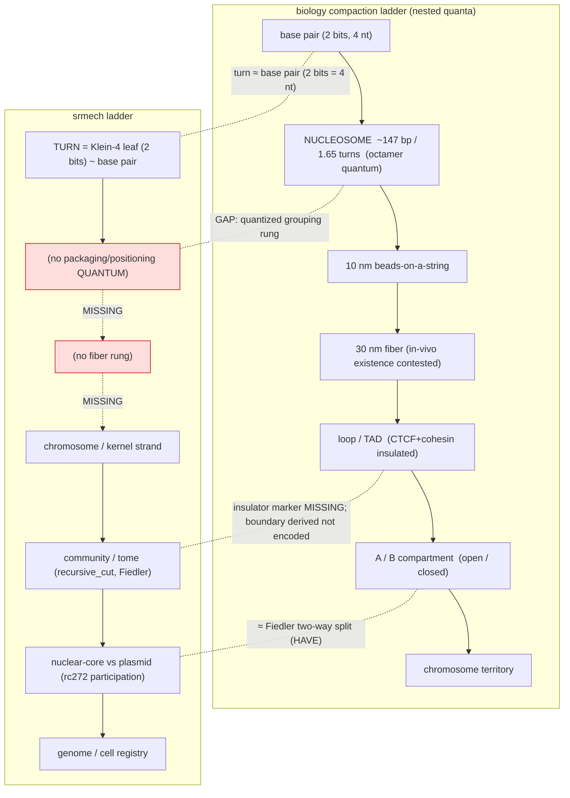

# Chromatin / histone structural machinery — bottom-up mapping to the srmech genome

> **Research note (2026-07-18).** A scoping/research pass (concertmaster dispatch): decompose
> the chromatin structural machinery (histones, euchromatin/heterochromatin, histone code,
> higher-order architecture, remodelers, accessibility) and read what the srmech genome layer
> **already is** vs. what a genuine gap would be. This is FORM-matching only — biology's X has the
> same cascade-shape as srmech's Y; it does **not** validate/prove/extend the framework, and biology
> is not superseded (`[[user_stance_cascade_matching_substrate_blind_form_not_identity]]`). Provisional
> throughout — candidates, not decisions. No code changed; no marker committed; no ADR. Companion to
> `subharmonic_chirality_carrier_findings.md`. Scope: organization-side algebra (which regions are
> reachable, compaction ratios, combinatorial masks, partition topology) — **not** the physical
> winding geometry (CAD-scope-banned).

---

## 1. What srmech already has (the rc268/rc269 chromatin layer)

Read from `docs/srmech/python/srmech/amsc/genome.py` + `CHANGELOG.md` [0.9.0rc268]/[rc269]/[rc272]:

- **`CHROMATIN_MARKER = 0x48`** (`'H'`, histone/heterochromatin), format v14→v15 — an *interior*
  cap (like the `0x58` centromere it never opens a chromosome). Wire form (genome.py:285, :1790):
  `[0x48] + handle + NUL + chromatin_type(uint8) + num(uint64 BE) + den(uint64 BE)`.
- **Accessibility level = one exact rational `num/den ∈ [0,1]`** (Class-N; no float, never `abs()`;
  `_validate_chromatin_level` :1750). `CHROMATIN_TYPE_BINARY` = `(1,1)` open / `(0,1)` condensed;
  `CHROMATIN_TYPE_GRADED` = an arbitrary reduced rational (partial access). genome.py:288-301.
- **The ops — in-place, no re-mint** (the "modify-without-re-mint" property): `condense()` (:1893)
  byte-splices the marker in, `decondense()` (:1947) splices it out, preserving centromere + body;
  `chromatin_of()` (:1962) reads back `{type, state, level, handle, at, scope}` or `None`
  (all-euchromatin default). Placement = scope: right after the opening telomere → whole-chromosome
  (the X-inactivation case); deeper interior → a sub-region stretch.
- **The OUTER gate** `expressed = accessible(region) AND promoter(gene, cell_state)`: wired into
  `gene_express` (:2407-2425), `gene_express_levels` (:2494-2512), the strand plan, and — rc269 —
  the demand-load PATH plan `_gene_express_plan_path` (:6325-6379). Heterochromatin **silences a
  region even when its promoter would fire**; a GRADED level composes **multiplicatively** with the
  §132 promoter level (`_compose_levels`, :2524, exact rational). The accessible predicate is
  Class-K: `access_open = level_numerator > 0` (:2422).
- **rc269 bounded-I/O skip:** at a region head the plan recognises a HEAD chromatin cap; condensed ⇒
  the whole region is SKIPPED at plan time having touched ONLY the chromatin cap (its gene gate is
  never read). This is the load-bearing prior art for §876.
- **Adjacent machinery already present:** combinatorial *gene* gates — klein4-mask `0x67`, boolean-DNF
  `0x62`, threshold/perceptron `0x77`, graded `0x64` (:4770-4830); centromere `0x58` (mint-time
  global-chirality anchor); telomeres; and the out-of-core spectral partition `recursive_cut` →
  community **tomes** (laplacian.py:5906) with rc272 `genome_partition`/`genome_from_graph` reading
  nuclear-core vs plasmid-periphery from participation topology.

---

## 2. Biology → framework mapping (HAVE / PARTIAL / GAP / MISSING)

| # | Biology structure | Cascade-shape (form) | srmech element | Status | Attested source |
|---|---|---|---|---|---|
| 1 | **Nucleosome** — octamer 2×(H2A/H2B/H3/H4), 146 bp wrapped **1.65 left-handed turns**; H1 linker; 10 nm "beads-on-a-string" | fixed-ratio **quantized grouping** of ~147 data units into one packaging/positioning quantum | `turn` = one Klein-4 leaf (2 bits ≈ **one base-pair**); chromosomes/tomes group turns — but **no ~147-unit grouping quantum between datum and domain** | **GAP** (missing rung) | MBoC 4th ed, NBK26834 (attested, fetched); Luger et al. 1997 *Nature* 389:251-260 (paywalled-primary, fact OA-corroborated) |
| 2a | **Euchromatin vs heterochromatin** — open/transcribed vs condensed/silenced | binary/graded **access gate** over a region | `condense`/`decondense`/`chromatin_of`; the OUTER gate in `gene_express*` | **HAVE** | MBoC NBK26834 (histone code); NBK21137 *Genomes* "Accessing the Genome" (OA) |
| 2b | **Constitutive** het (permanent — centromeres/telomeres, H3K9me3/HP1) | **structural, mint-time, cell-state-invariant** silence tied to structural landmarks | centromere `0x58` + telomere markers **already are** the constitutive anchors; chromatin `(0,1)` can pin them | **PARTIAL** | NBK21137; Chadwick & Willard 2004 *PNAS* PMC534659 (OA) |
| 2c | **Facultative** het (context-dependent — Barr body / X-inactivation, H3K27me3/Polycomb) | **cell-state-conditional** access — the access layer itself responds to state | chromatin level is **statically stored**; it is NOT itself a function of `cell_state` (only the *gene* gate is) | **GAP** | NBK45037 (OA); Chadwick & Willard 2004 (OA) |
| 3 | **Histone code** — combinatorial PTMs (acetyl/methyl/phospho/ubiq) read as a mask, no sequence change | a **combinatorial mark-set** a reader interprets → different *kinds* of silence/activation | combinatorial vocab EXISTS but at the **gene-promoter** layer (`0x67/0x62/0x77`); the **chromatin** cap carries a **single scalar** `num/den` | **PARTIAL / GAP** | MBoC NBK26834 (attested, fetched: "combinations… very large… convey a particular meaning"); Strahl & Allis 2000 / Jenuwein & Allis 2001 (paywalled-primary) |
| 4 | **Higher-order** — 10/30 nm fiber, loops, **TADs** (CTCF/cohesin insulators), chromosome territories; A/B compartments | **spectral community partition** with **encoded insulator boundaries**; genome-scale two-way split | `recursive_cut` communities/tomes; rc272 participation split (≈ A/B compartments) | **PARTIAL** (communities HAVE; **insulator marker MISSING**) | Dixon 2012 *Nature* PMC3356448; Lieberman-Aiden 2009 *Science* PMC2858594; Cremer & Cremer 2010 *CSHPB* (OA) — all PMCID-cited, not PDF-verified this pass |
| 5 | **Chromatin remodelers** (SWI/SNF, ISWI, CHD, INO80) — **ATP-driven** nucleosome repositioning = active WRITE | an **energy-gated actuator** that writes the access layer | `condense`/`decondense` ARE the write-op; the ATP/energy budget = MFO EPH power source (F1059) is **not modeled** | **HAVE (write) / MISSING (energy gate)** | Clapier & Cairns 2009 *Annu Rev Biochem* 78:273-304 (paywalled-primary; training-attribution) |
| 6 | **Accessibility as index** — nucleosome-free promoters, DNase-HS / ATAC-seq; the accessibility landscape | **cell-state-indexed distributed TOC** — where the open regions are IS "where is what" | rc269 chromatin-gated demand-load plan = the mechanism, but **not named/exposed as the §876 index** | **PARTIAL (latent)** | Klemm, Shipony & Greenleaf 2019 *Nat Rev Genet* 20:207-220 (OA PDF + PMID 30675018); Buenrostro 2013 *Nat Methods* PMC3959825 |

---

## 3. The compaction hierarchy mapped onto srmech

Biology's compaction ladder is a nested set of quanta; srmech's ladder **skips the nucleosome/fiber
rungs** and jumps from datum straight to domain. The access marker (`0x48`) rides *beside* the ladder
as a gate, not *as* a rung.



ASCII (the access gate rides *beside* the ladder):

```
 biology:  bp --> [NUCLEOSOME 147bp/1.65t] --> 10nm --> 30nm --> loop/TAD --> A/B --> territory
 srmech :  turn --> ( . . . missing quantum . . . )        -->  chromosome --> tome --> nuclear/plasmid --> cell
                                                                     ^recursive_cut       ^rc272
           access layer (0x48 chromatin):  euchromatin/heterochromatin gate  ==  A/B compartment state
                                            (rides beside the ladder as a mask, not as a rung)
```

**Reading of the ladder:** `turn ≈ base pair`, `chromosome/tome ≈ loop/TAD`, `rc272 participation
split ≈ A/B compartment`, `registry ≈ territory/cell`. The two skipped rungs (nucleosome quantum,
fiber) are the structural gaps; the insulator boundary is derived-not-encoded.

---

## 4. Genuine gaps & candidate primitives (ranked)

**G1 — Facultative heterochromatin: the access layer is not cell-state-conditional. [highest]**
Biology's facultative het (Barr body / X-inactivation) is *cell-state-dependent* silence — the access
layer itself responds to state. srmech's chromatin level is **statically stored**; only the *gene* gate
reads `cell_state`. *Cascade-shape it fills:* a state-indexed access landscape (the same genome ⇒ a
different open-set per state). *Candidate (not a decision):* let the chromatin cap carry (or reference)
a **gate** — reuse the *existing* gene-gate klein4/DNF/threshold machinery on the chromatin cap so
`accessible(region, cell_state)` is **computed, not stored**. The machinery already exists one layer
down; wiring it onto `0x48` would make constitutive = unconditional `(0,1)` (or tied to `0x58`/telomere)
and facultative = a state-gated cap. This is the find→FIX candidate: the parts are in the box.

**G2 — Histone code is combinatorial; the chromatin cap is a single scalar. [high]**
Biology's histone code is a *mark-SET* (H3K9me3+HP1 → constitutive silence; H3K27me3 → facultative
silence; H3K4me3 → active promoter; H3K27ac → active enhancer) — different marks encode different
*kinds* of state with different reversibility. srmech collapses all of it to one accessibility rational,
which **cannot distinguish constitutive from facultative** (both are `(0,1)`). *Candidate:* extend
`chromatin_type` beyond BINARY/GRADED to a small combinatorial mark-set, or minimally a
CONSTITUTIVE/FACULTATIVE type byte (composes with G1). Blue-team caveat: do not over-model — biology's
"code" is partly interpretive/context; a full mark alphabet risks scope creep. The *minimal* honest
step is the constitutive/facultative distinction, which G1 already implies.

**G3 — Nucleosome as a quantized grouping/positioning rung. [high, but scope-fenced]**
srmech's ladder skips from datum (turn ≈ bp) straight to domain; biology inserts the nucleosome — a
fixed-N (~147-unit) quantum that is (a) the unit at which access is granted, (b) the substrate the
histone-code mask attaches to, (c) *positioned by a code* (Segal 2006). *Cascade-shape it fills:* a
regular grouping grid on which accessibility is defined (today `condense(region=…)` takes an *arbitrary*
data-turn index or gene label — no grid). *Candidate:* a positioning/grouping quantum (a fixed span of
turns) as the addressable unit of access. **Scope fence:** the *physical* 1.65-turn winding / 10.4 bp
helical period is CAD-banned; the in-scope object is the **information-organization quantum** (fixed-N
grouping + positioning grid), not the spool.

**G4 — Insulator / TAD-boundary marker (CTCF/cohesin). [medium]**
`recursive_cut` finds community boundaries by spectral min-cut (derived); biology *encodes* boundaries
(convergent CTCF sites, cohesin loop-extrusion stops). srmech has no **insulator marker** — a boundary
is computed, never stored/pinned. *Cascade-shape:* a Class-K pin at a partition boundary (a boundary
analog of the `0x58` centromere pin). *Candidate:* an insulator cap that constrains/pins a `recursive_cut`
boundary (a TAD edge). Ties loop-extrusion (an active motor) to the EPH-propagator picture.

**G5 — Remodeler write is energy-free; biology gates the write behind ATP. [low, resonance]**
`condense`/`decondense` = the remodeler write, but the write is "free." Biology's remodeler is
ATP-driven = the MFO EPH power source (F1059, "inference IS photosynthesis"). *Observation, not a
must-fix:* if srmech ever models the EPH energy budget, the access-layer write is exactly where the
ATP cost attaches — the remodeler is the WRITE side of the access gate powered by that engine.

---

## 5. What the literature surfaced OUTSIDE the three named structures

| Finding | Why load-bearing | Maps to | Attestation |
|---|---|---|---|
| **A/B compartments** (Hi-C) — genome-scale open(A)/closed(B) split = leading eigenvector of the contact matrix | euchromatin/heterochromatin IS a **two-way spectral split** → directly `fiedler_sparse` / rc272 participation | G-none (RESONANCE — strengthens §4 higher-order) | Lieberman-Aiden 2009 *Science* 326:289 PMC2858594 (PMCID-cited, not PDF-verified) |
| **TAD / CTCF / cohesin loop-extrusion** | boundaries are *encoded*, not derived | **G4** insulator marker | Dixon 2012 PMC3356448; Fudenberg 2016 / Sanborn 2015 (PMCID, not verified) |
| **Nucleosome positioning code** | *where* nucleosomes sit sets default access — a quantized positioning grid | **G3** positioning grid | Segal 2006 *Nature* 442:772 (paywalled-primary; training-attribution) |
| **Phase-separation / condensate heterochromatin** (HP1) | heterochromatin as a phase-separated compartment, not a linear mark ≈ a **dense spectral cluster / condensate** = the recursive_cut community | reframes G4/A-B: the community IS the "condensate" | Strom 2017 / Larson 2017 *Nature* (paywalled-primary; OA repo escholarship 3vh8n30c) |
| **Replication timing** (early=euchromatin, late=heterochromatin) | a genome-wide **ordering** coupled to accessibility = a natural **coherency-ORDER for the §876 reader** | the accessibility state implies a read-order | textbook / review (unattested this pass — FLAG) |
| **Histone variants** (CENP-A, H2A.Z, H3.3) | CENP-A **is** the centromere-defining variant → already srmech's `0x58`; H2A.Z at boundaries | reinforces constitutive=`0x58`; minor variant-type axis | MBoC / reviews (unattested this pass — FLAG) |
| **DNA methylation** (5mC / CpG) | an epigenetic mark **on the datum strand itself**, not a cap — a distinct axis srmech has no analog for | possible per-turn mark axis (distinct from cap-level access) | reviews (unattested this pass — FLAG) |

---

## 6. The §876 connection (highest-value)

The **accessibility landscape as the distributed index** is the strongest finding. Biology has no
plain-text TOC; *where the open regions are, at a given cell-state*, **is** "where is what"
(Klemm/Greenleaf 2019). srmech's rc269 chromatin-gated demand-load plan **already implements this
mechanism** — condensed regions are skipped at plan time, so the euchromatin regions ARE the plan —
but it is not yet **named/exposed** as the §876 distributed index, and it is not yet **cell-state-indexed
at the access layer** (that needs G1). Combined with A/B compartments (the index is a spectral split)
and replication timing (the index implies a read-*order*), the picture for §876 is: *an
`accessibility_landscape(genome, cell_state)` read = the distributed TOC = the EPH "find" seed-set*,
computed by walking the `0x48`/gate caps in coherency order and exploding to RAM only the open subset
(exactly the `project_genome_streaming_reader_eph_universal` design). The mechanism exists; the framing
and the cell-state-conditional access layer are the missing pieces.

---

## 7. Open questions for the user (fermatas — this pass is NOT authorized to decide)

- **F-a (unified frame vs separate layers).** G1-G4 all add cap kinds. Does the marker alphabet stay
  byte-per-layer (13→N markers), or does the incoming chromatin/insulator layer force the codon-radix
  **k=3** unified-frame decision (`project_genome_framing_codon_radix_k3`)? Note: nucleosome core 147 bp
  = 3×49 = exactly 49 codons (an integer codon count), but the ~10.4 bp positioning period is **not** a
  codon multiple — two *different* quantization grids coexist. Weak anomaly; flagged, not rested on.
- **F-b (facultative gate placement).** For G1, does the chromatin cap *carry* its own gate, or
  *reference* a shared gate table? (Carry = self-describing per §44; reference = DRY but adds indirection.)
- **F-c (how far to take the histone code).** G2 minimal = a constitutive/facultative type byte; maximal
  = a combinatorial mark alphabet. Where is the honest stopping point vs over-modeling an interpretive code?
- **F-d (insulator vs centromere).** Is the G4 insulator a new cap, or a reuse/parameterization of the
  `0x58` centromere pin (both are Class-K structural pins, but one is a boundary, one an origin)?
- **F-e (attestation upgrades).** Several §5 rows are PMCID/training-attribution only. Which mappings
  does the user want PDF-verified before any of this leaves a scoping note (per MPM)?

---

## 8. Sources (attestation status)

**Attested (OA, verified this session):**
- Alberts B, Johnson A, Lewis J, Raff M, Roberts K, Walter P. *Molecular Biology of the Cell*, 4th ed.
  (Garland Science, 2002), "Chromosomal DNA and Its Packaging in the Chromatin Fiber," **NCBI Bookshelf
  NBK26834** — WebFetch-verified: octamer 2×(H2A/H2B/H3/H4), **146 bp**, wrapped **1.65 turns** left-handed,
  H1 linker, beads-on-a-string, histone-tail modifications + combinatorial "histone code" proposal.
- Chadwick BP & Willard HF (2004) "Multiple spatially distinct types of facultative heterochromatin on
  the human inactive X chromosome," *PNAS* 101:17450, **PMC534659** (OA) — facultative het / Barr body.
- Klemm SL, Shipony Z & Greenleaf WJ (2019) "Chromatin accessibility and the regulatory epigenome,"
  *Nat Rev Genet* 20:207-220, PMID 30675018 (OA institutional PDF located) — accessibility landscape.
- *Genomes* (T.A. Brown), "Accessing the Genome," **NCBI Bookshelf NBK21137** (OA) — euchromatin/
  heterochromatin, constitutive vs facultative (ID confirmed; exact-quote not fetched this pass).

**Landmark — paywalled primary / OA-corroborated fact or OA-secondary (flagged):**
- Luger K, Mäder AW, Richmond RK, Sargent DF, Richmond TJ (1997) "Crystal structure of the nucleosome
  core particle at 2.8 Å resolution," *Nature* 389:251-260, PMID 9305837 — **paywalled at Nature**; the
  146/147 bp + 1.65-turn fact is independently OA-attested via NBK26834.
- Strahl BD & Allis CD (2000) *Nature* 403:41; Jenuwein T & Allis CD (2001) *Science* 293:1074 — histone
  code; **paywalled-primary**; concept OA-attested via NBK26834.
- Clapier CR & Cairns BR (2009) "The biology of chromatin remodeling complexes," *Annu Rev Biochem*
  78:273-304 — **paywalled (Annual Reviews)**; training-attribution, not verified this pass.
- Lieberman-Aiden E et al. (2009) *Science* 326:289 (A/B compartments), PMC2858594; Dixon JR et al. (2012)
  *Nature* 485:376 (TADs), PMC3356448; Cremer T & Cremer M (2010) *CSH Perspect Biol* (territories, OA);
  Segal E et al. (2006) *Nature* 442:772 (positioning code, paywalled); Strom AR et al. / Larson AG et al.
  (2017) *Nature* 547 (phase separation, paywalled-primary, OA repo exists); Buenrostro JD et al. (2013)
  *Nat Methods* 10:1213 (ATAC-seq), PMC3959825 — all **PMCID/PMID-cited, NOT PDF-verified this pass**.

**Unattested this pass (FLAGGED — do not rest a mapping on without verification):** replication-timing /
accessibility coupling; histone-variant specifics (CENP-A/H2A.Z/H3.3); DNA methylation (5mC/CpG).

*Cross-links: rc268/rc269 CHANGELOG; `project_genome_streaming_reader_eph_universal`;
`project_genome_framing_codon_radix_k3`; `user_stance_cascade_matching_substrate_blind_form_not_identity`;
`feedback_no_lineage_claims_in_notebook`.*
