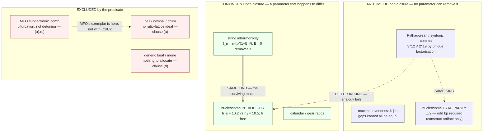

# Discrete mathematical forms of music — do they share the nucleosome's commensuration shape?

> **Research spike (2026-07-19; concertmaster dispatch).** Scoping/derivation only — no code shipped,
> no rc, no ADR. FORM-matching only; this does **not** validate the framework and music theory is not
> superseded (`[[user_stance_cascade_matching_substrate_blind_form_not_identity]]`,
> `[[feedback_no_lineage_claims_in_notebook]]`). Provisional throughout.
> Follows `nucleosome_turn_asymmetry_frame_spike.md`; companion to
> `subharmonic_chirality_carrier_findings.md` and `../../antikythera-maths/subharmonic_chirality_collapse_stub.md`.
> Generating script for every number: `music_discrete_forms_commensuration_shape_spike.py` — exact
> integer/rational arithmetic, Class-N logs via `srmech.amsc.rational.log1p_series_truncate`, Class-K
> pin-slot for sign, no `abs()`, no float in any load-bearing result
> (`[[feedback_computational_provenance_discipline]]`).

---

## 0. Bottom line

**The dispatch's central test resolves AGAINST the analogy as posed — and then finds a different one
that survives.**

The Pythagorean comma is an **arithmetic** non-closure (a theorem). The nucleosome's ~10.2-vs-10.5
detuning is a **contingent** one (a free physical parameter). They differ **in kind**, so
comma ↔ nucleosome is decorative.

But music contains **two structurally different non-closures**, and the dispatch pointed at the wrong
one. Music's *second* non-closure — **string inharmonicity** — is contingent in exactly the
nucleosome's way. That match survives on structure, not on "both involve ratios."

| pairing | verdict |
|---|---|
| Pythagorean comma ↔ nucleosome periodicity detuning | **FAILS** — arithmetic vs contingent |
| string inharmonicity ↔ nucleosome periodicity detuning | **SURVIVES** — both contingent detunings off an exact integer ideal |
| comma ↔ nucleosome **dyad parity** (146 bp) | **SURVIVES** — both arithmetic; but the DNA instance is a *construct artifact* |
| any of the above ↔ MFO's asymmetric-resonator comb | **FAILS** — §5; MFO's own exemplar is the one the predicate excludes |

---

## 1. The predicate — and what it EXCLUDES

> **P(a)** a discrete lattice generated by iterating a ratio · **P(b)** a continuous domain it must
> **close** within · **P(c)** an irreducible residual (closure fails) · **P(d)** the residual must be
> **allocated by a policy underdetermined by (a)–(c)**

Clause (d) needed sharpening. In its naive form ("a human chooses") it is anthropocentric and excludes
DNA by definition. The load-bearing form is **allocation-underdetermination**: the closure requirement
alone does not fix *how* the residual distributes, so an extra degree of freedom must be fixed from
outside the arithmetic. Under that reading the agent may be a tuner, a calendar committee, or a
histone fold.

**15 systems tested. 6 excluded, at four different clauses** — the signature of a predicate doing real
work rather than one clause carrying it. (Was 14/6 on first pass; the beat row **split in two** under
the measured amendment of §1.1 — the exclusion count is unchanged, the member count went up by one.)

| system | a | b | c | d | verdict |
|---|:-:|:-:|:-:|:-:|---|
| Pythagorean / syntonic comma | 1 | 1 | 1 | 1 | **MEMBER** — (c) arithmetic |
| maximal evenness / Euclidean rhythm | 1 | 1 | 1 | 1 | **MEMBER** — (c) arithmetic |
| calendar leap-year rules | 1 | 1 | 1 | 1 | **MEMBER** — (c) contingent |
| Antikythera gear-train ratios | 1 | 1 | 1 | 1 | **MEMBER** — (c) contingent |
| floating-point rounding modes | 1 | 1 | 1 | 1 | **MEMBER** — (c) arithmetic |
| string inharmonicity / Railsback | 1 | 1 | 1 | 1 | **MEMBER** — (c) contingent |
| **coupled asymmetric pair (directed coupling)** | 1 | 1 | 1 | 1 | **MEMBER** — (c) contingent; **measured**, see §1.1 |
| nucleosome periodicity detuning | 1 | 1 | 1 | ? | **PARTIAL** — (d) weak-form only |
| nucleosome dyad parity (146 bp) | 1 | 1 | 1 | 1 | **MEMBER** — construct artifact only |
| polyrhythm / tuplets | 1 | 1 | **0** | 0 | EXCLUDED at (c) — closes exactly at LCM |
| **UNCOUPLED** two-oscillator beat / moiré | 1 | 1 | 1 | **0** | EXCLUDED at (d) — nothing to allocate |
| bell / drum inharmonic spectrum | **0** | 1 | 1 | 0 | EXCLUDED at (a) — no ratio-lattice ideal |
| thermal equilibration | **0** | 1 | 1 | **0** | EXCLUDED at (d) — allocation is determined |
| statistical variance across particle classes | **0** | 0 | **0** | 0 | EXCLUDED — not a residual at all |
| MFO subharmonic comb (period-doubling) | **0** | 1 | **0** | 0 | EXCLUDED at (a),(c) — bifurcation |

**Verdict: DISCRIMINATING, not vacuous.** Clause (d) is what kills "any system with two
periodicities" — but the boundary sits **one level in** from where this note first drew it (§1.1): an
**uncoupled** pair has a residual and nothing to *allocate*; a **coupled** one does. Clause (a) is
second: it kills bells and drums, whose inharmonic spectra are not perturbations of any
ratio-generated ideal.

### 1.1 Amendment — the beat row splits, on a measured result (fermata F-α)

The first pass excluded "generic two-oscillator beat / moiré" wholesale. **That was too broad**, and
the correction comes from a measurement, not a preference.

**Attribution: this result is not ours.** It is **K5** of the open-experiments spike —
`open_experiments_kuramoto_hexasome_spike.md` §2.4 + its committed provenance script — run on srmech's
own `cascade.kuramoto_step`. Verified against that note's §2.4 body and data table before citing.

With **directed** (non-reciprocal) coupling at α = 0, holding the sum *A*₁₂ + *A*₂₁ fixed at 2.0 and
varying only the ratio, the locked phase offset is **φ\* = 0.25268 — identical to five decimals across
every row — while the allocation runs 0.05 → 0.95**, tracking *A*₁₂/(*A*₁₂+*A*₂₁) exactly. Closed form:
the threshold depends only on the **sum**, the split only on the **ratio**. **The lock threshold is
blind to the allocation.**

That is clause (d) verbatim in the strong sense: the residual is real, it closes a ledger, and *how it
splits between the two members is not determined by the closure*. So:

| case | status | why |
|---|---|---|
| **uncoupled** two-oscillator beat / moiré | **still EXCLUDED at (d)** | a residual exists, but there is nothing to allocate — the original reasoning stands for this case |
| **coupled asymmetric pair** (directed / non-reciprocal) | **MEMBER** | coupling creates the allocation degree of freedom, and directedness leaves it underdetermined by the closure |

**Coupling is what creates something to allocate.** That is the whole content of the split — an
uncoupled pair has two independent phases and no shared ledger; a coupled pair has one shared locked
state whose *allocation* between the members is a free direction. Note the mechanism is **directed**
coupling specifically: the source records the effect as arriving via non-reciprocity, **not** via the
Sakaguchi α frustration parameter.

**This does not inflate the verdict.** Adding coupled asymmetric pairs makes the member class
**larger, not more exclusive** — the headline stands unchanged below. This is generic
commensuration-under-closure **with a mechanism attached**, not a signature.

**But the predicate does not single out music + DNA.** Calendars, gear-trains and floating-point
rounding are full members. **The shape is a general commensuration-under-closure shape, not a
signature of anything cosmic.** Reported plainly, because the dispatch asked what the predicate rules
out and the honest answer includes ruling out its own specialness.

⚠️ **Equivocation caught.** The nucleosome spike's "the honest object is a DISTRIBUTION, not a
constant" uses *distribution* in the **statistical** sense (variance across particle classes). Clause
(d) uses it in the **allocation** sense (spreading one residual over several slots). These are
different objects and the word bridges them illegitimately. Row 13 above excludes the statistical
reading at every clause. **The two senses must not be traded on.**

---

## 2. Q2 — the discriminator. **ARITHMETIC vs CONTINGENT: they differ in kind.**

### 2.1 Music's non-closure is a theorem

> **Lemma (rational-closure exclusion).** Let *r* = *p*/*q* in lowest terms, *r* > 1. If *r*ⁿ = 2ᵐ for
> positive integers *n*, *m*, then *q* = 1 and *p* is a power of 2.
>
> *Proof.* *r*ⁿ = 2ᵐ ⇒ *p*ⁿ = 2ᵐ*q*ⁿ. Since gcd(*p*,*q*) = 1, gcd(*p*ⁿ,*q*ⁿ) = 1; yet *q*ⁿ divides
> *p*ⁿ, forcing *q* = 1. Then *p*ⁿ = 2ᵐ, so *p* is a power of 2 by unique factorisation. ∎

- **Corollary 1.** The just fifth 3/2 **never** closes the octave — not for 12 fifths, not for any *n*.
- **Corollary 2.** Any equal division of the octave into *n* > 1 parts uses an **irrational** step
  2^(1/n). **Rational intervals and octave closure are mutually exclusive.**

The failure is *prohibited by unique factorisation*. No parameter can be adjusted to remove it.
Computational witness: no 3^a is a power of 2 for a ∈ 1..399 (and the lemma says none ever is).

> **Attribution — read before citing.** The *fact* is attested: Scholtz 1998 endnote 8 states that
> (3/2)ⁿ "can never be an exact multiple of 2 **since every power of 3 is an odd number**" [E]. That is
> a **parity** argument, and it covers the fifth only. **The UFD/coprimality framing above, and the
> generalisation to arbitrary *r* = *p*/*q* with its two corollaries, are OURS** — Scholtz does not
> frame it that way and himself falls back on an "intuitive musical proof" for the fourths case. No
> number-theory-grade OA source for the general statement was located [NULL]. Flagged so the lemma is
> not mistaken for a cited result.

### 2.2 The nucleosome's is not

The coherency condition is *N/h* = *k*. Solving for *h* gives *h* = *N*/*k* = 147/14 = 21/2 = **10.5** —
and this is solvable for **any** integers *N*, *k*, because *h* is a **free real parameter**. There is
no coprimality argument, no unique-factorisation argument, **nothing that forbids** *h*ₛ = 10.5. The
measured surface periodicity simply *is not* 10.5.

**⇒ The two non-closures differ IN KIND. The comma ↔ nucleosome analogy is decorative.**

### 2.3 …but the nucleosome DOES have an arithmetic non-closure — on a different member

A 2-fold dyad axis passing **through a base pair** requires an **odd** bp count. That is a ℤ/2 parity
obstruction — **arithmetic**, and canonically **Class K** (pin-slot / phase boundary).

Luger 1997 used a **146 bp** (even) palindrome; the particle could not satisfy the parity condition and
absorbed the 1 bp deficit **by stretching** — i.e. an arithmetic impossibility forced a residual that
had to be **distributed through the structure** [attested prior spike, PMC4378457].

That is a genuine clause-(a)–(d) instance and it is *type-1* (arithmetic), matching the comma. **But it
is a crystallography construct artifact, not the native particle.** Flagged; not rested on.

**So the arithmetic non-closure in the nucleosome exists — it just isn't the one the dispatch was
looking at.**

### 2.4 Convergence — the instrument's reach reproduces the same split, by a different route

Worth recording because it arrives independently. The open-experiments spike reports that **sinusoidal
Kuramoto has exactly one resonance — 1:1** — with no higher-order *p*:*q* Arnold tongue at any
coupling, because higher tongues need harmonics the model does not carry
[`open_experiments_kuramoto_hexasome_spike.md` §2.6 / N4].

Line that up with §§2.1–2.2:

| | commensuration | inside the instrument's reach? |
|---|---|---|
| **nucleosome** | **1:1** — one helical turn per contact (*N*/*h*₀ = 14 turns over 14 contacts) | **yes** — it is the one resonance the model has |
| **music's comma** | **12:7** — twelve fifths against seven octaves | **no** — needs a higher-order tongue the model cannot reach |

So a **reach limit of the instrument**, derived from the model's harmonic content, lands on **exactly
the same boundary** as the §2.1 unique-factorisation argument — the contingent 1:1 detuning on one
side, the arithmetic high-order comma on the other. **Two independent routes to one split.**

Stated with its limit: this is a **convergence, not a proof**. A sinusoidal model's reach is a fact
about the model, and the *p*:*q* structure of the comma is a fact about the integers; that they
partition the same way is corroboration that the partition is real, not a second derivation of it. It
does mean the framework's own instrument would have found the boundary had the arithmetic not.

---

## 3. The enumeration — formalism → lattice → domain → residual → policy

Comma ratios and cents are **exact** (theorems; no citation needed). Historical/empirical rows carry
attestation status per §6.

| formalism | discrete lattice | continuous domain | residual | distribution policy | non-closure kind | verdict |
|---|---|---|---|---|---|---|
| **Pythagorean comma** | ⟨3/2⟩ iterated 12× | pitch (log-freq circle) | 531441/524288 = **23.4600 ¢** | — (untempered: dumped in one *wolf* fifth) | **arithmetic** | **MEMBER** |
| **syntonic comma** | ⟨3/2⟩⁴ vs 5/4 | pitch | 81/80 = **21.5063 ¢** | meantone: ¼ each over 4 fifths | **arithmetic** | **MEMBER** |
| **schisma** | PC ÷ SC | pitch | 32805/32768 = **1.9537 ¢** | absorbed / ignored | **arithmetic** | MEMBER (degenerate) |
| **diaschisma** | — | pitch | 2048/2025 = **19.5526 ¢** | — | **arithmetic** | MEMBER |
| **lesser diesis** | — | pitch | 128/125 = **41.0589 ¢** | — | **arithmetic** | MEMBER |
| **greater diesis** | — | pitch | 648/625 = **62.5651 ¢** | — | **arithmetic** | MEMBER |
| **equal temperament (12-EDO)** | ℤ/12 | pitch | PC spread evenly | **uniform**, 1.9550 ¢/fifth = PC/12 [C] | resolves (a) by leaving ℚ | **MEMBER** |
| **¼-comma meantone** | 4-fifth chain | pitch | SC over 4 fifths | **concentrated**, 5.3766 ¢/fifth; *consonant* major thirds [C] | " | **MEMBER** |
| **well-temperament** | 12 unequal fifths | pitch | PC unevenly | **deliberately unequal**, commas "divided and dispersed" [C] | " | **MEMBER** |
| **just intonation** | small-*d* rational lattice | pitch | non-closure **accepted** | none — residual kept visible | **arithmetic** | **MEMBER** |
| **Tonnetz / prime lattice** | ℤᵏ over primes (monzo) | pitch | comma vectors = lattice kernel | tempering = **quotient by the kernel** | **arithmetic** | **MEMBER** |
| **overtone vs tempered scale** | ℕ·f₀ vs 2^(k/12) | frequency | per-degree error | absorbed by ear/context | mixed | MEMBER |
| **string inharmonicity** | ℕ·f₀ (ideal) | frequency | f_n = n·f₀√(1+B n²), B ≈ 10⁻³ [A] | — (physical) | **contingent** (B→0 removes it) | **MEMBER** |
| **Railsback stretch** | tempered keyboard | frequency | inharmonicity accumulated | **measured & applied**: "stretching" [B]; octaves larger than nominal [A] | **contingent** | **MEMBER** |
| **beat frequencies (uncoupled)** | two partials | frequency | \|f₁−f₂\| | none — nothing to allocate | n/a | **EXCLUDED at (d)** |
| **coupled asymmetric pair** | two phases, directed *A*₁₂ ≠ *A*₂₁ | phase circle | locked φ\* with a free split | **allocation = *A*₁₂/(*A*₁₂+*A*₂₁)**, threshold blind to it | **contingent** | **MEMBER** — §1.1 |
| **polyrhythm / tuplets** | p:q pulses | time | **zero** — closes at LCM | none needed | n/a | **NULL at (c)** |
| **maximal evenness / Euclidean** | *k* onsets in *n* pulses, *k*∤*n* | time (cyclic) | gaps cannot all be equal | **maximally even** (Bjorklund) | **arithmetic** | **MEMBER** |
| **nucleosome periodicity** | 14 contacts | bp / turns | ΔØ = **7/17** turns | weak-form only | **contingent** | **PARTIAL** |
| **nucleosome dyad parity** | ℤ/2 on bp count | bp | 1 bp | stretched through structure | **arithmetic** | MEMBER (artifact) |

### 3.1 The sharpest structural point: JI and ET are **dual**, not competing approximations

By the §2.1 lemma you may have **rational intervals** or **octave closure**, never both:

- **just intonation** = keep ratios rational, accept non-closure
- **equal temperament** = accept irrational ratios, achieve exact closure

Temperament is therefore **not "a better `best_rational`"** — it is the deliberate move **off** the
rational lattice that `best_rational` exists to stay **on**. Same object, opposite direction. This is
the cleanest thing the spike found and it is a theorem, not a reading.

### 3.2 Numerology hazard, checked and defused

PC/12 = **1.955001 ¢** vs schisma = **1.953721 ¢** — differ by **0.001280 ¢**. Near-equal to ~10⁻³
cents and **not the same number**: the schisma is the rational 32805/32768 (monzo 2⁻¹⁵3⁺⁸5⁺¹); PC/12
is not a rational interval at all. **Recorded as a coincidence, explicitly NOT used as evidence.**

---

## 4. Q3 — does srmech already express it? **The JI half: yes, verbatim. The temperament half: no, and it should not ship as music.**

Exact continued fraction of log₂(3/2), computed by **integer power comparison only** (no floats):

```
[0, 1, 1, 2, 2, 3, 1, 5, 2, 23, 2, 2]
```

Its convergents **are** the historically-used equal divisions of the octave:

| convergent | EDO | tempered fifth | error vs just 3/2 |
|---|---|---|---|
| 3/5 | 5 | 720.0000 ¢ | +18.0450 ¢ |
| **7/12** | **12** | 700.0000 ¢ | **−1.9550 ¢** |
| 24/41 | 41 | 702.4390 ¢ | +0.4840 ¢ |
| **31/53** | **53** | 701.8868 ¢ | **−0.0682 ¢** |
| 179/306 | 306 | 701.9608 ¢ | +0.0058 ¢ |

And srmech's **shipped** Class-N op reproduces them directly:

```
best_rational(log2(3/2), max_d=  5) = 3/5     ->   5-EDO
best_rational(log2(3/2), max_d= 12) = 7/12    ->  12-EDO
best_rational(log2(3/2), max_d= 60) = 31/53   ->  53-EDO
best_rational(log2(3/2), max_d=400) = 179/306 -> 306-EDO
```

**Choosing a temperament IS choosing `max_denominator`.** That is Class N verbatim. Class I (ℤ/12
pitch-class / octave group) covers the cyclic side, consistent with the Z₁₂/D₁₂ reading already in
`audio-scoping-2026-05-09.md`.

**Recommendation — do NOT ship a music/tuning catalog.**

1. **The JI half is redundant.** `best_rational` + `continued_fraction` already are the just-intonation
   problem. A tuning catalog would re-wrap a shipped op.
2. **The temperament half is genuinely absent but is not music.** Tempering out a comma = **quotienting
   the prime-exponent lattice ℤᵏ by the sublattice generated by the comma vectors**, then choosing a
   section. That is integer linear algebra (Smith normal form / kernel), squarely in srmech's
   integer-ALU idiom and adjacent to Class L. If it ships it should ship as the **general**
   lattice-quotient + residual-allocation op, with music as *one worked instance* — not as a music
   op-family. Shipping it as "tuning" would privilege a substrate, against
   `[[feedback_no_privileged_primitive_classes]]`.
3. **Surface note (observed this run, not a defect):** `best_rational` is **uint64-bounded on both
   inputs**, so the exact Class-N rational for log₂(3/2) (a ~90-digit numerator out of
   `log1p_series_truncate`) is rejected by `_ensure_uint64`. Any use of Class-N `best_rational` on a
   transcendental needs an explicit pre-truncation step. Worth documenting if a worked instance ever
   ships.

**Fermata F-i** — conductor decides whether the lattice-quotient op is worth a tracker item at all.

---

## 5. Q4 — the MFO tie. **Checked, not assumed — and it does NOT triangulate.**

MFO's actual claim (notebook head, and §XIV.8):

> "All matter and force fields are **inharmonic and subharmonic** excitations of a single metric field.
> **An asymmetric resonator.**"

> "a body resonator is **asymmetric** and **inharmonic / subharmonic** (a **cymbal's** overtones are not
> an integer harmonic ladder…)"

Three findings, and they cut against the bridge:

1. **MFO has already decoupled the two words itself.** §XIV.8 measured the comb from a logistic map and
   recorded the honest correction: *"the comb comes from **nonlinearity, not from spatial asymmetry**."*
   So "asymmetric universal resonator" bundles two signatures MFO's own notebook has separated. The
   bridge must be checked per-signature; bundled, it is a phrase, not a claim.

2. **MFO's measured signature is a bifurcation cascade, not a detuning.** The comb is period-doubling
   (f/2, f/4, f/8, f/16) with Feigenbaum δ ≈ 4.669. That is **not a commensuration residual at all** —
   there is no ratio-generated lattice failing to close. It fails predicate clauses (a) and (c).

3. **MFO's chosen exemplar is precisely the one the predicate excludes.** A cymbal/bell spectrum is
   inharmonic in the *no-nearby-integer-ideal* sense; a piano string and the nucleosome are detuned in
   the *small-perturbation-off-an-exact-integer-ideal* sense. **Opposite ends of the same word.**
   In-tree corroboration already exists: Spike #40 measured bell as geometric-decay and drum as
   Bessel-zero frequencies — neither is a perturbation of ℕ·f₀.

**This answers the open fermata F-g.** The nucleosome spike's fermata-execution pass logged the user
framing — *"DNA carries both continuous and discrete domain mathematics; read as a physical
instantiation of MFO's asymmetric universal resonator"* — MFO-side, **recorded but not adjudicated**,
with two guard-rails: it must not retro-justify S1/S2, and it does not soften anomaly A1. **This spike
adjudicates it: the reading does not go through by commensuration** (§§2, 5). Both guard-rails are
observed — nothing here retro-justifies S1/S2, and A1 (the beat term under-determined to the width of
what it explains) is untouched and if anything reinforced, since §2.2 shows the detuning is a free
parameter.

**Q4 VERDICT: it is NOT a three-way triangulation.** It is a genuine **two-way** form-match
(nucleosome ↔ string inharmonicity) plus a **third thing wearing the same word**. The dispatch asked
whether DNA ↔ music ↔ cosmos genuinely triangulates or is "three different things wearing one word" —
the answer is **two of the three match; the cosmos member does not join via commensuration.**

This does **not** refute MFO. It says the *bridge the user proposed* does not go through by this route,
and names the route that does (§2.3, §5 above). Per `[[feedback_mfo_vs_srmech_notebook_split_rule]]`,
the ontology stays MFO-side; §§2–4 (lemma, lattice, Class-N) are srmech-side. **Fermata F-ii.**

---

## 6. Attestation ledger

**Exact / no citation required** (arithmetic theorems, reproduced in the script): all comma ratios and
monzos · all cents values · the §2.1 lemma and both corollaries · the continued fraction of log₂(3/2)
and its convergents · the `best_rational` outputs · maximal-evenness onset sets · LCM closure of
polyrhythms · the nucleosome parity argument.

**Inherited attested** (prior spike, re-used not re-derived): 14 minor-groove contacts [PMC4512544] ·
*h*ₛ ≈ 10.2 / *h*₀ ≈ 10.5 and ΔØ ≈ +0.4 [PMC6162219] · the 146-vs-147 resolution and the stretch
[PMC4378457] · MFO §XIV.8 Feigenbaum comb [in-tree].

**ATTESTED OA, full text fetched this spike:**

| tag | claim | source |
|---|---|---|
| **[A]** | stiff-string law f_n = n·f₀√(1+Bn²); partials run **sharp**; B ≈ 10⁻³ typical for piano; "octaves slightly larger than should" | Gràcia & Sanz-Perela, *The wave equation for stiff strings and piano tuning*, **arXiv:1603.05516v2** (UPC; *Reports@SCM* 3, 2017) — verbatim: *"the frequency spectrum is no longer harmonic, but of the form fn = n f √(1 + Bn²)"*; *"For piano strings the value of the inharmonicity parameter B is about 10⁻³."* Corroborated: Roy, *Edinburgh Student J. Sci.*, **DOI 10.2218/esjs.9815** (OA, 2024) |
| **[B]** | Railsback 1938; tuners deviate from ET ("stretching"); **caused by inharmonicity** | Hinrichsen, *Entropy-based Tuning of Musical Instruments*, **arXiv:1203.5101v1** — verbatim: *"first explained by O. L. Railsback in 1938, who showed that this perception is caused by inharmonic corrections in the overtone spectrum… Professional aural tuners compensate this inharmonicity by small deviations, a technique known as stretching."* |
| **[C]** | ET flattens fifths by **1/12 Pythagorean comma**; meantone divides the **syntonic comma over four links**; well-temperament distributes **deliberately unequally** | Scholtz, *Algorithms for Mapping Diatonic Keyboard Tunings and Temperaments*, **Music Theory Online 4.4 (1998)** (peer-reviewed OA musicology) — verbatim: *"Equal temperament flattens the fifths… by 1/12 of a Pythagorean comma"*; *"equally dividing the syntonic comma over the four links of each major third"*; *"The more that the commas were divided and dispersed, the more that well temperament approached equal temperament."* |
| **[D]** | maximal evenness; Bjorklund ≡ Euclidean algorithm; **k∤n is the hard case**; 7-of-12 **is** the diatonic pattern | Toussaint, *The Euclidean Algorithm Generates Traditional Musical Rhythms*, BRIDGES 2005 extended version (McGill-hosted, author's own copy) — verbatim: *"If k divides evenly… the solution is obvious… The solution is less obvious when k and n are relatively prime"*; *"it is the same pattern as the pitch pattern of the major diatonic scale."* |
| **[E]** | no sequence of just fifths ever closes an octave | Scholtz, **MTO 4.4 (1998) endnote 8** — verbatim: *"which can never be an exact multiple of 2 since every power of 3 is an odd number."* |

**REJECTED (paywalled-only ⇒ not attestation):** Railsback, *Scale Temperament as Applied to Piano
Tuning*, JASA 1938 (the primary) · *Explaining the Railsback stretch…*, JASA 138(4):2359 (2015) —
**HTTP 403** · Clough & Douthett, *Maximally even sets*, *J. Music Theory* 35 (1991) — reference-only
inside [D], not fetched; **do not quote their words** · Fletcher, Blackham & Stratton, JASA 1962.

**NULL — could not attest (do NOT write these):**
- **The Railsback stretch magnitude in cents.** Every trail terminated at a *Wikipedia image file*
  (Hinrichsen's own Fig. 1 credit line is `en.wikipedia.org/wiki/File:Railsback2.png`). The "~30 cents"
  figure in circulation has **no fetchable source**. ⚠️ This is the same failure mode as the prior
  spike's **A3** — a number that looks sourced but dissolves on fetch.
- **The phrase "treble sharp / bass flat."** Not present in any fetched OA text. Only the aggregate
  "octaves slightly larger" is attested. The note's §3 row was corrected accordingly.
- **"Key colour" / "key character"** as a sourced term — **absent from [C]**. The *unequal distribution*
  is attested; the name for its consequence is not. Corrected in §3.
- **"Meantone gives PURE major thirds"** — [C] says *"consonant"*, and reserves *"pure"* for just
  intonation. Corrected in §3.
- **Per-string measured B values** — Roy's results are locked in a figure, not a table.
- **A UFD-grade source for the general closure lemma** (§2.1 attribution note).

**⚠️ Attested-source conflict, flagged not resolved:** [A] gives typical piano B ≈ 10⁻³; Hinrichsen
[B] states B ranges *"between 0.0002 for bass strings up to 0.4 for treble strings"* — but his own
figure axis tops out at 10⁻¹, below his quoted 0.4. **Treat 0.4 as suspect; do not cite it.** The
script brackets B ∈ {10⁻⁴, 5×10⁻⁴, 10⁻³}, consistent with [A].

---

## 7. Diagram — the lattice-vs-continuum closure failure

```
  CONTINUOUS DOMAIN: the octave circle, one full turn = 1200 cents
  DISCRETE LATTICE:  iterate the just fifth 3/2 (= 701.955 cents), fold into the octave

   0¢ ┌────────────────────────────────────────────────────────────────┐ 1200¢
      │  the lattice generated by ⟨3/2⟩ is DENSE in this circle and     │
      │  NEVER lands on 0 again — by the §2.1 lemma, not by bad luck    │
      └────────────────────────────────────────────────────────────────┘
        ↑                                                            ↑
      start                                                    after 12 fifths
        │                                                            │
        └───────────────── 12 fifths = 7 octaves + 23.4600¢ ─────────┘
                                                    │
                                      PYTHAGOREAN COMMA — the residual
                                                    │
              ┌─────────────────────────────────────┼─────────────────────────────┐
              │                                     │                             │
        ┌─────▼─────┐                        ┌──────▼──────┐              ┌───────▼───────┐
        │  EQUAL    │                        │  MEANTONE   │              │     WELL-     │
        │ spread    │                        │ concentrate │              │  TEMPERAMENT  │
        │ evenly    │                        │ on 4 fifths │              │  deliberately │
        │ 1.955¢    │                        │  5.377¢     │              │   UNEQUAL     │
        │ ×12       │                        │  ×4         │              │  = key colour │
        └───────────┘                        └─────────────┘              └───────────────┘
              └────────────── clause (d): SAME residual, ALLOCATED differently ──────────┘

  ─────────────────────────────────────────────────────────────────────────────────────
  CONTRAST — the nucleosome (why the shape does NOT carry over):

     147 bp / (21/2 bp per turn) = 14.000 turns  ← EXACT. The lattice DOES close.
     147 bp / (51/5 bp per turn) = 14.412 turns  ← detuned, residual ΔØ = 7/17

     the residual exists only because the MEASURED h_s is 10.2 rather than 10.5.
     Nothing forbids h_s = 10.5.  h is a free real parameter.
              ⇒ CONTINGENT, not arithmetic. Different kind of failure.
```



---

## 8. NULLs (first-class)

- **N1 — polyrhythm / tuplets.** Every rational polyrhythm *p*:*q* closes **exactly** at LCM(*p*,*q*).
  Residual identically zero. **There is no rhythmic comma.** The dispatch's "same problem in rhythm"
  framing does not survive. (The time domain *does* have a member — maximal evenness — but by a
  divisibility obstruction, not a commensuration one.)
- **N2 — beat frequencies, *uncoupled only*.** Excluded at clause (d): a residual exists but there is
  nothing to allocate and no policy. **Amended** — the *coupled* asymmetric case is a **member**, on a
  measured result (§1.1). The null now applies strictly to the uncoupled case.
- **N3 — "both involve ratios."** The stated null hypothesis. Confirmed vacuous: it is satisfied by
  every row of §3 including the excluded ones.
- **N4 — the predicate's specialness.** Excluded. Calendars, gear-trains and floating-point rounding
  are full members; the shape is generic commensuration-under-closure.
- **N5 — MFO three-way triangulation.** Does not hold (§5).
- **N6 — PC/12 ≡ schisma.** Coincidence to ~10⁻³ ¢, not an identity (§3.2).
- **N7 — the "distribution" equivocation.** Statistical variance ≠ residual allocation (§1).
- **N8 — the Railsback stretch magnitude.** The most-quoted number in this whole area ("~30 cents at
  the extremes") has **no fetchable source**; it traces to a Wikipedia image file. The *curve* is
  attested [B]; its *magnitude* is not. See §9 A3.
- **N9 — "key colour", "pure meantone thirds", "treble sharp / bass flat".** Three phrases that read as
  standard and are **not in any fetched OA source**. All three were in this note's first draft and were
  removed. See §6.

---

## 9. Anomalies

**A1 — the surviving match is with the member music theory treats as an *error*, not as *structure*.**
Temperament (the comma side) is the celebrated, theorised, notated part of music's commensuration
problem. Inharmonicity is the part treated as a defect of real strings — yet it is inharmonicity, not
temperament, that shares the nucleosome's shape. **Investigation:** §2 lemma vs §2.2 free-parameter
argument, both exact. **Verdict:** real, and it inverts the dispatch's expected mapping. **Next:** if
the framework wants the DNA↔music reading, it must be built on the Railsback/inharmonicity member and
explicitly *not* on the comma — the opposite of the intuitive route.

**A2 — the nucleosome's arithmetic non-closure survives only in an artificial construct.** The one
genuinely arithmetic obstruction found on the DNA side (ℤ/2 dyad parity) manifests as a distributed
residual **only** in Luger's 146 bp palindrome — a crystallographer's construct. The native 147 bp
particle satisfies the parity condition exactly and has **no** residual to distribute.
**Investigation:** parity arithmetic + the attested 146/147 resolution [PMC4378457]. **Verdict:** real;
means the type-1 match is with an experimental artifact, not with biology. **Next:** conductor decision
on whether an artifact-only match may be cited at all.

---

**A3 — the prior spike's A3 failure mode recurred, in a new domain.** The nucleosome spike logged a
search summary that did not survive fetch. Here the same vector appeared as a *number*: the Railsback
stretch magnitude is quoted everywhere, is cited by an arXiv paper — and that paper's own figure credit
is a **Wikipedia image file**, not a measurement. **Investigation:** direct fetch of every candidate
source; the JASA primary (1938) and the 2015 JASA explanatory paper are both paywalled (the latter
returned HTTP 403). **Verdict:** confirmed — an apparently well-sourced quantity with no attestable
origin. **Next:** the Railsback *curve* may be cited [B]; its *magnitude* may not. Worth a methodology
exhibit line alongside the nucleosome A3 — two independent instances now, in unrelated literatures.

**A4 — three "standard" phrases failed attestation.** "Key colour", "pure thirds in meantone", and
"treble sharp / bass flat" all read as textbook and none is in any fetched OA source; "pure" is
actively contradicted by [C], which says *consonant*. All three were in this note's first draft.
**Verdict:** real; the failure mode is *fluent-domain-vocabulary*, distinct from citation
hallucination — the phrases are plausible register, not invented facts, which makes them harder to
catch. **Next:** none required; logged as a pattern.

---

## 10. Fermatas (conductor decisions — this pass is NOT authorized to decide)

- **F-i (srmech surface).** Ship a general **lattice-quotient + residual-allocation** op (integer
  Smith-normal-form over a prime-exponent lattice), with tuning as one worked instance — or park it?
  Recommendation in §4 is *not as a music catalog*. Also: document the `best_rational` uint64 bound?
- **F-ii (notebook placement).** §5 is an MFO-side ontological finding (the resonator bridge does not
  go through by commensuration); §§2–4 are srmech-side tooling/math. Split per
  `[[feedback_mfo_vs_srmech_notebook_split_rule]]`, or hold both here pending the F-d decision still
  open from the nucleosome spike?
- **F-iii (A2).** May an artifact-only (146 bp construct) match be cited in framework prose, or is
  "arithmetic non-closure on the DNA side" to be recorded as *native-absent*?
- **F-iv (the inversion).** A1 says the DNA↔music reading must be built on inharmonicity and **not** on
  the comma — inverting the intuitive route. Worth a follow-up spike on the Railsback member
  specifically (it is the one with a *measured, applied, systematic* deviation curve), or park?
- **F-v (Kuramoto, still open).** The nucleosome spike's **F-c** (Arnold-tongue / mode-locking, untested;
  `cascade.kuramoto_step` ships with Sakaguchi-α) is now *more* motivated: §3 shows two-periodicity
  detuning is the contingent-class mechanism shared by strings and nucleosomes. Fold F-c into a
  follow-up, or keep parked?

---

*Cross-links: `nucleosome_turn_asymmetry_frame_spike.md` (Q1/Q3, ΔØ = 7/17, fermata F-c) ·
`chromatin_histone_structural_machinery_findings.md` (row 1 / G3) ·
`subharmonic_chirality_carrier_findings.md` (Class-K chirality, overtone/undertone ±-pair) ·
`../../antikythera-maths/subharmonic_chirality_collapse_stub.md` ·
`spike_40_musical_wave_epicycle_shape_2026-05-17.md` (bell/drum spectra — the clause-(a) exclusions) ·
`audio-scoping-2026-05-09.md` (Z₁₂/D₁₂ pitch-class group) · MFO notebook head + §XIV.8 (F1179–F1186) ·
`srmech.amsc.rational` (Class N) · `[[feedback_no_privileged_primitive_classes]]` ·
`[[feedback_mfo_vs_srmech_notebook_split_rule]]`.*
