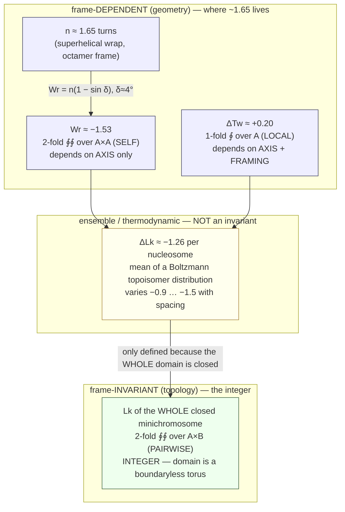

# The nucleosome's "~1.65 turns" — is it fixed, whose frame is it in, and what shape is it?

> **Research spike (2026-07-19; concertmaster dispatch).** Scoping/derivation only — no code shipped,
> no rc, no ADR. FORM-matching only: biology's X has the same cascade-shape as srmech's Y; this does
> **not** validate/extend the framework and biology is not superseded
> (`[[user_stance_cascade_matching_substrate_blind_form_not_identity]]`,
> `[[feedback_no_lineage_claims_in_notebook]]`). Provisional throughout.
> Companion to `chromatin_histone_structural_machinery_findings.md` (row 1 / gap **G3**) and
> `subharmonic_chirality_carrier_findings.md`.
> Generating script for every number below: `nucleosome_turn_asymmetry_frame_spike.py`
> (`[[feedback_computational_provenance_discipline]]`) — exact integer/Class-N rationals, Class-K
> pin-slot for sign, no `abs()`, no float in any load-bearing result.

---

## 0. The methodological gate — resolved FIRST, and it fires

**The gate fires harder than the dispatch assumed. Do not fit the decimal.**

Attested candidate constants against the target, and against the *real* spread:

| candidate | value | dev. from 1.65 |
|---|---|---|
| φ = (1+√5)/2 | 1.61803 | 0.03197 |
| 5/3 | 1.66667 | 0.01667 |
| 147/89 | 1.65169 | 0.00169 |
| 28/17 (= 14/8.5) | 1.64706 | 0.00294 |
| √e | 1.64872 | 0.00128 |

Worst deviation among **all** candidates = **0.05**. Against that:

- canonical-particle band alone: **1.65 – 1.70** → width **0.05**
- attested *physical* spread across particle classes: **1.20 – 1.90** → width **0.70** (14× larger)
- the **sign is not fixed**: handedness flips between **−0.80 ± 0.05** and **+0.86 ± 0.39** turns
  at a barrier of only **2.3 ± 0.4 k_BT** [PMC4623960]

Every candidate sits inside the *rounding* band of one crystal structure. **The target discriminates
nothing.** Any fit is unfalsifiable numerology. **[NULL — gate fires; no fitting performed below.]**

The φ-proximity is therefore explicitly **not evidence** of a phyllotaxis/optimal-packing shape. It is
2% off a number whose real physical range is 58% wide.

---

## 1. Q1 — Is it even fixed? **NO. It genuinely deviates. This is the spike's first-order finding.**

The literature spread is **not** measurement scatter. It decomposes cleanly:

**Convention/construct artifact (real scatter, resolved):**
- **146 vs 147 bp** — settled at **147**. The dyad lines up *with* a base pair, so the native count is
  **odd**; Luger 1997 used a 146 bp palindrome on the pre-structural assumption of an even count and
  the particle absorbed the 1 bp deficit by *stretching* [PMC4378457, McGinty & Tan 2014].
- **"1.65" vs "~1.7"** — same measurement, different rounding.
- **"1.75"** — **no OA source found. Treat as spurious.** [NULL]

**Real physical variance (the finding):**

| particle | wrapped bp | turns | source |
|---|---|---|---|
| H2A.B nucleosome | 103 | **1.2** | PMC7780145 |
| H3–H4 octasome | ~120 | **1.5** | PMC9659345 |
| canonical NCP | 145–147 | **1.65–1.7** | PMC4378457, PMC7780145 |
| chromatosome (+H1) | 166–167 | **1.9** | PMC7801413 |

Plus: salt-dependent unwrapping **7 ± 2 bp → 22 ± 5 bp** across physiological ionic strength
[PMC8129070]; *in vivo* range **~100–170 bp** [PMC8129070]; ΔLk per nucleosome varies **−1.4 to −0.9**
as a systematic function of nucleosome spacing [PMC5659657]; and the handedness inverts, with wrapping
orientation set by the *pre-assembly supercoiling state of the DNA*, i.e. **not uniquely determined by
the octamer** [PMC7959483].

Farr et al. 2021 name it directly: nucleosomes are "**a dynamic family of particles**", "highly dynamic
and structurally irregular entities" rather than "static building blocks" [PMC8129070].

**And the primary source said so in 1997.** Luger et al.'s own abstract closes:
> "The lack of uniformity between multiple histone/DNA-binding sites causes the DNA to **deviate from
> ideal superhelix geometry**." [PMID 9305837, abstract fetched]

**Q1 VERDICT: "the exact rational" was the wrong question.** There is no fixed value to find. The user's
reframe #2 is correct on the evidence — the object deviates, and the deviation is a function of variant,
salt, sequence, spacing, and supercoiling state. **This supersedes the framing of row 1 / G3 in
`chromatin_histone_structural_machinery_findings.md`**, which recorded "1.65 turns" as a fixed quantum.

**Premise corrections logged** (three prompt premises did not survive): H1 does **not** take the wrap to
an integer 2 turns (attested **1.9**); Klug & Lutter 1981 report **10.0** bp/turn, not 10.6 (the 10.6 is
Rhodes & Klug 1980 for DNA on a *flat surface*, identified with the *solution* value); the ~76 bp
unwrapping is the **high**-force transition, not the first [PMC9388122].

---

## 2. Q2 — Whose frame? **The k=2 frame-split reading is CONFIRMED at the geometry level and REFUTED at the "integer invariant" level.**

### 2.1 Attestation status: now attested (it was not in-tree before this spike)

`Lk = Tw + Wr` and the linking-number paradox were **absent** from
`chromatin_histone_structural_machinery_findings.md`. Both are now OA-attested:

- **Lk is an integer topological invariant; Tw and Wr are geometric and trade off continuously** —
  Benham 2024, *NAR* 52(1):22–48, DOI 10.1093/nar/gkad1092 (fully OA):
  > "**L is an integer, and has a fixed value so long as both DNA strands remain covalently closed.**"
  > "**Both W and T can change continuously as a DNA domain fluctuates… But in a ccDNA topoisomer their
  > sum, which is L, must remain a fixed integer.**"
- **Dennis & Hannay 2005**, arXiv:math-ph/0503012v2 (full text extracted): "this topological invariant
  is the sum of two other terms … **which individually depend on geometry rather than topology**."

### 2.2 The frame-split reading — SUPPORTED, and stronger than posed

The literature does not merely *treat* 1.65 turns as writhe-side; it publishes the explicit conversion
**Wr = n(1 − sin δ)** [PMC6162219, Segura et al. 2018]. So "turns" and "writhe" are **not even the same
geometric quantity** — there are **two** geometric stages before any topology:

```
   1.65 turns  --(pitch-angle δ≈4°)-->  Wr ≈ −1.53  --(+ΔTw)-->  ΔLk
   [frame-dependent]                    [frame-dependent]        [measured]
```

Reproduced exactly (Class-N rationals, srmech `sin_series_truncate`): −1.65 × (1 − sin 4°) = **−1.5349**
vs published **−1.53**. ✓ Sensitivity: δ=3° → −1.564; δ=5° → −1.506.

### 2.3 The refutation: **ΔLk per nucleosome is NOT the integer invariant**

This is where the dispatch hypothesis breaks, and it matters:

- The integer invariance predicate is **closure of the whole domain** — "so long as both DNA strands
  remain covalently closed" [Benham 2024]. It lives on the *whole minichromosome*, not per nucleosome.
- Segura 2018 measures ΔLk = **−7.07** for the whole minichromosome and **−1.26** per nucleosome — both
  non-integers, obtained by **subtracting the means of two topoisomer distributions**, which are
  Boltzmann-populated because "**the energy difference between the Lk topoisomers is less than the
  thermal energy**" [PMC6162219].
- **Călugăreanu–White–Fuller does not apply to open segments at all.** Sierzega, Wereszczynski & Prior
  2021 [PMC7811023]: "**the linking … is not an invariant for open-ended ribbon structures**";
  "**there is no evidence that the equality in (1) holds if the ribbon is not closed**"; and artificial
  closure "**will generally contribute to both the writhing and the linking of the composite**."

**Q2 VERDICT:** ~1.65 turns **is** a frame-dependent geometric half of a k=2 pair — attested, twice over.
But the other half is **not an integer invariant**; it is a real-valued, ensemble-averaged,
thermodynamic *local linking difference* (Fuller 1978's reference-ribbon construction is what lets a
per-nucleosome number be extracted from a globally-closed molecule at all [PMC392823, abstract]).
**Both members of the pair are on the geometry/statistics side. The integer sits above both, at the
whole-domain scale, where no per-nucleosome number exists.** The honest object is therefore *not* an
exact rational and *not* an integer — it is a distribution.

### 2.4 The frame-ledger reconciliation (exact)

Every published "disagreement" closes its own ledger — because `Lk = Tw + Wr` is a **theorem**:

| account | regime | Wr | ΔTw | ΔLk | closes? |
|---|---|---|---|---|---|
| classical textbook | ΔLk **assumed** −1.0 | −1.70 | +0.70 | −1.00 | ✓ resid 0 |
| Segura 2018 | ΔLk **measured** −1.26 | −1.46 | +0.20 | −1.26 | ✓ resid 0 |
| Nikitina 2017 | ΔTw **held** at 0 | −1.70 | 0 | −1.70 | ✓ resid 0 |

The three OA accounts differ **only in which member is held/assumed**. But one gap is *not* a frame
choice: the classical **postulates** ΔLk = −1.00 while Segura **measures** −1.26 — a **0.26** gap between
an assumption and a measurement. **The frame reading does not dissolve it.** Separately, Segura's own
geometric Wr(−1.53) + ΔTw(+0.20) = −1.33 vs measured −1.26, a **0.07** gap they attribute to DNA
breathing — i.e. Q1's variance re-entering the topology.

---

## 3. Q3 — What is the shape? (broad enumeration; two survive, three fail)

### 3.0 Direct answer to the user's reframe #1 — and its honest limit

*"What discrete op⊗operand⊗responsion structure, at what coherency, has this value as its projection —
with a FORMULA, not a fit."*

**Answer, for the twist term:** the discrete substrate quantity is the **integer 14** — the octamer's
minor-groove contact count [ATTESTED, PMC4512544]. The coherency is **exact commensuration**, where the
DNA's helical repeat divides the wrap into exactly one turn per anchor:

```
   coherency condition:   N / h = 14      ⟺   h = N/14 = 147/14 = 21/2 = 10.5 bp/turn
   the formula:           ΔØ = N · (1/hs − 1/h0)        [detuning from that coherency]
   at hs = 51/5, h0 = 21/2, N = 147:  ΔØ = 7/17  exactly
```

The continuous quantities — 10.2 bp/turn, ΔØ, ΔTw — are **projections of the integer 14 under a
detuning**. (14 anchors bound 13 unit intervals plus a half-turn overhang at each end: 13×10.5 + 2×5.25
= 147 = 14×10.5. Both accountings agree.)

**The limit, stated plainly: this derives ΔØ. It does NOT derive 1.65.** The wrap count is a separate
geometric fact (superhelix pitch and radius), and per **Q1 there is no fixed 1.65 to derive** — so the
correct conclusion is not "we haven't found the formula yet" but "the quantity the reframe asked about
turns out not to be a constant." The formula exists for the member that *is* structurally determined.

| # | candidate shape | mechanism | independent observable predicted | attestation | verdict |
|---|---|---|---|---|---|
| S1 | **Two-periodicity beat / moiré** | surface *h*ₛ ≈ 10.2 vs solution *h*₀ ≈ 10.5 bp/turn; the detuning integrated over the wrap **is** the twist term | ΔTw should track (1/hₛ − 1/h₀)·N across *any* surface-wrapped DNA, not just nucleosomes | numbers ATTESTED [PMC6162219]; **derivation is ours** | **SURVIVES, but under-determined** — §3.1 |
| S2 | **ℤ/14 contact-lattice commensuration** | 14 minor-groove-inward anchors, one arginine each, at SHL −6.5…+6.5 | sub/super-nucleosomal particles wrap **k × 10.5 bp** for their own contact count *k*; and a computable ΔLk per *k* | contacts ATTESTED [PMC4512544] | **DEGRADED (2026-07-19)** — fails a k-independent 3.49σ test and cannot represent the observed bistability — §3.2.1 |
| S3 | structure-**blind** 10.5 bp quantisation | "all wrap lengths are near multiples of 10.5" | variant bp counts cluster at multiples of the spacing | — | **NULL** — §3.2 |
| S4 | **φ / phyllotaxis / optimal divergence** | golden-angle packing | a 137.5° divergence between successive contacts | — | **NULL** — observed advance is 42.4°/contact; and §0 kills the fit |
| S5 | **Kuramoto / Arnold-tongue mode-locking** | phase-lock of two coupled periodicities with a critical coupling | a *coupling-strength threshold* below which the lock breaks; hysteresis | — | **NOT TESTED — fermata F-c** |

### 3.1 S1 — the beat, exact, and its hazard

Exact Class-N arithmetic with *h*ₛ = 51/5, *h*₀ = 21/2, *N* = 147:

```
  1/hs − 1/h0 = 1/357  turns per bp
  ΔØ = 147 × 1/357   = 441/1071 = 7/17 = 0.411765 turns   [147 = 3·7²; 1071 = 3²·7·17]
```

**ΔØ = 7/17 exactly**, reproducing Segura's published "ΔØ ≈ +0.4". A second, independent verification run
converged on the same value from the other direction (147/10.2 = 14.41 vs 147/10.5 = 14.00) —
**convergence**, not dissonance.

> **This is a VERIFICATION of Segura et al.'s published arithmetic, not a discovery.** Both halves of
> their decomposition now reproduce from published geometry alone: ΔØ = 7/17 ≈ +0.412, and
> −1.65(1 − sin 4°) = −1.5349 vs their Wr = −1.53; their ΔTw ≈ +0.2 closes as +0.412 − 0.19 (STw) =
> +0.222. What the framework adds is the *reading* — that the term is a **commensuration detuning off an
> integer lattice** — not the numbers. `[[feedback_no_lineage_claims_in_notebook]]`.

And at the *solution* periodicity the commensuration is **exact**:

```
  N / h0 = 147 / (21/2) = 14 exactly   ← 14 helical turns == 14 contacts, one turn per contact
  N / hs = 147 / (51/5) = 245/17 = 14.4118
  detuning                            = 7/17
```

So the twist term **is** the detuning of the DNA from an exact 14-fold commensuration with the octamer's
contact lattice. That is a genuine closed-form reading, and the two-periodicity beat is real.

**The hazard, which is load-bearing.** ΔØ is a *difference of reciprocals* and is therefore hypersensitive
to inputs that the OA literature does not pin. Across the attested periodicity values:

| *h*ₛ | *h*₀ | ΔØ exact | ΔØ |
|---|---|---|---|
| 10.0 (Klug & Lutter 1981) | 10.5 | 7/10 | 0.700 |
| 10.1 (Chandrasekhar 2024) | 10.5 | 56/101 | 0.554 |
| **10.2 (Segura 2018)** | **10.5** | **7/17** | **0.412** |
| 10.4 (Bishop 2008) | 10.5 | 7/52 | 0.135 |

**Span = 0.632 turns — comparable to the entire physical spread of ΔLk (−0.9 to −1.5, width 0.6) that
the term is invoked to explain.** So the periodicity-difference "resolution" of the paradox is **not
quantitatively constrained by the attested data**. This independently explains why the three OA accounts
disagree on mechanism (core overtwist vs. linker geometry vs. more-negative-ΔLk): *the beat term is free
enough to absorb any of them.* **[ANOMALY — logged §5.]**

### 3.2 S2/S3 — the contact lattice; a null and a survivor

**ATTESTED** [Hodges et al. 2015, *Genetics*, PMC4512544]:
> "These interactions occur primarily at **14 locations** in the nucleosome structure where the **DNA
> minor groove faces the histone octamer** [**superhelical locations (SHL) −6.5 to 6.5**]." …
> "**At each of these locations, an arginine side chain extends into the DNA minor groove.**"

**S3 (structure-blind) is NULL.** Testing "is bp/spacing near an integer" across 10 attested particles,
against a Uniform[0, s/2] null (mean s/4, var s²/48; z² reported exactly):

| spacing | mean \|resid\| | null | z² | \|z\| | verdict |
|---|---|---|---|---|---|
| 10.5 bp | 2.300 | 2.625 | 338/735 | 0.68σ | **NULL** — better than random but far under 2σ |
| 10.0 bp | 2.800 | 2.500 | 54/125 | 0.66σ | **NULL** — *worse* than random |

**[NULL — structure-blind quantisation has no support.]**

**S2 (structure-aware) survives.** Using each particle's *own* contact count k and bp = k × 10.5:

| particle | contacts k | predicted bp | observed | resid |
|---|---|---|---|---|
| octamer NCP | 14 | 147.0 | 147 | 0.0 |
| hexasome (−1 H2A–H2B) | 11 | 115.5 | 110–120 | −0.5 |
| chromatosome (+H1) | 16 | 168.0 | 166–167 | −1.0 |
| H2A.B | **10 (predicted)** | 105.0 | 103 | −2.0 |
| H3–H4 octasome | 11 | 115.5 | ~120 | +4.5 |
| tetrasome (H3–H4)₂ | 6 | 63.0 | ~70 | +7.0 ✗ |

5/6 within half a contact-spacing. **Circularity caveat (load-bearing):** *k* is usually read off the same
structures the bp count comes from. The reading is non-circular only where *k* is fixed independently by
*which histone fold is deleted* — hexasome, tetrasome, chromatosome. **The one genuine open prediction is
H2A.B ⇒ k = 10**, which would need an independent contact count to test.

**Independent-observable the surviving pair jointly predicts (the falsifiable core):** the contact count
and the surface periodicity are **not independent facts** — 14 anchors distributed over 147 bp *is* the
constraint forcing *h*ₛ ≈ 10.2 rather than 10.5. So **k → hₛ → ΔØ → ΔTw → ΔLk is one causal chain**, and
the prediction is: *a particle with a different contact count k should show a **different surface
periodicity**, hence a different ΔTw, hence a shifted ΔLk — with the shift computable in closed form.*
For a hexasome (k=11): predicted hₛ = 115.5/11.29… — **testable against measured ΔLk for hexasomes.**
Not tested here (no OA hexasome ΔLk located). **[FERMATA F-a.]**

### 3.2.1 S2 DOWNGRADED — the first per-particle ΔLk at *k* ≠ 14 (amendment, 2026-07-19)

> **Verdict change: S2 goes from "survives with a caveat" to DEGRADED. It is NOT recorded as having
> survived a test.** Source of the datum and the σ computation: the **open-experiments spike** and its
> committed provenance script. Structural checks below independently re-derived here.

**The datum [ATTESTED-OA, CC BY]** — Vlijm R, Lee M, Ordu O, et al. (2015), *PLoS One* 10(10):e0141267,
DOI 10.1371/journal.pone.0141267, **PMC4623960**: the **tetrasome** ΔLk is a bistable pair, flipping
between **−0.80 ± 0.05** and **+0.86 ± 0.39** turns, barrier **2.3 ± 0.4 k_BT**. **This is the first
per-particle ΔLk at *k* ≠ 14 in our ledger** — exactly the class of test F-a asks for.

**S2 fails it three ways, in increasing severity:**

1. **A 3.49σ miss using the OBSERVED wrap — and this is *k*-independent.** Because the test uses the
   *measured* N rather than S2's own `bp = k × 10.5`, the *k*=6-vs-7 ambiguity **cannot rescue it**.
   (4.74σ using the S2-predicted wrap.)
2. **The residual SIGN FLIPS between particles** — **+0.053** at canonical (N=147) vs **−0.175 / −0.237**
   at tetrasome (N=70). Re-derived independently: a correction term `c·N` needs
   `c = +0.000361` for canonical but `c = −0.002500 / −0.003386` for the tetrasome branches; and a term
   monotone in N **cannot change sign between two positive N**. **No law linear in N fits both.**
3. **Decisive — an arity failure, not a fit failure.** S2 is a **function** *k* → ΔLk: one input, one
   output. The observed particle occupies **two** states at the **same** *k*, separated by **1.66 turns**
   and thermally interconverting. **S2 cannot represent this particle at all.** No re-parameterisation
   fixes arity.

**Why it doesn't cleanly die — and why that is the indictment, not a reprieve.** The σ miss *can* be
absorbed by re-choosing unattested auxiliary scalings. **That freedom is exactly anomaly A1** — the beat
term is under-determined to the width of the quantity it explains, so it can absorb almost any residual
handed to it. Therefore:

> **A hypothesis that cannot be falsified is not passing a test when it survives one.**

**This REINFORCES A1; it does not resolve S2.** S2's survival here is a symptom of the under-determination,
not evidence for the shape.

**Diagnosis in in-tree vocabulary — naming the failure, NOT repairing it.** The two branches are near-equal
in magnitude (0.80 vs 0.86, differing by 0.06) and opposite in sign — the "**±-pair at equal magnitude,
differing only by orientation**" of `subharmonic_chirality_carrier_findings.md` §1–2. So the precise defect
is that **S2 is a magnitude-only law with no chirality degree of freedom** ("a lone theta is a lone
chirality"). **Flagged explicitly: this is a diagnosis, not a consolation result and not a rescue. S2 stays
DEGRADED.** Whether a ±-pair-valued successor is worth building is a conductor question, not a claim here.

**F-a remains OPEN.** The tetrasome tests S2 but does **not** close F-a: the **hexasome (*k*=11)** is still
the cleanest test — no bistability confound. The open-experiments spike could not locate hexasome ΔLk
(deep null: four search families plus raw-byte grep across six papers).

### 3.3 Frame both-directions check (`[[feedback_always_check_both_directions_including_time]]`)

Every candidate above assumes the **octamer frame** (n turns of DNA about a fixed protein). Reciprocal
frame — hold Wr, solve n = Wr/(1 − sin δ):

| given | n (turns) | Class-N anchor |
|---|---|---|
| ΔWr = −1.46 (Segura implied) | 1.5695 | 11/7 |
| ΔLk = −1.26 (Segura measured) | 1.3545 | 23/17 |
| ΔLk = −1.70 (Nikitina, ΔTw=0) | 1.8275 | 53/29 |
| ΔLk = −1.00 (classical) | 1.0750 | 29/27 |

The reciprocal-frame values span **1.08 – 1.83** — reinforcing §0: which number you call "the turns"
depends entirely on which member you held.

---

## 4. The k=3 reading — `Lk ⊗ Tw ⊗ Wr` (conductor's mid-task angle)

> **Epistemic ceiling, stated first and hard.** `Lk = Tw + Wr` is an established theorem of differential
> geometry (Călugăreanu 1959/61, White 1969, Fuller 1971). Everything below is **our framework's reading
> of a structure that already exists and is already documented**. Nothing here is a discovery, and the
> mathematics is **not** "secretly k=3." Form-matching only.

### 4.1 The type-asymmetry is real, and the three-way scope distinction is ATTESTED

All three integral forms attested from Dennis & Hannay 2005 (arXiv:math-ph/0503012v2, full text):

| member | integral form | domain | depends on | value type |
|---|---|---|---|---|
| **Tw** | `(1/2π) ∮_A ds (t × u)·u̇` | **1-fold**, one curve | axis **+ framing** | real |
| **Wr** | `(1/4π) ∮_A ds ∮_A ds′ …` | **2-fold, A×A** (self) | axis **only** | real |
| **Lk** | `(1/4π) ∮_A ds ∮_B ds′ …` | **2-fold, A×B** (two curves) | **neither — invariant** | **integer** |

> "**Tw is local in the sense that it is an integral of quantities defined only by s on the curve, and
> clearly depends on the choice of framing (ribbon).**"
> "writhe Wr equals the sum of signed **nonlocal** crossings … **twice the average of self-crossings of
> the axis curve with itself**"
> "The crossings between the two edge curves naturally fall into two types: **'local,' which will be
> associated with Tw, and 'nonlocal,' which will be associated with Wr.**"

Note the three-way locality structure is **the source's own organizing principle**, not our imposition —
Dennis & Hannay build their proof on the local/nonlocal crossing split.

**Where the integer comes from — ATTESTED:**
> "The domain of integration in equation (3.2), A × B, is the cross chord manifold … topologically
> equivalent to the torus … with the torus 'wrapping around' the sphere **an integer number of times**
> (the integer arises since the cross chord manifold **has no boundary**, and the mapping is smooth)"

**[SYNTHESIS — ours, not attested]** The integral-arity *ladder* framing (1-fold / 2-fold-self /
2-fold-pairwise), and the inference that the invariant sits on **Lk** and not **Wr** *despite both being
Gauss double integrals* because the self-domain A×A carries a diagonal singularity at s = s′ while A×B is
closed and boundaryless. Dennis & Hannay state each ingredient; the ladder reading is ours. Flagged so it
is not mistaken for a cited result.

### 4.2 Why this argues *natively triadic* rather than 2+1 — the differing-bipartition test

The strongest honest support is not "there are three terms" (trivial) but that **different criteria pick
different odd-ones-out**:

- by **value type** (integer vs real): **Lk** stands out
- by **integral arity** (1-fold vs 2-fold): **Tw** stands out
- by **dependency set**: all three differ — Tw depends on axis+framing, Wr on axis only, Lk on neither

If the object were a k=2 pair with a labelled third, every criterion would yield the *same* bipartition.
It does not. That is a checkable statement, and it is the only part of the k=3 reading that earns its
keep on evidence rather than aesthetics.

### 4.3 Candidate assignment — weighed, not assumed

The conductor proposed Tw = op, Wr = operand, Lk = responsion. This aligns with **srmech's own shipped
responsion schema**, which keys on `(operator, carrier) → responsion{answers_with, status}` — i.e. an
*acting* member, a *carried* member, and an *answering correspondence that verifies*
(`srmech.amsc.responsion_schema`, 23 edges, rc225). On that shape:

- **Tw = op** — the local action applied pointwise along the curve ✓ (attested local)
- **Wr = operand** — the global embedding being acted on ✓ (attested axis-only, self-referential)
- **Lk = responsion** — the *pairwise* correspondence **between the two ribbon edges**, invariant, integer
  ✓ (attested two-curve; and "stored relationship between two strands" is on the nose for srmech)

**Alternatives weighed and rejected as worse fits**, not as impossible: (a) Wr = op — rejected, writhe is
a property of the axis, not an action; (b) Lk = op — rejected, Lk is not an action and is invariant under
the deformations op would perform; (c) Tw = responsion — rejected, Tw is framing-dependent and so cannot
be the verifying member. **But note the algebra is symmetric** — Tw = Lk − Wr and Wr = Lk − Tw are equally
valid rearrangements. **What breaks the symmetry is the type/locality structure of §4.1, not the algebra.**
Absent that table, the assignment would be unmotivated.

### 4.4 The three "centrisms" — **2 attested-direct + 1 derived**

| regime | physical realization | attestation | status |
|---|---|---|---|
| **hold Lk** → Tw/Wr trade | ccDNA topoisomer; single-molecule torsion on chromatin fibers | Benham 2024; Kaczmarczyk 2020 [PMC6949304]: "**At fixed linking number, this must be compensated by increased twist in the DNA handles**" | **ATTESTED, canonical** |
| **hold Tw** → Lk/Wr co-vary | ΔTw=0 idealization; torsionally-relaxed / nicked DNA | Nikitina 2017: "**if the DNA Twist is not changed (ΔTw = 0)**"; Corless & Gilbert 2016 [PMC5153829]: "**Most of the linker DNA in eukaryotes is torsionally relaxed**" | **ATTESTED** (caveat: nicking destroys closure, so Lk ceases to be *defined*, not merely varies) |
| **hold Wr** → Lk/Tw co-vary | DNA axis path pinned by the octamer's 14 contacts | **DERIVED** from attested premises — §4.4.0. (The surface-adapted SLk formalism is separately OA-attested, §4.4.1, but is a *different* decomposition and is not the basis.) | **DERIVED** (mathematically entailed; physically approximate) |

**k=3 VERDICT (revised 2026-07-19): the composition is 2 attested-direct + 1 DERIVED.** Stated in exactly
those terms so this is never later read as three citations. A **derived** result is first-class here, not a
lesser tier — see the methodology note in §4.4.0.

### 4.4.0 Regime (iii), DERIVED — the derivation, shown so it can be checked

> **This is OUR derivation, not a citation.** It is written out step-by-step precisely so a reader can
> check it against premises they can fetch themselves, rather than take our word for it.

**Premises (all attested, all openly fetchable):**

- **P1** — **Wr = W[A], a functional of the AXIS CURVE ALONE.** Dennis & Hannay (arXiv:math-ph/0503012v2):
  both writhe integrations run over A; Benham 2024 *NAR*: "**W is a geometric parameter determined by the
  shape of the central axis curve C**."
- **P2** — **Lk = Tw + Wr**, for a **closed** ribbon. Benham 2024 *NAR*; Dennis & Hannay.
- **P3** — **the octamer's 14 contacts pin the DNA axis path.** Hodges et al. 2015 [PMC4512544]: 14
  minor-groove-inward locations, an arginine inserted at each. Corless & Gilbert [PMC5153829]: "each
  nucleosome in the genome **constrains** a single under-wound supercoil."

**Derivation:**

- **D1.** From **P1**, Wr is a function of A. Therefore **fixing A fixes Wr**.
  *Direction check (the step most likely to be got backwards):* `{A fixed} ⇒ {Wr fixed}` is **sufficient,
  not necessary** — distinct axis curves can share a writhe. Only sufficiency is needed to *exhibit* a
  realization, so the direction used here is the valid one.
- **D2.** From **P2** with Wr held constant: `ΔLk = ΔTw + 0`, i.e. **ΔLk = ΔTw exactly** — Lk and Tw
  co-vary one-for-one. **That is regime (iii).**
- **D3.** **D1 + D2 use no biology whatsoever.** The regime is **mathematically well-posed on the theorem
  plus the axis-only dependency alone.** This is stronger than the "physical realization" framing this note
  carried before the re-examination.
- **D4.** From **P3**, the nucleosome **physically realizes** the constraint — **approximately**. Q1's
  breathing/unwrapping/variance is exactly the size of the approximation, and is not hidden here.
- **Inherited condition:** closure of the ribbon (P2) — **the same condition regimes (i) and (ii) inherit.**
  No extra assumption is smuggled in for (iii).

**Entailment verdict, stated honestly:** the **mathematical** claim is **entailed** (D1–D3, airtight). The
**physical** claim is **approximate** (D4), bounded by Q1. Regime (iii) is therefore well-posed.

**Consistency test** — apply the regime to Segura's own data and check whether the residual is a *known*
term or an unexplained one:

```
   hold Wr = −1.53  (octamer geometry)
   measured ΔLk     = −1.26
   ⇒ ΔTw implied by regime (iii) = ΔLk − Wr = 27/100 = +0.270
     Segura's stated ΔTw          =            +0.200
     residual                     =             0.070
```

The residual **0.07 is not new and not unexplained** — it is the *same* breathing gap already isolated in
§2.4. The regime reproduces the known ledger and its residual lands on a term the literature already names.
**Consistent.**

> **Methodology — standing practice from 2026-07-19, not a one-off.** *A paywalled result is not a dead
> end: derive it from open premises and show the steps.* The rule against unquotable sources exists for
> **open quotability**, not cost — a source no reader can open makes them **trust us instead of check us**.
> A derivation from premises anyone can fetch is therefore **more** re-verifiable than a citation nobody
> can read, and re-verifiability is what attestation is *for*. **A result labelled DERIVED is first-class.**
> Guard-rail: deriving is *not* permission to assume — if the premises do not entail the conclusion, say so
> and leave the gap open.

### 4.4.1 The SLk decomposition — what the F-b hunt did and did not deliver

**FOUND [ATTESTED-OA, CC BY-NC]** — Chen B, Xiao Y, Liu C, Li C, Leng F (2010), "DNA linking number change
induced by sequence-specific DNA-binding proteins," *Nucleic Acids Research* 38(11):3643–3654,
DOI 10.1093/nar/gkq078, **PMC2887952** (Europe PMC reports `isOpenAccess: Y`, `license: cc by-nc`):

> "White *et al.* also showed that ΔLk can be described by two geometrical terms: the surface linking
> number (SLk) and the winding number (ϕ). In this case, **ΔLk = ΔSLk + Δϕ**."

and, applied to the paradox itself:

> "It has been known for a long time that 146 bp of DNA wrap around the histone octamer core **1.8 turns**
> in a left-handed superhelix. In this case, **ΔSLk = −1.8**. Initially, it was mis-expected that
> ΔLk = ΔSLk, which resulted in the 'linking number paradox' … **ΔLk = ΔSLk + Δϕ**, where Δϕ = −0.8 and
> significantly compensated the ΔSLk to yield **ΔLk = −1**."

**Corroboration [ATTESTED-OA, CC BY]** — Segura 2018 [PMC6162219], already in our ledger, turns out to
carry the White-1988 attribution explicitly and states the twist-side form: ΔTw = ΔØ + ΔSTw, where "the
winding number (Ø) **depends on the helical repeat** of DNA at the nucleosome surface (hs), and the surface
twist (STw) is a **correction function that accounts for the curved path** of DNA." Our existing
attestation was stronger than recorded.

**NULL — the load-bearing gap.** No OA source states that **SLk is independent of the helical repeat /
determined by the surface alone**, nor "hold the surface fixed ⇒ SLk fixed." A Europe PMC full-text search
for the exact phrase `"surface linking number"` returns **10 records in the entire indexed literature, of
which exactly one is in the OA subset** — the formalism lives almost entirely in paywalled 1988–1994
Science/JMB/Springer literature. Confirmed misses: **Benham 2024 NAR — zero occurrences** of SLk/STw/White
(the highest-probability hit, a clean miss); Nikitina 2017 **cites without restating** ("according to the
surface linking theory (24)") — rejected on exactly the cite-vs-restate line; Prunell 1998 and White/Gallo/
Bauer 1989 *NAR* are free but **scanned images, no text layer**; Leng 2016 *Biophys Rev* restates the
equation but is **free-to-read, NOT OA-licensed** (`isOpenAccess: N`) — a weaker tier, not used; Swigon 2009
paywalled; arXiv full-text search returned **0 entries**.

### 4.5 Falsifiability — stated plainly, including what CANNOT falsify

**What CANNOT falsify it:** the closure condition `Lk − Tw − Wr = 0`. It is a **theorem**; it closes with
residual exactly 0 in all three published accounts (§2.4) and could not have done otherwise. **Any test
built on the closure is vacuous.** The dispatch's proposed falsifier ("the three descriptions must give
mutually consistent accounts of the same data") is therefore **not a test** — it is guaranteed. Reported
as such.

**What WOULD falsify it, and the current standing:**
1. If Tw were also a Gauss double integral (same kind as Wr and Lk) → 3-scope claim collapses.
   → **Survives**: attested 1-fold.
2. If any two members shared an identical dependency set → not natively triadic, it is 2+1.
   → **Survives**: §4.1 table, all three differ.
3. If any of the three hold-one-fixed regimes were ill-posed or physically unrealizable.
   → **SURVIVES (2026-07-19).** Regimes (i) and (ii) attested-direct; regime (iii) **derived** and
   well-posed (§4.4.0), with the derivation shown so it can be checked. *Note the honest asymmetry:*
   (i) and (ii) have directly attested *physical* instances; (iii) has an entailed *mathematical*
   well-posedness plus an approximate physical realization. That is a difference in **kind of evidence**,
   not a shortfall — but it is stated rather than smoothed over.
4. If the differing-bipartition test (§4.2) failed — i.e. some criterion made the same bipartition
   canonical across all three axes. → **Survives** on the three criteria tested.

### 4.6 Numerology hazard — the codon-radix k=3 link, checked and **rejected**

Per instruction, tested rather than assumed. Two independent hazards, both cleared:

- **k=3 (triality) vs k=3 (codon radix)**: both are 3. That is a coincidence of the smallest non-trivial
  error-correcting arity until a *shape* correspondence is shown. `Lk/Tw/Wr` is a
  one-invariant-two-projections triad; the codon radix is a 4³=64 alphabet cardinality. **No shape match
  demonstrated. Do not link. [FLAGGED, not used as evidence.]**
- **14 contacts vs the framework's 14 A–N classes**: the totals coincide; the **partitions do not**.
  A–N is `1+3+7+3` (sorted `[1,3,3,7]`); the nucleosome contact inventory is `3+3+3+3+2` by histone-fold
  dimer (sorted `[2,3,3,3,3]`). Cascade-matching compares **shape, not cardinality**, and there is no part
  larger than 3 on the biology side. **[NULL — hazard explicitly cleared, and worth keeping cleared.]**

---

## 5. Diagrams

**The Tw/Wr frame-split, and where the integer actually lives:**



**The two-periodicity beat (why the octamer's 14-fold lattice detunes the DNA):**

```
   contact lattice (octamer):   |....|....|....|....|....|....|....|....|....|....|....|....|....|....|
                                 1    2    3    4    5    6    7    8    9   10   11   12   13   14
                                SHL −6.5 ......................... 0 ......................... +6.5
                                 └── 14 anchors, one arginine into the minor groove at each ──┘

   DNA at SOLUTION periodicity h0 = 10.5 bp/turn :  147 / 10.5 = 14.000 turns   ← EXACTLY commensurate
   DNA at SURFACE  periodicity hs = 10.2 bp/turn :  147 / 10.2 = 14.412 turns   ← detuned

                                          detuning = 7/17 = 0.412 turns  ==  ΔØ
                                                    │
                                  this beat IS the twist term in the paradox
```

---

## 6. Anomalies

**A1 — The beat term is under-determined to the width of the thing it explains.** ΔØ spans 0.135–0.700
across the attested periodicity inputs (span 0.632), while the whole physical ΔLk spread is 0.6. The
periodicity-difference resolution of the linking-number paradox is therefore *not pinned by OA data*.
**Investigation:** exact reciprocal-difference arithmetic, 4 attested *h*ₛ × 2 attested *h*₀.
**Verdict:** real; independently explains the live three-way mechanism disagreement in the OA literature
(Segura core-overtwist vs Nikitina linker-geometry vs classical). **Next:** an OA source that pins *h*ₛ
with error bars would collapse it; none located.

**A2 — Assumption-vs-measurement gap of 0.26 turns.** The classical ΔLk = −1.00 is a *postulate*;
Segura's −1.26 is a *measurement* [PMC6162219]. Frame-reading does **not** dissolve this — it is a factual
disagreement, and the textbook value is the weaker of the two. **Next:** conductor decision on whether any
in-tree row may cite −1.0.

**A9 — a retrieval failure against ourselves: we already held the answer and filed it under the wrong
question.** The tetrasome ΔLk pair (−0.80 / +0.86, PMC4623960) that downgraded S2 was **already in-tree —
quoted in §0 of this very note** — but filed as a **handedness anecdote** ("the sign is not fixed"), not as
**a per-particle ΔLk at *k* ≠ 14**. F-a was asking for exactly that, and a separate spike had to re-find it.
**Investigation:** cross-check of §0 against the open-experiments spike's find. **Verdict:** real, and ours.
The datum was never missing; the *index* was wrong — it was catalogued by the property that first caught our
attention rather than by the quantity it measures. **Next:** when a number is recorded, record *what
quantity it is* and *what tests it could serve*, not only the point it was cited to make. Note this is the
same failure mode as **A5** one level up: A5 found the *literature* conflating four quantities as bare
numbers; A9 finds *us* filing one quantity under the wrong question. **The MPM ledger indexes provenance
well and queryability badly.**

**A4 — the Chen 2010 SLk ledger does NOT close arithmetically as printed.** The quoted sentence gives
ΔSLk = −1.8, Δϕ = **−0.8**, ΔLk = −1. But −1.8 + (−0.8) = **−2.6 ≠ −1**. The word "compensated" requires
*opposite* signs, and **Δϕ = +0.8 closes exactly**: −1.8 + 0.8 = −1.0. **Investigation:** exact rational
differencing (provenance script, block A4). **Verdict:** a sign error in the printed text or in the
extraction — unresolved either way. **The magnitude 0.8 is usable; the sign as printed is not. Do not rest
anything on the −0.8 figure.** **Next:** re-fetch the published PDF/typeset version to see whether the
minus is in the paper or in the XML extraction. Math doesn't lie — flagged rather than quietly corrected.

**A5 — four DIFFERENT quantities are reported in the literature as bare numbers near 1–2.** The spread
"1.65 / 1.7 / 1.8 / 1.9" is *not* four measurements of one thing:

| value | context | quantity |
|---|---|---|
| 1.2 / 1.5 / 1.65 / 1.7 / 1.9 | variant wraps | **superhelical turns** |
| **1.8** | Chen 2010, "146 bp … 1.8 turns"; ΔSLk = −1.8 | **surface linking / wrapping number** |
| −1.53 | Wr = n(1 − sin δ) | **writhe** |
| −1.26 / −1.00 | per-nucleosome (measured / postulated) | **linking difference** |

The **1.8 is not a sixth measurement of the wrap — it is a different quantity.** So part of the apparent
"disagreement about 1.65" in the literature is not disagreement at all; it is **the same frame confusion
this spike is about, appearing in the source literature itself.** This independently reinforces §0 (the
target does not discriminate) and §2 (the honest object is frame-specified or it is nothing). **Verdict:**
real; **next:** any in-tree row quoting a bare "turns" number must name *which quantity* it is.

**A3 — Search-summary text did not survive fetch.** A search result attributed "~10.2 bp periodicity …
14 independent sites" to Jin, Rube & Song 2016 *NAR*; on fetch **the sentences were not in the paper**
(it discusses 10.5 bp and never mentions 14 sites). Logged as a live instance of the hallucination vector
MPM exists to catch. **Do not cite that pairing.**

---

## 7. Fermatas (conductor decisions — this pass is NOT authorized to decide)

- **F-a (the real test). — STILL OPEN 2026-07-19; partially answered, not closed.** The k→hₛ→ΔØ→ΔTw→ΔLk
  chain predicts a *computable ΔLk shift* per contact count. The **tetrasome** ΔLk has now been found
  (Vlijm 2015, PMC4623960) and **S2 fails against it** (§3.2.1) — but the tetrasome does **not** close F-a,
  because its bistability confounds the test that F-a was designed to run. **The hexasome (*k*=11) remains
  the cleanest instrument** — single-valued, one dimer removed, no chirality confound. Hexasome ΔLk is a
  **deep null**: four search families plus raw-byte grep across six papers, nothing. Dispatch a dedicated
  hunt, or accept the null and let §3.2.1 stand as the verdict on S2?
- **F-b (regime iii). — CHASED 2026-07-19; PARTIAL FIND + a residual NULL.** An OA restatement of the SLk
  decomposition **was** found (Chen et al. 2010, PMC2887952, CC BY-NC — §4.4.1), and our existing Segura
  attestation turned out to carry the White-1988 attribution already. **But regime (iii) is still not
  closed:** SLk is a *different* decomposition, and the invariance property the regime needs has **no OA
  restatement** (10 records corpus-wide; 1 in the OA subset). **k=3 stays at 2/3 + 1-by-inference — the
  standard was not weakened to close it.** Anomaly **A4** (the Chen ledger does not close as printed) is
  open and should be resolved before that source is used for anything numeric.
- **F-h (abstract-tier attestation). — RESOLVED 2026-07-19. My own proposal was WITHDRAWN, correctly.**
  I had raised whether the free White 1988 *abstract* was admissible. **It is not**, and the reasoning
  corrects the premise I raised it on: **the rule's rationale is OPEN QUOTABILITY, not cost.** A source no
  reader can open makes them **trust us instead of check us**. So: no abstract-tier, no free-to-read tier,
  **no laundering of unquotable authority into the record.** White/Cozzarelli/Bauer 1988 is a **pointer
  only**, never a basis. The gap it appeared to leave was **not a gap** — the answer was already in hand as
  a derivation (§4.4.0), and a derivation from open premises is *more* re-verifiable than an unreadable
  citation. Standing practice recorded in §4.4.0.
- **F-c (S5 untested).** Kuramoto/Arnold-tongue mode-locking was enumerated but **not tested**. srmech
  ships `cascade.kuramoto_step` with Sakaguchi-α + directed adjacency — the instrument exists. Worth a
  spike, given §3.1 shows the system *is* a two-periodicity detuning problem?
- **F-d (notebook placement). — CONFIRMED + EXECUTED 2026-07-19.** Q1 supersedes the "1.65 = fixed quantum"
  framing of row 1 / **G3** in `chromatin_histone_structural_machinery_findings.md`. **That note is now
  amended**: row 1 re-keyed to the integer contact count *k*; new **§2.1** carries the four-particle-class
  table and the four tooling consequences; **G3** amended (keying on *k* strengthens it — hexasome /
  tetrasome / chromatosome become first-class rather than exceptions); both compaction ladders updated; and
  the "147 bp = exactly 49 codons" weak anomaly in that note's fermata F-a is **withdrawn** (it rested on
  147 being a constant). Per the split rule, the *tooling/structural* consequence stays srmech-side there;
  the *ontological* point (deviation-as-content; the honest object being a distribution) is cross-ref'd to
  MFO only and **not restated** in the srmech note.
- **F-e (provenance script).** The dispatch said "no code"; `[[feedback_computational_provenance_discipline]]`
  requires generating code for load-bearing numerics. Script written as a research artifact, not package
  code. Keep, or strip?
- **F-f (running-notes convention). — CONFIRMED 2026-07-19.** `srmech_mpm_notes.ndjson` kept as the direct
  peer of `docs/antikythera-maths/research-mfo/mfo_mpm_notes.ndjson` (same `phase: "concertmaster_dispatch"`
  schema). That peering is now the convention for srmech-side running notes.
- **F-g (user framing, 2026-07-19) — MFO-SIDE, RECORDED NOT ADJUDICATED.** The user's reading: *DNA's shape
  carries **both** continuous and discrete domain mathematics, and this is a physical instantiation of the
  asymmetric universal resonator shape MFO finds in the cosmos.* This is an **ontological claim and MFO-side
  material** per `[[feedback_mfo_vs_srmech_notebook_split_rule]]`; this note records it as a cross-ref and
  **does not adjudicate it**. Two guard-rails attach, and they are load-bearing:
  1. **It must not retro-justify S1 or S2.** Those two survive on their own attested footing (§3.1, §3.2)
     or not at all. A resonator framing is not evidence for a commensuration derivation.
  2. **It does not soften anomaly A1.** The beat term remains under-determined to the width of the very
     quantity it explains (span 0.632 vs 0.6) — §6. An ontological reading that makes the deviation
     *meaningful* does not make the arithmetic *constrained*. Those are independent questions.
  The observation the framing rests on **is** in-tree and attested here: the object genuinely carries a
  discrete integer invariant (*k* = 14 contacts; whole-domain Lk) **and** continuous frame-dependent
  members (Tw, Wr, the wrap) — §4.1. What that *means* is MFO's to decide.

---

## 8. Sources (attestation status)

**Attested OA, full text fetched this spike:** Segura et al. 2018 *Nat Commun* 9:3989 PMC6162219 ·
Nikitina et al. 2017 *Sci Adv* PMC5659657 · Sierzega et al. 2021 *Sci Rep* 11:1527 PMC7811023 ·
Dennis & Hannay 2005 arXiv:math-ph/0503012v2 · Benham 2024 *NAR* 52(1):22–48 DOI 10.1093/nar/gkad1092 ·
Hodges et al. 2015 *Genetics* PMC4512544 · McGinty & Tan 2014 *Chem Rev* PMC4378457 ·
Corless & Gilbert 2016 *Biophys Rev* PMC5153829 · Kaczmarczyk et al. 2020 *Nat Commun* PMC6949304 ·
Farr et al. 2021 *Nat Commun* 12:2883 PMC8129070 · Zhou K, Gaullier & Luger 2018 PMC7386248 ·
Zhou M et al. 2021 *EMBO J* PMC7780145 · Wang et al. 2021 *Sci Rep* 11:380 PMC7801413 ·
Vlijm et al. 2015 *PLoS One* PMC4623960 · Vlijm et al. 2017 *Nanoscale* PMC7959483 ·
Nozawa et al. 2022 *PNAS* PMC9659345 · Klug & Lutter 1981 *NAR* 9(17):4267 PMC327434 ·
Díaz-Celis et al. 2022 *PNAS* PMC9388122 · Talbert & Henikoff 2021 *J Cell Sci* PMC8015243 ·
Winger et al. 2018 *eLife* DOI 10.7554/eLife.34100 · Rudnizky et al. 2017 *Protein Sci* PMC5477540.

**Abstract-only (body not fetchable — flagged, not rested on):** Luger et al. 1997 *Nature* 389:251
PMID 9305837 (the 1.65 figure is **not in the abstract**; attested secondhand via PMC4378457) ·
Prunell 1998 *Biophys J* PMC1299595 · Fuller 1971 *PNAS* PMC389050 · Fuller 1978 *PNAS* PMC392823 ·
Vasudevan, Chua & Davey 2010 *JMB* PMID 20800598.

**Added by the F-b hunt (2026-07-19):** Chen B, Xiao Y, Liu C, Li C & Leng F (2010) *NAR* 38(11):3643–3654
DOI 10.1093/nar/gkq078 **PMC2887952** — **ATTESTED OA (CC BY-NC)**; restates ΔLk = ΔSLk + Δϕ and applies it
to the paradox. ⚠ **its printed ledger does not close — see anomaly A4; do not use its Δϕ sign.**

**REJECTED (not openly quotable ⇒ not attestation, and NOT our basis):** White, Cozzarelli & Bauer 1988
*Science* 241:323 — **POINTER ONLY**: the surface-invariance result is *independently stated there*
(paywalled, not openly quotable, **not our basis**). Our basis for regime (iii) is the **derivation in
§4.4.0** from open premises. Its free abstract is **not** admitted — see F-h; the rule's rationale is open
quotability, not cost. · White, Gallo & Bauer 1989 *JMB* 207:193 (Elsevier) — same status, pointer only ·
Swigon 2009 *IMA* vol. 150 (Springer) · Rhodes & Klug 1980 *Nature* 286:573 ·
Călugăreanu 1959/61 and White 1969 originals — **no OA copy located**.

**Free-to-read but NOT OA-licensed (weaker tier — not used):** Leng F (2016) *Biophys Rev* 8(3):197–207
PMC5425792 — restates ΔLk = ΔSLk + Δϕ, but Europe PMC reports `isOpenAccess: N` with no license field.
Recorded to show the tier distinction was applied, not to rest a claim on.

**Rejected on cite-vs-restate (fetched, but only CITES the formalism):** Nikitina et al. 2017 PMC5659657
("according to the surface linking theory (24)") · Prunell 1998 PMC1299595 and White/Gallo/Bauer 1989 *NAR*
PMC318199 — free but **scanned page images, no extractable text layer**.

**NULL / could not attest:** "1.75 turns" (no source) · the 5-vs-6 bp contact-spacing irregularity ·
a uniform bp spacing between adjacent contacts (partial only) · hexasome ΔLk.

*Cross-links: `chromatin_histone_structural_machinery_findings.md` (row 1, G3) ·
`subharmonic_chirality_carrier_findings.md` · `../../antikythera-maths/subharmonic_chirality_collapse_stub.md` ·
MFO §XIV.8 (F1179–F1186, op⊗operand⊗responsion) · `srmech.amsc.responsion_schema` ·
`[[user_stance_k2_compare_is_frame_relative_asymmetric_pair]]` ·
`[[feedback_cad_ban_is_gpu_numerical_not_closedform_physical]]` (closed-form topology in scope).*
