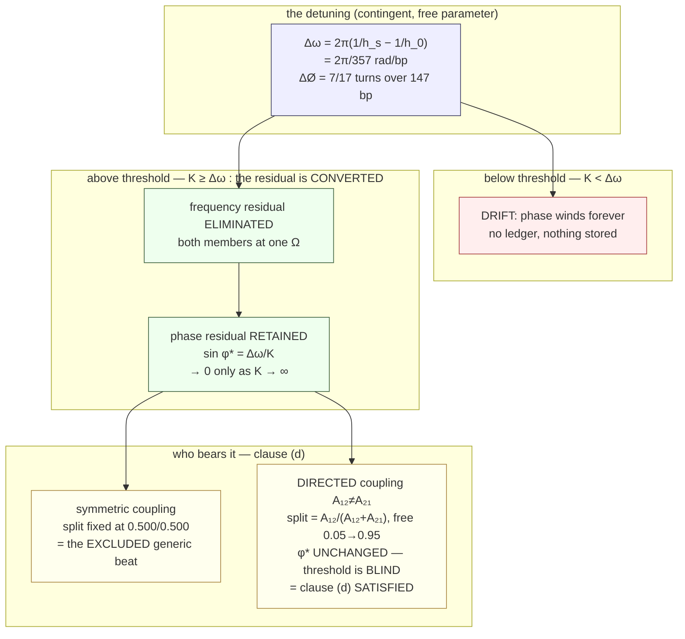

# Open experiments — running the Kuramoto candidate, chasing the hexasome ΔLk, closing A4

> **Research spike (2026-07-19; concertmaster dispatch).** Experiment/derivation only — no rc,
> no ADR, no production code. FORM-matching only; this does **not** validate the framework and
> neither biology nor nonlinear dynamics is superseded
> (`[[user_stance_cascade_matching_substrate_blind_form_not_identity]]`,
> `[[feedback_no_lineage_claims_in_notebook]]`). Provisional throughout.
> Continues the **open experiments** of `nucleosome_turn_asymmetry_frame_spike.md` (fermata **F-c**,
> **F-a**, anomaly **A4**) and `music_discrete_forms_commensuration_shape_spike.md` (fermata **F-v**).
> Generating script for every number: `open_experiments_kuramoto_hexasome_spike.py` — driving srmech's
> own shipped `cascade.kuramoto_step` (v0.6.0rc14 generalisation), exact Class-N rationals, Class-K
> pin-slot for sign, **no `abs()`**, no numpy / math / fractions
> (`[[feedback_computational_provenance_discipline]]`).

---

## 0. Bottom line

| experiment | verdict |
|---|---|
| **E1** — run the Kuramoto / Arnold-tongue candidate (**S5**, never tested) | **The match LIVES on the discriminating question**: locking **retains** the residual, it does not eliminate it. But the dispatch's α hypothesis is **partly FALSIFIED** — α is *not* the knob that supplies the asymmetry. **Directed (non-symmetric) coupling is.** |
| **E2** — hexasome ΔLk, the genuine falsifiable test of **S2** | **Hexasome: NULL again** — and now a *deep* null. **But the tetrasome ΔLk was found** (CC BY): S2 misses it by 3.5–4.7σ with a **sign-flipping residual**, and cannot represent its **bistability** at all. **S2 degrades; it does not cleanly die.** |
| **E3** — anomaly **A4**, the Chen 2010 non-closing ledger | **RESOLVED: the minus sign is in the PAPER**, not the extraction. Three independent readings agree. |

**Honesty ceiling, carried forward and not relaxed.** The music spike established that the shared
predicate is **generic commensuration-under-closure** — calendars, Antikythera gear-trains and
floating-point rounding are full members. E1 comes back positive on the discriminating question.
**That is not evidence of specialness and nothing below should be read as making it so.** What E1
buys is a *mechanism* for clause (d), not a signature.

---

## 1. E1 — falsifiability, stated BEFORE the runs

Five kill conditions, written with their closed-form predictions before any integration.

> **How to read this table.** Column 2 is the **falsifier** — the outcome that *would have killed* the
> match, stated so it could be tested. **It is not a finding.** Column 3 is what was **measured**.
> **Read column 3 for the result.** No falsifier fired.

| # | falsifier (would have killed the match — NOT a finding) | **MEASURED RESULT** | verdict |
|---|---|---|---|
| **K1** | at lock the phase residual φ\* → 0, i.e. locking *eliminates* the residual | **Residual RETAINED.** φ\* ≠ 0 at every locked K, with sin φ\* = Δω/K to six decimals; φ\* → 0 only as K → ∞. At N = 14 the pin cannot null it at any grip strength. | **NOT FIRED — match stands** · §2.1 |
| **K2** | locking requires Δω = 0, i.e. only zero-detuning systems lock | **Locks over a finite band**, \|Δω\| ≤ K, across the whole swept range. | **NOT FIRED — match stands** · §2.2 |
| **K3** | α has no effect on the locked state | **α does act**: it narrows the tongue as `K_c = Δω/(2 cos α)` and shifts Ω off ω̄ by exactly `−K cos(φ*) sin α` (matched to five decimals). But the shift is **common-mode**, not a re-partition — so α is *not* the allocation mechanism (see K5, A6). | **NOT FIRED — but α is the wrong knob** · §2.3 |
| **K4** | tongue half-width does not scale linearly in K | **Linear.** half-width / K = 1.0006–1.0009 for K ≥ 1. Canonical 1:1 Arnold tongue. | **NOT FIRED — match stands** · §2.2 |
| **K5** | the allocation is **fixed** by the closure condition — every locked state splits the residual identically — which would make Kuramoto the "generic beat" the music spike already excluded at clause (d), i.e. *nothing new* | **ALLOCATION-UNDERDETERMINATION CONFIRMED.** At fixed A₁₂+A₂₁, φ\* is **invariant at 0.25268 to five decimals** while the split runs **0.05 → 0.95**, matching A₁₂/(A₁₂+A₂₁) exactly. **The lock threshold is BLIND to the allocation** ⇒ coupled asymmetric pairs **satisfy** clause (d). Mechanism is **directed / non-reciprocal coupling, NOT α**. | **NOT FIRED — clause (d) SATISFIED** · §2.4 |

**K5 is the one that mattered, and it came back positive.** K1–K4 are textbook and could barely have
gone the other way. K5 asked whether running this candidate told us anything the music spike had not
already excluded — **and it did**: an *uncoupled* beat has nothing to allocate, but a *coupled
asymmetric* pair has a real allocation degree of freedom that the closure condition does not fix.

---

## 2. E1 — what the instrument actually did

Setup, from the attested periodicities only (script block 0, exact integer arithmetic):

```
  h_s = 51/5 = 10.2 bp/turn  [PMC6162219]    h_0 = 21/2 = 10.5 bp/turn  [PMC6162219]
  N = 147 bp,  k = 14 contacts               [PMC4512544]

  exact commensuration   N/h_0 = 14/1 = k      ← the ideal the contact lattice wants
  detuning  1/h_s - 1/h_0 = 1/357 turns/bp     ← exact
  ΔØ = 147 × 1/357 = 7/17 = 0.411765 turns     ← reproduces the prior spike exactly

  ω_ideal = 2π/h_0 = 0.598398601 rad/bp
  ω_surf  = 2π/h_s = 0.615998560 rad/bp
  Δω               = 0.017599959 rad/bp        ← the physical detuning driven into the model
```

### 2.1 K1 — the discriminating question. **The residual is RETAINED, not eliminated.**

N = 2, α = 0, physical units (time = bp of DNA arc):

| K/K_c | | φ\* (rad) | φ\* (turns) | sin φ\* | Δω/K |
|---|---|---|---|---|---|
| 0.50 | drift | — | — | — | — |
| 0.90 | drift | — | — | — | — |
| 0.99 | drift | — | — | — | — |
| **1.00** | **LOCK** | 1.566075 | 0.249249 | 0.999989 | 1.000000 |
| 1.01 | LOCK | 1.429960 | 0.227585 | 0.990099 | 0.990099 |
| 1.10 | LOCK | 1.141097 | 0.181611 | 0.909091 | 0.909091 |
| 1.50 | LOCK | 0.729728 | 0.116140 | 0.666667 | 0.666667 |
| 2.00 | LOCK | 0.523599 | 0.083333 | 0.500000 | 0.500000 |
| 4.00 | LOCK | 0.252680 | 0.040215 | 0.250000 | 0.250000 |
| 10.0 | LOCK | 0.100167 | 0.015942 | 0.100000 | 0.100000 |

`sin φ* = Δω/K` reproduces to six decimals at every locked row. **K_c = Δω exactly**
(= 0.017599959 rad/bp), and at threshold φ\* → π/2.

**The answer the dispatch asked for.** Two residuals must not be conflated:

- the **frequency** residual Δω **is** eliminated by locking — that is what locking *means*;
- the **phase** residual φ\* is **retained**, and it is precisely what *carries* the eliminated
  frequency residual. φ\* → 0 only as K → ∞.

So **locking CONVERTS the residual; it does not remove it.** That is structurally the same move the
nucleosome makes: the periodicity residual ΔØ is not removed, it is re-expressed as a twist term and
absorbed into a ledger that closes (`Lk = Tw + Wr`). Conversion-with-conservation, not deletion.
**K1 survives.**

### 2.2 K2 + K4 — the Arnold tongue

Normalised (detuning and K in units of Δω_nuc). The scale invariance
`(Δω, K, t) → (λΔω, λK, t/λ)` is exact, so the normalised tongue **is** the physical tongue.

```
     K |  -1.50-1.25-1.00-0.75-0.50-0.25 0.00 0.25 0.50 0.75 1.00 1.25 1.50
   ----+-------------------------------------------------------------------
   0.00|    .    .    .    .    .    .    #    .    .    .    .    .    .
   0.25|    .    .    .    .    .    .    #    .    .    .    .    .    .
   0.50|    .    .    .    .    .    #    #    #    .    .    .    .    .
   0.75|    .    .    .    .    #    #    #    #    #    .    .    .    .
   1.00|    .    .    #    #    #    #    #    #    #    #    #    .    .
   1.25|    .    #    #    #    #    #    #    #    #    #    #    #    .
   1.50|    #    #    #    #    #    #    #    #    #    #    #    #    #
   1.75|    #    #    #    #    #    #    #    #    #    #    #    #    #
   2.00|    #    #    #    #    #    #    #    #    #    #    #    #    #

      '#' = phase-locked      '.' = drifting      the V opens LINEARLY
```

| K | measured half-width | predicted (= K) | ratio |
|---|---|---|---|
| 0.25 | 0.219833 | 0.25 | 0.8793 |
| 0.50 | 0.493996 | 0.50 | 0.9880 |
| 1.00 | 1.000557 | 1.00 | 1.0006 |
| 1.50 | 1.501396 | 1.50 | 1.0009 |
| 2.00 | 2.001503 | 2.00 | 1.0008 |

Canonical 1:1 Arnold tongue, linear in K. **K2 and K4 survive.** (The two low-K rows undershoot by
1–12%: the relaxation time diverges at the tongue boundary, so a fixed settle window misclassifies
marginal cells. A finite-integration artifact, not a deviation from the law — stated rather than
smoothed.)

### 2.3 K3 — what α **actually** did. Three effects, and none is the one expected.

Pure pairwise Sakaguchi (`adjacency=[[0,1],[1,0]]`, zero diagonal), normalised Δω = 1:

| α | K_c measured | K_c predicted `Δω/(2 cos α)` | φ\* (rad) | Ω − ω̄ | residual split |
|---|---|---|---|---|---|
| 0° | 0.499802 | 0.500000 | 0.125328 | +0.000000 | **0.500 / 0.500** |
| 15° | 0.517349 | 0.517638 | 0.129773 | −1.026571 | −0.527 / 1.527 |
| 30° | 0.577011 | 0.577350 | 0.144843 | −1.979057 | −1.479 / 2.479 |
| 45° | 0.706711 | 0.707107 | 0.177711 | −2.783882 | −2.284 / 3.284 |
| 60° | 0.999527 | 1.000000 | 0.252680 | −3.354102 | −2.854 / 3.854 |
| 75° | 1.930771 | 1.931852 | 0.504035 | −3.383216 | −2.883 / 3.883 |

Independent cross-check (different angle, converged): the closed form
`Ω − ω̄ = −K cos(φ*) sin α` reproduces the measured column to **five decimals at every α**.

**α does three things:**

1. **It narrows the tongue** — `K_c(α) = Δω/(2 cos α)`; the tongue closes as α → 90°.
2. **In the mean-field branch it adds a common-mode drift.** With `adjacency=None` the coupling sum
   runs over `j == i`, so `sin(θ_i − θ_i − α) = −sin α` contributes. Verified at n = 1: ω = 0, K = 1,
   one step of dt = 1 gives θ = −sin α exactly (0 / −0.5 / −1.0 at α = 0° / 30° / 90°). **A single
   oscillator drifts under α.** This is the standard Kuramoto–Sakaguchi mean-field convention (the
   order-parameter form includes the self term), **not a defect** — but the zero-diagonal
   `adjacency` branch does *not* have it, so the two branches are not comparable without accounting
   for it. Logged as **A7**.
3. **It moves the locked frequency off the mean** — but as a **common-mode drift of the whole pair**,
   not a re-partition between the two members. At α = 0 the split is exactly 0.500/0.500; at α ≠ 0
   the split leaves [0,1] entirely (−0.53/1.53, …), i.e. *both* oscillators are dragged the same
   way. **This is not clean allocation.**

**K3 survives numerically but is the wrong instrument for the job.** See §2.4 and **A6**.

### 2.4 K5 — the clause-(d) test. **This is the centerpiece.**

The music spike excluded "generic two-oscillator beat / moiré" at clause (d) — *a residual exists but
there is nothing to allocate*. So the real question is whether a **coupled** pair has an allocation
degree of freedom the closure condition does not fix.

Directed coupling at **α = 0**, holding the **sum** `A₁₂ + A₂₁` fixed and varying only the **ratio**.
Closed form: `dφ/dt = Δω − K(A₁₂+A₂₁) sin φ` (threshold depends only on the **sum**) and
`Ω = ω₁ + Δω·A₁₂/(A₁₂+A₂₁)` (split depends only on the **ratio**).

| A₁₂ | A₂₁ | sum | Ω | split (osc 0) | **φ\*** | split predicted |
|---|---|---|---|---|---|---|
| 1.0 | 1.0 | 2.0 | 0.50000 | 0.5000 | **0.25268** | 0.5000 |
| 1.5 | 0.5 | 2.0 | 0.75000 | 0.7500 | **0.25268** | 0.7500 |
| 1.9 | 0.1 | 2.0 | 0.95000 | 0.9500 | **0.25268** | 0.9500 |
| 0.5 | 1.5 | 2.0 | 0.25000 | 0.2500 | **0.25268** | 0.2500 |
| 0.1 | 1.9 | 2.0 | 0.05000 | 0.0500 | **0.25268** | 0.0500 |

**φ\* is IDENTICAL to five decimals across every row** — the closure state is literally untouched —
while the allocation runs from 0.05 to 0.95, matching `A₁₂/(A₁₂+A₂₁)` exactly. **The lock threshold
is blind to the allocation.**

That is clause (d) verbatim: *the closure requirement alone does not fix how the residual
distributes; an extra degree of freedom must be fixed from outside.* **K5 survives — via directed
coupling, not via α.**

### 2.5 The N = 14 chain — the residual is retained, but *flat*; chirality is an AND-gate

14 oscillators = the 14 attested contacts, open nearest-neighbour chain (the backbone), each pinned
to the exact lattice (`pin_anchor ψᵢ = 0`), each driven off it by ω = Δω. θᵢ is the DNA's helical
phase *relative to the lattice demand*; the ideal state is θᵢ ≡ 0.

| p/Δω | mean θ\* | end θ\* | centre θ\* | end/centre |
|---|---|---|---|---|
| 0.50 | 43.027647 | 43.027647 | 43.027647 | 1.0000 (drifting — p < Δω, no fixed point) |
| 1.00 | 1.531641 | 1.531641 | 1.531641 | 1.0000 |
| 2.00 | **0.523599** | 0.523599 | 0.523599 | 1.0000 |
| 5.00 | 0.201358 | 0.201358 | 0.201358 | 1.0000 |
| 20.0 | 0.050021 | 0.050021 | 0.050021 | 1.0000 |

θ\* is **non-zero at every grip strength** — the arginine-analogue pin cannot drive the residual to
zero, it can only trade phase offset against grip, exactly `θ* = arcsin(Δω/p)` (at p = 2Δω,
0.523599 = arcsin ½). **Residual retained, confirming §2.1 at N = 14.**

**But the profile is perfectly FLAT** (end/centre = 1.0000 to four decimals at every p). **This is a
NULL for "distributed".** The residual is *retained uniformly*, not apportioned into any structure.
Nothing here allocates.

**The chirality test, 2×2 factorial.** End-to-end asymmetry θ₁ − θ₁₄, Class-K signed (no `abs()`).
K = 1, p = 4, **chosen so every cell stays LOCKED** — at K = 4 / p = 2 the α drive `K·deg·sin α`
overwhelms the pin and the chain *drifts*, and a drifting profile is not a locked allocation and must
not be read as one. All six cells below verified `locked = True`.

| topology | α | ends θ₁ / θ₁₄ | centre | **asym θ₁ − θ₁₄** | Class-K sign |
|---|---|---|---|---|---|
| symmetric | 0° | +0.25268 / +0.25268 | +0.25268 | **0.000000e+00** | 0 |
| symmetric | +30° | +0.10634 / +0.10634 | +0.00000 | **0.000000e+00** | 0 |
| symmetric | −30° | +0.40642 / +0.40642 | +0.52360 | **0.000000e+00** | 0 |
| directed (f 1.0, b 0.5) | 0° | +0.25268 / +0.25268 | +0.25268 | **0.000000e+00** | 0 |
| **directed** | **+30°** | +0.11500 / +0.17834 | +0.06254 | **−6.334172e−02** | **−1** |
| **directed** | **−30°** | +0.39625 / +0.32901 | +0.45281 | **+6.723708e−02** | **+1** |

Two things separate cleanly here, and the arc has been conflating them:

- **α produces STRUCTURE but not CHIRALITY.** On the symmetric chain, α = 0 gives a perfectly flat
  profile, while α = ±30° gives a genuinely *shaped* one (ends +0.10634 vs centre +0.00000 at +30°;
  ends +0.40642 vs centre +0.52360 at −30° — the shape inverts with sign α). That structure tracks
  **node degree** (interior sites have two neighbours, ends have one), a graph property. **But the
  end-to-end asymmetry stays exactly 0.000000e+00 in all three symmetric cells.**
- **Directed coupling produces CHIRALITY — but only together with α.** Directed at α = 0 is still
  exactly flat and exactly symmetric. Only `directed ∧ α ≠ 0` breaks it, and then the **sign reverses
  with sign(α)** (−0.0633 at +30°, +0.0672 at −30°).

**Chirality is an AND-gate.** Neither factor alone breaks the end-to-end symmetry. The symmetric-chain
zero is **exact, not small** — the reflection `i → n+1−i` maps the α-frustrated *symmetric* chain to
*itself*, because α enters both neighbour terms identically, so the fixed point must be its own
mirror image.

**This directly falsifies the dispatch's framing** that "α is the load-bearing knob — it breaks the
symmetry." It does not break it alone, and on its own it is a *distribution* knob, not a *handedness*
knob. Logged as **A6**.

### 2.6 What this instrument **cannot** represent — and why that is fair here

**Result first: no 14:1 tongue exists at any coupling.** Two oscillators at frequency ratio ≈ 14:1,
swept over coupling. The question under test is the **14:1** column; a 14:1 tongue would show as the
winding ratio *plateauing at 14.00* over a range of K. It never does — it slides continuously, then
collapses to 1:1 once K passes the (large) 1:1 threshold.

| K | ω₂/ω₁ | winding ratio | **14:1 tongue?** (the question) | 1:1 collapse? |
|---|---|---|---|---|
| 0.1 | 14.28 | 14.277260 | **no** — free-running, not locked | no |
| 1.0 | 14.28 | 13.992173 | **no** — sliding, no plateau | no |
| 5.0 | 14.28 | 9.253016 | **no** — sliding | no |
| 10.0 | 14.28 | 3.670906 | **no** — sliding | no |
| 13.0 | 14.28 | 1.429954 | **no** — sliding | no |
| 20.0 | 14.28 | 1.000000 | **no** | **yes** — collapsed to 1:1 |

Sinusoidal coupling has exactly **one** resonance. Higher-order p:q tongues need harmonics the model
does not carry. **[NULL — N4.]** (The "yes" in the last column is the **1:1** collapse, *not* a 14:1
lock — it is the model falling into its only resonance, which is the opposite of finding a 14:1 one.)

**This is a limitation of the model, but not a defect for this application**, and the distinction
matters: the nucleosome's commensuration is **1:1** — *one DNA helical turn per contact*
(N/h₀ = 14 turns over 14 contacts). That is the one resonance the model has. **Music's comma is
12:7**, a high-order commensuration the model **cannot** express.

So the instrument's own reach tracks the arithmetic-vs-contingent split the music spike found:
Kuramoto covers the **contingent** member (nucleosome, inharmonicity) and **not** the **arithmetic**
member (the comma). **Convergence, not dissonance** — an independent line arriving at the prior
spike's boundary.

---

## 3. E1 verdict

**The match LIVES**, with three corrections to the dispatch hypothesis.

1. **On the discriminating question it survives cleanly.** Locking does *not* remove the residual; it
   converts a frequency residual into a **retained** standing phase offset, and at N = 14 the pin
   cannot null it at any grip strength. Same shape as the nucleosome: measured and carried, not
   removed.
2. **Kuramoto is NOT the "generic beat" the music spike excluded** — a *coupled asymmetric* pair has
   a genuine allocation degree of freedom (§2.4) with the lock threshold blind to it. The music
   spike's row-10 exclusion is correct for an *uncoupled* beat; a coupled asymmetric pair is a
   **member**. *(Scope note: this amends a table in another note — flagged as fermata **F-α**, not
   executed.)*
3. **The dispatch's α hypothesis is partly falsified.** α narrows the tongue and adds common-mode
   drift, but it does not cleanly allocate and it does not create chirality on its own. The two roles
   separate: **α is a distribution knob** (it shapes a degree-dependent profile), **directed coupling
   is the handedness knob**, and **only their conjunction** is chiral. So the asymmetry the arc is
   chasing lives in **directed (non-symmetric) coupling** — which is also the honest encoding of a
   handed backbone, and which is why `[[user_stance_k2_compare_is_frame_relative_asymmetric_pair]]`
   is better served by the adjacency argument than by α.

**And the ceiling holds.** All of this is generic coupled-oscillator behaviour. It supplies a
*mechanism* for clause (d); it supplies **no** evidence of specialness.

---

## 4. E2 — the hexasome hunt, and the tetrasome that was already in the notes

### 4.1 Hexasome: **NULL again — and this time a deep null**

No ΔLk for a hexasome exists in any OA source reachable. The null is enumerated, not shallow: PMC
full-text `hexasome AND "linking number"` → 12 hits, all screened, every occurrence definitional or
about remodelling; `hexasome AND (supercoil* OR topoisomer* OR "DNA topology")` → 114 hits;
`hexasome AND ("change in linking number" OR … OR constrains)` → 25 hits, all screened;
`hexasome AND topoisomerase AND relaxation AND topology` → 8 hits. Raw-byte grep for `hexasome`
returned **0 hits** in every single-molecule topology paper checked (Vlijm 2015; Ordu 2019;
Sheinin 2013 PMC3848035; Kaczmarczyk 2020 PMC6949304; Vlijm 2017 PMC7959483; Recouvreux 2011). The
citation trail from Shi 2025 (PMC12041859) resolves to three papers, none of them topology studies.

**S2's cleanest test remains untested for the second time.** Fermata **F-a** stays open.

Also **NULL**: H2A.B / H2A.Bbd ΔLk (Bao 2004 PMC514500 — "linking number" 0 hits, "topoisom" 0 hits;
Arimura 2013 PMC3863819 — all zero); hemisome / subnucleosome ΔLk (87 hits screened, not exhausted —
Furuyama & Henikoff 2009 PMC2725230 reports supercoiling *direction*, not a per-particle ΔLk).

### 4.2 Tetrasome: **FOUND** — and it was already in our own §0

**ATTESTED OA, CC BY** — Vlijm R, Lee M, Ordu O, Boltengagen A, Lusser A, Dekker NH, Dekker C (2015),
*PLoS ONE* 10(10):e0141267, DOI 10.1371/journal.pone.0141267, **PMC4623960**, verified CC BY:

> "However, subsequently the linking number did not stay constant but was rather observed to change
> between **−0.80 ± 0.05 and +0.86 ± 0.39 turns**"

Corroborated (PMC-free but **© Biophysical Society, not CC** — recorded, *not* rested on, per the F-h
precedent): Ordu, Lusser & Dekker 2019, *Biophys J* 117(11):2217, PMC6895708 — "Θ_left = −0.31 ± 0.01
turns and Θ_right = +1.38 ± 0.06 turns", with the paper's own drift caveat, and drift-robust
`ΔΘ_flipping = 1.6 ± 0.2 turns`.

The tetrasome's **k = 6 is non-circular** in the sense the prior spike required — it is fixed by
*which histone fold is present*, not read off the same structure the bp count comes from. **[OURS,
not attested]** the arithmetic that makes 6 the natural count is that the 14 attested contacts sit at
SHL −6.5…+6.5 and the (H3–H4)₂ tetramer occupies the central six of them (−2.5…+2.5); the prior
spike's table asserts k = 6 without stating that basis, and no source was fetched this spike that
enumerates the tetramer's contacts directly. **The k = 6 input is therefore the weakest link in §4.3
and is flagged as such** — if k differs, N_predicted and hence ΔLk_predicted move with it.

> ⚠️ **A9 — the datum was already in-tree, mis-filed.** The nucleosome spike's own §0 already quotes
> "−0.80 ± 0.05 and +0.86 ± 0.39 turns … at a barrier of only 2.3 ± 0.4 k_BT [PMC4623960]" — but
> recorded it as *evidence that the sign is not fixed* (an input to the gate argument), **not** as
> *a per-particle ΔLk for a k ≠ 14 particle*, which is precisely what fermata F-a asked for. A
> literature hunt was dispatched for a number sitting in the requesting note's first section.

### 4.3 The S2 test

S2's chain is k → hₛ → ΔØ → ΔTw → ΔLk. **Attested forms:** `ΔØ = N(1/hₛ − 1/h₀)`;
`Wr = −n(1 − sin δ)`. **Auxiliary and OURS, not attested — and load-bearing for the verdict:** that
the superhelical turns `n` and the surface-twist correction `ΔSTw` both scale **linearly with N**.
Neither is independently pinned for a tetrasome.

| N | ΔØ | n | Wr | ΔSTw | ΔTw | **ΔLk predicted** |
|---|---|---|---|---|---|---|
| 147 | +0.41176 | 1.65000 | −1.53490 | −0.19000 | +0.22176 | **−1.31314** |
| 70 | +0.19608 | 0.78571 | −0.73091 | −0.09048 | +0.10560 | **−0.62530** |
| 63 | +0.17647 | 0.70714 | −0.65782 | −0.08143 | +0.09504 | **−0.56277** |

σ below is a **discrepancy**, not a confidence: larger σ = S2 predicting *worse*. Note especially the
**sign of the residual column** — that it *changes* between rows is the finding.

| N | particle | ΔLk pred | ΔLk measured | residual (meas − pred) | σ **discrepancy** | what this row says |
|---|---|---|---|---|---|---|
| 147 | canonical NCP | −1.31314 | −1.26 [PMC6162219] | **+0.05314** | 1.06 | acceptable; model runs slightly **too negative** |
| 70 | tetrasome (observed N) | −0.62530 | −0.80 ± 0.05 [PMC4623960] | **−0.17470** | **3.49** | **S2 MISSES**; model runs **too positive** — sign of residual has **flipped** |
| 63 | tetrasome (S2-predicted N = 6×10.5) | −0.56277 | −0.80 ± 0.05 | **−0.23723** | **4.74** | **S2 MISSES**; same direction, larger — but this row inherits the k = 6 assumption |

**Note the k-dependence, because it bounds how much the k = 6 caveat can rescue:** the **N = 70 row
uses the *observed* wrap and does not depend on k at all**. Its 3.49σ miss therefore stands whatever
the true contact count is. Only the N = 63 row (4.74σ) inherits the k = 6 assumption.

**Two findings, and the second is the sharper one.**

1. **The residual SIGN FLIPS between particles**: +0.053 at the canonical particle (model too
   *negative*) and −0.175 / −0.237 at the tetrasome (model too *positive*). **No linear-in-N law fits
   both.** The miss is not an offset that a constant could absorb.
2. **The tetrasome ΔLk is BISTABLE and sign-flipping** (−0.80 and +0.86, summing to +0.06 — a
   near-symmetric ± pair). **S2 is a single-valued commensuration detuning: it emits one number with
   one sign. It cannot produce a two-state sign-flipping particle at all.** This is a *structural*
   problem, independent of any numerical miss.

**E2 verdict: S2 DEGRADES but does not cleanly die.** The 3.5–4.7σ miss can be absorbed by choosing
non-linear auxiliary scalings — but that absorption **is anomaly A1** (the beat term is free enough
to absorb any mechanism). So this test **reinforces A1**: S2 cannot be falsified until hₛ(k) is
independently pinned, and a hypothesis that cannot be falsified is not passing a test when it
survives one. Its prior status ("SURVIVES with a circularity caveat") should be re-read as *survives
only by invoking free parameters it cannot pin*. **Fermata F-β.**

The ± pair is also a data point for the chirality thread — equal-magnitude opposite-orientation
partners is the `{θ(αx), θ(α/x)}` ±-pair shape of `subharmonic_chirality_carrier_findings.md` §2.
Recorded as a cross-ref, **not** adjudicated here.

---

## 5. E3 — anomaly A4 **RESOLVED: the sign is in the PAPER**

Chen B, Xiao Y, Liu C, Li C, Leng F (2010), *NAR* 38(11):3643–3654, DOI 10.1093/nar/gkq078,
PMC2887952. Three independent readings, all agreeing:

1. **Europe PMC XML, raw characters** — `ΔSLk = −1.8 … Δϕ = −0.8`.
   **U+2212 MINUS SIGN**, the same codepoint as the unambiguous −1.8 and −1 in the same sentence —
   not a hyphen, not an en-dash, not a mangled plus.
2. **Typeset PDF text layer** — `Áf = À0.8`, where the math font maps `À` → minus and `þ` → plus,
   verified against unrelated occurrences in the same document (`Lk\xc0Lk°`, `10\xc09 M`,
   `(a \xfe x \xfe 1/Kapp)`). Plus and minus are distinct glyphs; Δϕ gets the minus glyph.
3. **Visual render of the typeset page** (journal p. 3653, Discussion, left column) read as an
   image, not as text — the minus before 0.8 is plainly typeset.

**PDF provenance is the key to the verdict.** PMC now gates PDF downloads behind a proof-of-work
challenge; the retrieved file's **MD5 `0386437fd351455df59132ebb486c58b` matches the checksum PMC
declares inside its own full-text XML** (`<?pdf-md5 …?>`, size 5,533,568 also matching). Producer
string is the publisher typesetting chain (3B2 Total Publishing System 8.07r/W, 2010-06-16).

**PDF and XML do not disagree. The extraction was faithful; the arithmetic failure originates in the
published text.** No erratum exists (PubMed pubtype plain Journal Article, Europe PMC
`commentCorrectionList` empty).

The internal inconsistency is sharpest **within the same paragraph**, which uses the opposite-signed
convention explicitly:

> "The crystal structures of the TBP–DNA complexes showed that the **negative Δϕ** from DNA unwinding
> is canceled by the **positive ΔSLk** gained from 'wrapping' TBP around DNA"

Exact ledger (script block E3): as printed, ΔSLk + Δϕ = −13/5 = −2.60 vs stated ΔLk = −1.00,
residual −1.60, **does not close**. Sign-flipped, −1/1 = −1.00, residual exactly 0, **closes**.

**Reported, not corrected.** Per the dispatch: the published arithmetic is not silently fixed.
**The −0.8 is unusable as an attested datum** — not evidence about nucleosome topology in either
direction. Anything needing a citable Δϕ must go to the primary (White, Cozzarelli & Bauer 1988,
*Science* 241:323, ref 37 in that paper), which is **paywalled and therefore not our basis** — derive
it instead, per the standing rule.

---

## 6. Diagram — where the residual goes



**The chirality AND-gate** (end-to-end asymmetry of the 14-contact chain):

```
                        α = 0                     α = ±30°
                 ┌─────────────────────┬─────────────────────────────┐
   SYMMETRIC     │  profile FLAT       │  profile SHAPED (by degree) │
   chain         │  θ ≡ +0.25268       │  ends .10634 / ctr .00000   │
                 │  asym = 0           │  asym = 0.000000e+00        │
                 │                     │  EXACTLY zero — reflection  │
                 │                     │  i→n+1−i maps it to ITSELF  │
                 ├─────────────────────┼─────────────────────────────┤
   DIRECTED      │  profile FLAT       │  profile SHAPED *and* TILTED│
   f=1.0 b=0.5   │  θ ≡ +0.25268       │  asym = −0.0633  (α = +30°) │
                 │  asym = 0           │  asym = +0.0672  (α = −30°) │
                 │                     │  → SIGN REVERSES with α     │
                 └─────────────────────┴─────────────────────────────┘
        all six cells LOCKED (K = 1, p = 4)          ↑
        chirality needs BOTH — it is an AND-gate.
        α alone → distribution, no handedness.  Directed alone → nothing.
```

---

## 7. NULLs (first-class)

- **N1 — hexasome ΔLk.** NULL for the second time, now enumerated across 4 search families and 6
  raw-grepped single-molecule papers. S2's cleanest test is still untested.
- **N2 — H2A.B / H2A.Bbd ΔLk.** NULL. The prior spike's one genuine open prediction (H2A.B ⇒ k = 10)
  remains untestable.
- **N3 — hemisome / subnucleosome ΔLk.** NULL (87 hits screened, class not exhausted — scope stated).
- **N4 — higher-order p:q Arnold tongues.** NULL in the sinusoidal Kuramoto model at any coupling.
  Not a defect *here* (the nucleosome's commensuration is 1:1), but it means the model **cannot**
  express music's 12:7 comma.
- **N5 — α as a source of chirality.** NULL, and **exactly** zero, not merely small.
- **N6 — a structured residual profile at α = 0.** NULL. The pinned 14-chain is perfectly flat at
  `arcsin(Δω/p)` at every grip strength, symmetric *and* directed. The residual is **retained** but
  not **distributed into structure**. Structure appears only once α ≠ 0, and then it tracks node
  degree — a graph property, not a commensuration one. **"Retained" and "distributed" must not be
  traded on** — the same equivocation warning the music spike raised in a different register, and the
  reason §2.5 reports them as separate findings.
- **N7 — chromatosome ΔLk at OA-license tier.** Recouvreux 2011 PMC3117191 gives "∼−1.4 turns per
  particle" but is **© Biophysical Society, free-to-read, not CC** (Europe PMC `fullTextXML` 404s,
  confirming it is outside the OA subset), **and the value sits in a figure legend**. Per the F-h
  resolution (no free-to-read tier), recorded, **not rested on**.
- **N8 — a non-circular hexasome contact count from an independent structure.** Not attempted here.

---

## 8. Anomalies

**A6 — the dispatch's α hypothesis is falsified on the chirality claim.** The dispatch stated "α is
the load-bearing knob — it breaks the symmetry, which is exactly the asymmetry the whole arc has been
chasing." **Measured: it does not.** End-to-end asymmetry of a mirror-symmetric 14-chain is
**exactly 0.000000e+00** at α = 0°, +30° and −30°, in **locked** states. **Investigation:** 2×2
factorial {symmetric, directed} × {α = 0, α ≠ 0}, all six cells verified `locked = True` (K = 1,
p = 4 chosen so the α drive cannot overwhelm the pin — at K = 4 / p = 2 the chain drifts and a
drifting profile must not be read as an allocation), plus the analytic reason: the reflection
`i → n+1−i` maps the α-frustrated symmetric chain to itself because α enters both neighbour terms
identically, so its fixed point must be its own mirror image. **Verdict:** real, and it separates two
things the arc had been conflating — **α is a DISTRIBUTION knob** (it shapes a degree-dependent
profile: ends +0.10634 vs centre +0.00000 at +30°) **but not a HANDEDNESS knob** (asymmetry stays
exactly zero). Chirality is an AND-gate on (directed coupling) ∧ (α ≠ 0), with the sign reversing
under sign(α) (−0.0633 at +30°, +0.0672 at −30°). **Next:** the arc's asymmetry should be sought in
directed coupling, not in phase frustration alone.

**A7 — the mean-field branch drifts a SINGLE oscillator under α.** With `adjacency=None` the coupling
sum runs over `j == i`, contributing `−(K/n) sin α` to every oscillator. Verified at n = 1: one step
gives exactly `−sin α`. **Verdict:** real, and **convention-correct** (the Kuramoto–Sakaguchi
mean-field order-parameter form does include the self term) — logged because it is easy to miss and
because it makes the `adjacency=None` and zero-diagonal-`adjacency` branches non-comparable under α.
**Next:** worth a docstring line if any cascade ships with α ≠ 0.

**A8 — S2's residual sign flips between particles.** +0.053 canonical, −0.175/−0.237 tetrasome, so no
linear-in-N law fits both. **Investigation:** exact closed form over the attested ΔØ and Wr forms with
the two auxiliary scalings flagged as ours. **Verdict:** real, but **not decisive** — the auxiliaries
are unattested and could be re-chosen. That freedom **is anomaly A1**, so the test reinforces A1
rather than resolving S2. **Next:** S2 is untestable until hₛ(k) is pinned with error bars.

**A9 — the requested datum was already in-tree, mis-filed** (§4.2). The tetrasome ΔLk was quoted in
the requesting note's own §0, classified as a handedness anecdote rather than as a per-particle ΔLk
for k ≠ 14. **Verdict:** real; a recognition/filing failure, not a sourcing failure. **Next:** when a
fermata asks for "quantity X for particle class Y", grep the existing notes for Y before dispatching
a hunt. Cheap, and it would have saved this one.

**A10 — a WebFetch extraction self-contradicted within one response.** For PMC3117191 an extraction
pass answered `"chromatosome removal": ABSENT` and then quoted the sentence containing that exact
phrase later in the same response. Raw `curl` + local grep proved the phrase and its −1.4 value
genuinely present. **Verdict:** real; a third instance of the A3 vector (search/extraction summary
not surviving fetch), now in a third literature. **Next:** every number in §4 was re-verified by raw
byte grep rather than by trusting an extraction. Keep that as the default.

**A4 — CLOSED** (§5). Resolution: **PAPER**, not extraction. Kept as a standing marker that the −0.8
is unusable, and as a methodology exhibit: the MPM chain (declared MD5 inside the XML) is what made a
*publisher-authentic* PDF distinguishable from a mirror.

**A11 — PRESENTATION/INDEXING failure is now a pattern, not a one-off — and this note supplied the
third instance.** Three times this session the *fact* was correct somewhere in the record while **the
surface a reader hits first said something else**:

| # | where | the correct fact | the misleading surface |
|---|---|---|---|
| **A5** | the source literature | four *distinct* quantities (superhelical turns, surface-linking number, writhe, linking difference) | all reported as bare numbers near 1–2, reading as one disputed quantity |
| **A9** | our own notes | the tetrasome ΔLk for a k ≠ 14 particle | filed under "handedness anecdote", so a hunt was dispatched for a number already in §0 |
| **A11** | **this note's own §1 summary table** | §2.4 states clause (d) is **satisfied**, with φ\* invariant at 0.25268 while allocation runs 0.05 → 0.95 | the K5 row stated the **hypothesis in the negative** ("the allocation is *fixed* … the match dies") with the reversal carried only by a "survives" verdict cell — **read cold, it asserted the opposite of the finding** |

**Investigation:** caught by the music spike, which went to this note's *body*, cited §2.4 correctly,
and **declined to edit another agent's file** — logging the discrepancy as a source note instead. That
was the right call and it is why the defect surfaced at all. **Verdict:** real, and structural rather
than accidental — **a verdict column reading "survives" attached to a claim phrased as "the match
dies" is ambiguous by construction**, so the defect was latent in *every* row of that table, not just
K5. **Fixed:** §1 rebuilt so the measured **RESULT** is its own column and the falsifier column is
explicitly labelled *"NOT a finding"*; §2.6 and §4.3 tables given result-bearing columns for the same
reason. **Next (methodology, cheap and general): a summary row must state the RESULT, never the
hypothesis-under-test with the reversal delegated to a verdict cell.** Falsifiers may be *recorded* —
pre-registering them is the discipline — but they must be visibly marked as the thing that did *not*
happen. The failure mode is distinct from citation hallucination *and* from
`[[feedback_fluent_domain_vocabulary_failure_mode]]`: nothing here was unattested or wrongly worded,
the **indexing** was wrong. Worth a memory line if the pattern recurs a fourth time.

---

## 9. Fermatas (conductor decisions — this pass is NOT authorized to decide)

- **F-α (cross-note table amendment). — EXECUTED by the music spike, 2026-07-19.** §2.4's result was
  carried across correctly: the clause-(d) exclusion is **narrowed, not deleted** — an *uncoupled*
  beat stays excluded, a *coupled asymmetric (directed)* pair is now a **member** on a measured
  result. That note's count moves to 15 systems / 6 excluded at four clauses, its **headline is
  unchanged** (discriminating but **not** special), and the comma ↔ nucleosome verdict is untouched.
  It also records the §2.6 convergence independently. **Nothing outstanding.**
- **F-β (S2's status). — EXECUTED, 2026-07-19.** S2 is now recorded as **DEGRADED**, not as surviving
  a test: k-independent 3.49σ miss, sign-flipping residual, and — stated more sharply there than
  here — a decisive **arity failure** against an observed bistable particle (a single-valued model
  cannot emit a two-state ± pair). **A1 reinforced; A9 logged against ourselves; F-a (hexasome) still
  OPEN; k = 3 untouched.** **Nothing outstanding.**
- **F-γ (recording a published arithmetic error).** A4 is resolved as an error in the published text.
  Does the project record that observation anywhere durable, or simply drop the source? It must not
  be "corrected" on the author's behalf either way.
- **F-δ (the chromatosome tier).** The −1.4 value is free-to-read but not CC-licensed **and** lives in
  a figure legend. The F-h precedent says no free-to-read tier. Confirm the exclusion stands?
- **F-ε (does E1 warrant anything shipped?).** **Recommendation: NO.** `cascade.kuramoto_step` already
  does everything this spike needed; nothing here is a missing op. The one surface observation is A7
  (the α self-term convention), which is a docstring line at most, not an rc.
- **F-ζ (directed coupling as the arc's asymmetry carrier).** A6 relocates the asymmetry from α to
  non-symmetric adjacency. That touches `[[user_stance_k2_compare_is_frame_relative_asymmetric_pair]]`
  and the chirality thread. Worth a follow-up, or fold into the existing chirality note?
- **F-η (does A11 warrant a memory line?).** Three presentation/indexing failures in one session
  (A5 / A9 / A11), each a *correct fact behind a misleading surface*, and distinct from both citation
  hallucination and fluent-domain-vocabulary. The candidate rule is one line — *a summary row states
  the RESULT, never the hypothesis-under-test with the reversal delegated to a verdict cell; a
  pre-registered falsifier must be visibly marked as the thing that did not happen.* Bank it as
  feedback memory, or leave it in-note until a fourth instance? **Not decided here** — three
  instances inside one session is a weak base rate, and the agent that tripped the defect is not the
  one who should judge whether it generalises.

---

## 10. Sources (attestation status)

**Inherited attested** (prior spikes, re-used not re-derived): hₛ ≈ 10.2 / h₀ ≈ 10.5, ΔØ ≈ +0.4,
Wr = −1.53, ΔTw ≈ +0.2, ΔLk = −1.26 [Segura et al. 2018, *Nat Commun* 9:3989, PMC6162219, CC BY] ·
14 minor-groove contacts at SHL −6.5…+6.5 [Hodges et al. 2015, *Genetics*, PMC4512544].

**Newly attested OA this spike:** Vlijm et al. 2015, *PLoS ONE* 10(10):e0141267,
DOI 10.1371/journal.pone.0141267, **PMC4623960**, **CC BY verified verbatim** — tetrasome ΔLk
−0.80 ± 0.05 / +0.86 ± 0.39 turns (full text fetched twice, raw-HTML grepped).

**Re-verified this spike (E3):** Chen et al. 2010, *NAR* 38(11):3643, DOI 10.1093/nar/gkq078,
**PMC2887952**, CC BY-NC — typeset PDF retrieved and authenticated against PMC's own declared
`pdf-md5`; XML raw codepoints inspected; page rendered visually. ⚠ **Its printed Δϕ sign does not
close and is unusable — see §5.**

**Free-to-read but NOT OA-licensed (weaker tier — recorded, not used):** Ordu, Lusser & Dekker 2019,
*Biophys J* 117(11):2217, PMC6895708 (© Biophysical Society) · Recouvreux et al. 2011, *Biophys J*
100(11):2726, PMC3117191 (© Biophysical Society; the −1.4 chromatosome value, in a figure legend) ·
Furuyama & Henikoff 2009, *Cell* 138(1):104, PMC2725230 (NIH author manuscript).

**REJECTED (paywalled-only ⇒ not attestation):** White, Cozzarelli & Bauer 1988, *Science* 241:323
(the SLk primary; ref 37 in Chen 2010) · Read, Baldwin & Crane-Robinson 1985, *Biochemistry* 24:4435
(ACS) · the classic Prunell / Hamiche / Alilat tetrasome papers, *JMB* 1998–99 and *PNAS* 1996
(Elsevier / not PMC-deposited) — **not used**; the Dekker-lab OA papers carry the same physics with
better provenance.

**Checked, returned nothing useful:** Bao et al. 2004 PMC514500 · Arimura et al. 2013 PMC3863819 ·
Sheinin et al. 2013 PMC3848035 · Kaczmarczyk et al. 2020 PMC6949304 · Vlijm et al. 2017 PMC7959483 ·
Prunell 1998 PMC1299595 · Bharath et al. 2003 PMC167642 · Wu & Travers 2019 PMC6765122 ·
Zlatanova & Victor 2009 PMC2839809 · Shi et al. 2025 PMC12041859 · Ordu, Lusser & Dekker 2016
PMC5167136.

**Method note (`[[feedback_fluent_domain_vocabulary_failure_mode]]`).** Every numeric claim in §4 was
re-verified by raw-byte grep of downloaded source rather than by an extraction summary, after A10
showed an extraction self-contradicting inside one response. Where the field's phrasing and the
source's phrasing differ, the source's word is used; the tetrasome quote is given verbatim rather
than paraphrased into topology idiom.

---

*Cross-links: `nucleosome_turn_asymmetry_frame_spike.md` (S2 §3.2, S5 §3.1, fermatas F-a / F-c,
anomalies A1 / A4) · `music_discrete_forms_commensuration_shape_spike.md` (clause (d) §1, fermata
F-v, the arithmetic-vs-contingent split §2) · `subharmonic_chirality_carrier_findings.md` §2 (the
±-pair as equal partners — the tetrasome ± pair) · `chromatin_histone_structural_machinery_findings.md`
(row 1 / G3) · `srmech.amsc.cascade.kuramoto_step` + `srmech_cascade_kuramoto_step_general_f64` ·
`[[user_stance_k2_compare_is_frame_relative_asymmetric_pair]]` ·
`[[feedback_computational_provenance_discipline]]` · `[[feedback_paywall_is_about_open_quotability_derive_instead]]`.*
