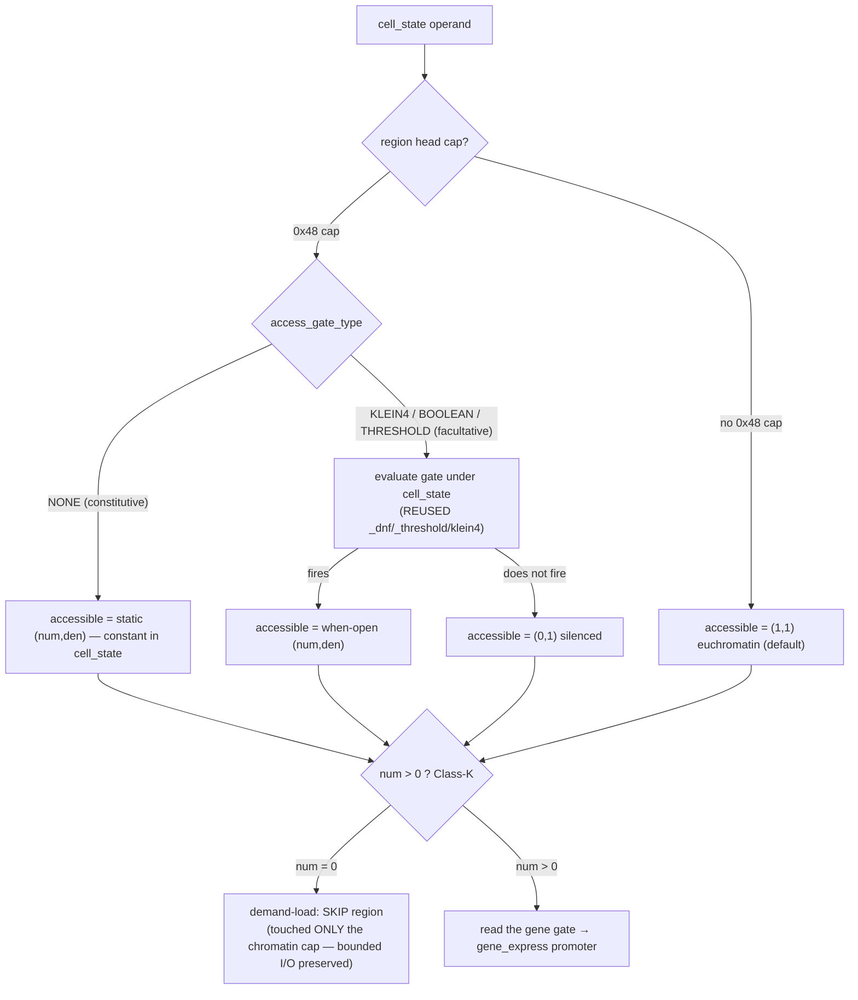

# rc274 (§102 / G1) — cell-state-conditional chromatin (facultative heterochromatin): BUILD-READY prototype

> **Prototype/design note (2026-07-18).** A concertmaster dispatch. Executes **G1**, the highest-ranked
> gap from `chromatin_histone_structural_machinery_findings.md`: make the `0x48` chromatin ACCESS layer
> **cell-state-conditional** (facultative heterochromatin — Barr body / X-inactivation) by reusing the
> EXISTING gene-gate machinery ON the chromatin cap, so `accessible(region, cell_state)` is **COMPUTED,
> not stored**. FORM-matching only (`[[user_stance_cascade_matching_substrate_blind_form_not_identity]]`);
> biology not superseded. **No code changed by this note** — it is the executable spec a build subagent
> follows to ship rc274. Grounded by reading `genome.py` (rc268/rc269 chromatin + the four cell-state
> read-sites + the gene-gate readers), `srmech_genome.c` / `srmech.h`, `_native.py`, `tool_schema.py`,
> and `test_express_plan_chromatin_rc269.py`.

## 0. Ground truth (introspected, not assumed)

- **Chromatin cap `0x48` wire (v15, today)**: `[0x48] + handle + NUL + chromatin_type(u8) + num(u64 BE) +
  den(u64 BE)`, NUL-padded to `leaf_dim`. `den` ends at byte offset **`19 + H`** (`3 + H + 2·8`, `H` =
  handle length). Everything from `19+H` to `leaf_dim` is **NUL padding today.** (`genome.py:1790`, C
  `genome_pack_chromatin` `srmech_genome.c:1232`.)
- **Accessibility is STORED**: `_chromatin_spec` reads the static `(type,num,den)`; the Class-K predicate
  everywhere is `access_open = _an > 0` (numerator sign; never `abs()`).
- **Four cell-state read-sites already thread `cell_state`** (so NO signature churn for the internal fix):
  `gene_express` (`genome.py:2420`), `gene_express_levels` (`:2507`), `_gene_express_plan_strand` (`:6400`),
  `_plan_path_head_expresses` (`:6365`). C peers: `srmech_genome_chromatin_of` (`:1277`) and the demand-load
  head-resolver `genome_plan_read_head` (`:3472`, static `if (num == 0u) skip`).
- **The gene-gate evaluators are ALREADY factored on *decoded fields*** — directly reusable:
  `_dnf_expresses(dnf_terms, cell_state)` (`:1102`), `_threshold_expresses(weights, threshold, cell_state)`
  (`:1231`), and the klein4 rule `(cs & act)==act and (cs & rep)==0` (`:2573`). Only DECODERS are gene-specific.
- **In-tree byte-format precedent**: rc129 repressor-in-padding dual-read — an additive uint64 in the cap's
  NUL padding, absent ⇒ back-compat default (repressor 0), **same marker, NO format bump** (`genome.py:519-527,
  955, 990-996`). (The task's "rc273 copy-number" precedent is the same structural pattern; it is **not yet in
  the tree** — HEAD is ~rc272 — so this note grounds on rc129, which is byte-for-byte the same discipline. →
  **fermata F-1.**)
- **Current counts**: `GENOME_FORMAT_VERSION == 15`; `introspect.describe()["tools"]["total"] == 448`
  (`test_express_plan_chromatin_rc269.py:251`); ABI == 3.

---

## 1. The three DERIVED decisions (reasoning + falsification)

### Decision 1 — the cap carries the predicate IN-CAP (not a reference). **Structure-forced, not a preference.**

**Answer: carry-in-cap.** Append `access_gate_type(u8)` + the gate payload after the `den` field, in the
cap's existing NUL padding, reusing the gene-gate wire forms.

**Derivation (three independent forcings, all point the same way):**
1. **§44 self-describing invariant.** Every gate in this genome (gene `0x67/0x62/0x77/0x64`) carries its
   predicate INLINE; a bare-strand scan self-describes with no manifest. A reference-to-separate-gate-block
   would be the *only* non-self-describing block in the strand.
2. **rc269 bounded-I/O.** The demand-load skip reads **only the head chromatin cap** (one `leaf_dim` seek) to
   decide a whole region. A reference forces a SECOND seek to resolve the gate → destroys the very property
   (`test_condensed_region_touches_only_the_chromatin_cap`) G1 must preserve. Carry-in-cap keeps the
   cell-state gate evaluation **free** (zero extra bytes) — this is the payoff that makes the cell-state skip
   a single-seek read.
3. **L-store / M-read split.** The cap is the L-store (one addressable stored relationship); the gate
   evaluation (`cs & act`, `Σw·bit`) is the M-read (a computed projection). A reference splits the L-store
   across two blocks — the store is no longer one relationship.

**Reuse is maximal:** only two NEW pure helpers — a `_chromatin_gate_spec` DECODER (reads the fields after
`den`) and a `_chromatin_access` composer. The EVALUATORS (`_dnf_expresses`, `_threshold_expresses`, the
klein4 rule) are reused **verbatim** — "the parts are in the box."

**Falsification:** construct a facultative predicate whose payload exceeds `leaf_dim − (3+H+16)`; carry-in-cap
must raise the SAME "widen leaf_dim" error the gene caps already raise (`_pack_threshold_gene`), not silently
fall back to a reference. (Constraint is identical to the existing gene caps — no NEW limit.)

### Decision 2 — constitutive = ABSENCE of a predicate (static); facultative = a state-gated predicate.

**Answer:** `access_gate_type == NONE (0)` ⇒ **constitutive**: `accessible` returns the STATIC stored
`(num,den)`, constant in `cell_state` (exactly today). `access_gate_type ∈ {klein4,boolean,threshold}` ⇒
**facultative**: `accessible` is COMPUTED — the stored `(num,den)` is the **when-open level**, returned iff the
gate fires under `cell_state`, else `(0,1)` (silenced).

**Derivation:**
- Constitutive het (centromeres/telomeres, H3K9me3/HP1) is cell-state-INVARIANT. The invariant is naturally
  the ABSENCE of a conditional — a gate-less cap whose `(num,den)` is fixed. A constitutive `(0,1)` cap =
  permanent heterochromatin (the centromere/telomere case); `(1,1)` = permanent euchromatin; **no cap** =
  default-open euchromatin (unchanged today's default).
- **Tie to `0x58`/telomere is POSITIONAL, not a new byte.** The `0x58` centromere and the telomere boundary
  caps are ALREADY mint-time invariant landmarks (a boundary RESETS access to euchromatin, `:2425`). The
  existing *placement-is-scope* mechanism already lets a constitutive `(0,1)` cap sit adjacent to the
  centromere / at the telomere head. Adding a *bind* to the anchor would be redundant machinery
  (`[[feedback_no_privileged_primitive_classes]]` / don't-over-model). → **rejected**; constitutive =
  gate-less cap, its anchoring is the existing positional scope.
- Facultative het (Barr body, H3K27me3/Polycomb) is default-ACTIVE, conditionally silenced. Storing the
  when-open (active) level in `(num,den)` makes the computed reading correct AND makes a gate-blind reader
  degrade to the biologically-correct default (see Decision on version, §3).

**Falsification:** a facultative region MUST read different accessibility under two cell_states differing on a
gated bit; a constitutive/plain region MUST read identical accessibility under all cell_states. Both directly
tested (test shapes T2/T1).

### Decision 3 — is codon-radix **k=3** forced? **NO — and this is load-bearing (it un-blocks the ship).**

**G1 adds NO new marker and NO new symbol quantization**, so it does **not** touch the k=3 unified-frame
decision (`project_genome_framing_codon_radix_k3`). Derivation:
- The whole of Decision 1 is that G1 is an **additive field in the existing `0x48` cap's padding** — it
  consumes **zero** new marker codepoints (like rc129, like the rc273 copy-number precedent). The marker
  alphabet does not grow, so the "13→N markers vs k=3" pressure (research-note fermata F-a) is **not**
  applied by G1.
- The gate payload lives in the cap's **byte** space (u8 `access_gate_type`, u64 masks), the same
  byte-oriented cap frame every gate already uses. No new Klein-4 symbol quantization is introduced.
- The only whisper toward k=3 is aesthetic: a *unified* gate_type alphabet across gene+chromatin layers now
  has 4+4 values — a 6-bit codon could host it. That is a FRAMING nicety, **not a forcing**; byte-per-gate_type
  is unbounded and fine.
- The note's own nucleosome observation (147 bp = 49 codons integer, but the 10.4 bp period isn't a codon
  multiple) is a **G3** (positioning-grid) concern, untouched by G1's pure information-organization change.

**Consequence to surface prominently:** rc274/G1 can ship **without** resolving the k=3 fermata. k=3 stays a
G3/F-a open question, explicitly NOT gated by G1.

---

## 2. Byte format

**Same `0x48` marker. Additive field in the existing NUL padding. `GENOME_FORMAT_VERSION` STAYS 15.**

```
 off 0        : marker 0x48
 off 1..1+H   : handle (H bytes, utf-8, no NUL)
 off 1+H      : 0x00                         handle terminator
 off 2+H      : chromatin_type (u8)          0=BINARY, 1=GRADED   (describes the when-open level)
 off 3+H      : num (u64 BE)                 the when-open accessibility numerator
 off 11+H     : den (u64 BE)                 the when-open accessibility denominator
 off 19+H     : access_gate_type (u8)  ◄── NEW  0=NONE (constitutive/static; the pre-rc274 NUL default)
                                                1=KLEIN4  2=BOOLEAN  3=THRESHOLD
   then, IFF access_gate_type != NONE, the gate payload (byte-identical to the gene gate's own fields):
     KLEIN4    : activator(u64 BE) + repressor(u64 BE)                          [16 B, fixed]
     BOOLEAN   : n_terms(u16 BE) + n_terms × ( act(u64 BE) + rep(u64 BE) )      [2 + 16·n_terms]
     THRESHOLD : n_weights(u16 BE) + threshold(i64 BE) + n_weights × weight(i64 BE)  [2 + 8 + 8·n_w]
 off …        : NUL padding to leaf_dim
```

Notes:
- **KLEIN4 chromatin gate stores BOTH masks fixed (16 B)** — it does NOT use the rc129 "read-repressor-iff-room"
  dual-read (that presence test keys on the leaf END; here the field is interior, always followed by padding,
  so it needs an explicit sentinel — which `access_gate_type` supplies). Fixed-16 keeps the writer byte-exact
  and trivial.
- The reader guards the tight-leaf edge: `access_gate_type = cap[19+H] if (19+H) < leaf_dim else NONE`.

### Version decision (explicit, per the rc273/rc129 discipline)

**`GENOME_FORMAT_VERSION` STAYS at 15. No bump.** The established in-tree rule is crisp: *new marker byte →
bump* (rc128 `0x67` v7→v8, rc130 `0x62` v8→v9); *additive field in an existing marker's padding → no bump*
(rc129 repressor). G1 adds **no new marker** ⇒ by the rule, **no bump.**

Bidirectional back-compat argument:
- A **constitutive** rc274 cap is written with nothing after `den` (the `access_gate_type` value NONE `== 0x00
  ==` the pad byte), so it is **byte-identical to a v15 cap.** Existing saved genomes + `test_...rc269` fixtures
  are unaffected.
- A pre-rc274 reader (or a NONE-only reader) reading a **facultative** rc274 cap reads the static `(num,den)` =
  the **when-open (active) level** and ignores the padding → it degrades to "constitutively at the active
  level." This is not just non-crashing — it is the **biologically-correct default** (a facultative locus is
  active *unless* the Polycomb/Xic gate fires). Graceful degradation to the right default is the strong
  back-compat argument for staying at v15.
- The `assert GENOME_FORMAT_VERSION == 15` reads in `gene_express_plan` / `genome_genes_expressed` are
  UNCHANGED.

(The srmech *package* version bumps to `0.9.0rc274` as normal — that is the release-version SSOT ripple, DISTINCT
from `GENOME_FORMAT_VERSION`, which stays 15.)

---

## 3. Prototype — Python (signatures + body sketches)

All closed-form / Class-I,K,N integer; no numpy/math/fractions; never `abs()` (sign-flip = Class-K pin-slot +
Class-C re-apply).

```python
# ── new gate-type enum for the CHROMATIN cap (NONE=0 is the pre-rc274 static/constitutive default) ──
CHROMATIN_GATE_NONE      = 0   # constitutive: accessibility is the STATIC stored (num,den)
CHROMATIN_GATE_KLEIN4    = 1   # facultative: activator/repressor two-mask (E1)
CHROMATIN_GATE_BOOLEAN   = 2   # facultative: DNF over condition bits (E2)
CHROMATIN_GATE_THRESHOLD = 3   # facultative: linear-threshold / perceptron (E4)
_CHROMATIN_GATE_NAMES = {0: "none", 1: "klein4", 2: "boolean", 3: "threshold"}

def _chromatin_gate_spec(hv):
    """Decode the FACULTATIVE gate carried after `den` in a chromatin cap (§102/G1), or
    (CHROMATIN_GATE_NONE, None) for a constitutive/pre-rc274 cap. The evaluators are the SAME
    ones the gene path uses — only this DECODER is chromatin-specific. Class-I/N exact; no abs."""
    raw = hv.tobytes()
    if raw[:1] != bytes([CHROMATIN_MARKER]):
        raise ValueError("not a chromatin cap")
    nul = raw.find(b"\x00", 1)
    den_end = nul + 2 + 2 * _CHROMATIN_LEVEL_BYTES            # 0x48+handle+NUL+type+num+den
    if den_end >= len(raw):                                   # tight leaf: no room for a sentinel
        return CHROMATIN_GATE_NONE, None
    gt = raw[den_end]
    if gt == CHROMATIN_GATE_NONE:
        return CHROMATIN_GATE_NONE, None
    b = den_end + 1
    if gt == CHROMATIN_GATE_KLEIN4:
        act = int.from_bytes(raw[b:b+8], "big"); rep = int.from_bytes(raw[b+8:b+16], "big")
        return gt, (act, rep)
    if gt == CHROMATIN_GATE_BOOLEAN:
        n = int.from_bytes(raw[b:b+2], "big"); o = b + 2; terms = []
        for _ in range(n):
            terms.append((int.from_bytes(raw[o:o+8], "big"),
                          int.from_bytes(raw[o+8:o+16], "big"))); o += 16
        return gt, terms
    if gt == CHROMATIN_GATE_THRESHOLD:
        n = int.from_bytes(raw[b:b+2], "big")
        th = int.from_bytes(raw[b+2:b+10], "big", signed=True); o = b + 10; w = []
        for _ in range(n):
            w.append(int.from_bytes(raw[o:o+8], "big", signed=True)); o += 8
        return gt, (w, th)
    raise ValueError(f"chromatin cap has unsupported access_gate_type {gt}")

def _chromatin_access(hv, cell_state):
    """The COMPUTED accessibility (num, den) of ONE chromatin cap under cell_state (§102/G1).
    Constitutive (NONE) → the static stored (num,den). Facultative → the when-open (num,den) if the
    gate FIRES, else (0,1). Reuses _dnf_expresses / _threshold_expresses / the klein4 rule verbatim."""
    _ct, num, den = _chromatin_spec(hv)                      # the when-open (or static) level
    gt, fields = _chromatin_gate_spec(hv)
    if gt == CHROMATIN_GATE_NONE:
        return (num, den)                                    # constitutive: constant in cell_state
    if gt == CHROMATIN_GATE_KLEIN4:
        act, rep = fields
        fires = (cell_state & act) == act and (cell_state & rep) == 0   # Class-I, no abs
    elif gt == CHROMATIN_GATE_BOOLEAN:
        fires = _dnf_expresses(fields, cell_state)           # REUSED
    else:                                                    # THRESHOLD
        w, th = fields
        fires = _threshold_expresses(w, th, cell_state)      # REUSED (Class-K sign)
    return (num, den) if fires else (0, 1)

def accessible(strand, cell_state, *, the_one=None, label=None):
    """NEW PUBLIC OP — the COMPUTED accessibility level (num, den) of a chromosome under cell_state
    (§102/G1). The op⊗operand theorem at the CHROMATIN scale (parallel to gene_express at the gene
    scale): SAME genome, DIFFERENT cell_state → DIFFERENT open-set. Constitutive / chromatin-free →
    a CONSTANT level; facultative → COMPUTED. A READ (never mutates). num>0 is 'open' (Class-K).
    cell_state is a non-negative exact int (Class-I bitwise; no float, never abs). Native-dispatched
    (srmech_genome_accessible); pure is the complete alternative + oracle."""
    _plan_validate_cell_state("accessible", cell_state)      # reuse the existing validator
    strand = list(strand)
    # (native fast path: genome_accessible_c(strand_bytes, n_blocks, leaf_dim, cell_state) → (found,num,den))
    for hv in strand:                                        # first chromatin cap in the (label) chromosome
        if _cap_kind(hv) == CHROMATIN_MARKER:
            return _chromatin_access(hv, cell_state)
    return (1, 1)                                            # chromatin-free → default euchromatin
```

**The four read-sites change ONE line each** (cell_state is already in scope everywhere):

```python
# gene_express (:2420-2422)          — was: _ct,_an,_ad=_chromatin_spec(hv); access_open=_an>0
_an, _ad = _chromatin_access(hv, cell_state);  access_open = _an > 0

# gene_express_levels (:2507-2509)   — was: _ct,_an,_ad=_chromatin_spec(hv); access=(_an,_ad)
access = _chromatin_access(hv, cell_state)

# _gene_express_plan_strand (:6400-6402)
_an, _ad = _chromatin_access(hv, cell_state);  access_open = _an > 0

# _plan_path_head_expresses (:6365-6369)  — the demand-load HEAD, cell_state already a param
_an, _ad = _chromatin_access(_hv_from_block(head_block), cell_state);  access_open = _an > 0
```

**`condense` facultative API** — `_chromatin_state` gains dict forms (in addition to bool/str/(num,den)):
`state={"activator":m,"repressor":m0, "open_level":(n,d)}` (klein4) / `{"dnf":[...], "open_level":…}` /
`{"weights":[...],"threshold":t,"open_level":…}` (`open_level` defaults `(1,1)`). It returns
`(chromatin_type, num, den, access_gate_type, gate_fields)`; `_pack_chromatin` appends `access_gate_type` +
the payload when `!= NONE` (and is byte-identical to today when `== NONE`). `decondense` / `chromatin_of` are
unchanged except `chromatin_of` optionally gains `cell_state=` (see ripple, lighter path).

---

## 4. C parity plan (byte-exact; JPL Power-of-Ten)

New/edited C symbols in `srmech_genome.c` (+ `srmech.h` prototypes + `_native.py` ctypes bindings):

1. **`genome_gate_eval(gate_type, const unsigned char *fields, size_t fields_len, uint64_t cell_state,
   int *expressed)`** — a static core that decodes+evaluates klein4/boolean/threshold from a field buffer.
   Factor it OUT of the existing `srmech_genome_gene_express` dispatch so BOTH the gene path and the chromatin
   path call it (mirrors the Python evaluator reuse). Byte layouts already exist in the gene functions — reuse
   them exactly. ≤60 lines (split per gate_type into `genome_gate_eval_klein4/_dnf/_threshold` helpers if
   needed); ≥2 asserts each; no goto; no malloc (evaluate in place over `fields`).
2. **`genome_chromatin_access(const unsigned char *cap, uint32_t leaf_dim, uint64_t cell_state,
   uint64_t *num_out, uint64_t *den_out)`** — static; decode `access_gate_type` after `den` (guard
   `den_end < leaf_dim`, else NONE), NONE→static `(num,den)`, else `genome_gate_eval` → `(num,den)` or `(0,1)`.
3. **`srmech_genome_accessible(const unsigned char *strand, size_t n_blocks, uint32_t leaf_dim,
   uint64_t cell_state, uint64_t *num_out, uint64_t *den_out, int *found_out)`** — public; walk to the first
   `0x48` cap, call `genome_chromatin_access`; `found_out=0`+`(1,1)` if chromatin-free. **Additive symbol → ABI
   stays 3.** Python binding `genome_accessible_c` + `has_native_genome_accessible` in `_native.py` (bind via
   `hasattr`; absent → pure fallback).
4. **`genome_plan_read_head` (`:3472-3497`)** — replace the static `if (num == 0u) *skip=1` (`:3493`) with
   `genome_chromatin_access(gate, leaf_dim, cell_state, &num, &den); if (num == 0u) *skip=1;`. `cell_state` is
   already a param of the plan path. **This preserves the bounded-I/O single-seek** — the gate is IN the cap
   already paged (Decision 1's payoff). This is the byte-exact hot spot (see §7 riskiest).
5. **The facultative WRITER**: add `srmech_genome_chromatin_gated(chromatin_type, num, den,
   const unsigned char *gate_blob, size_t gate_blob_len, handle, handle_len, dim, out, out_cap)` where
   `gate_blob = [access_gate_type] + payload` is serialized in Python and appended verbatim (byte-exact,
   trivial). **Additive symbol → ABI stays 3.** The existing `srmech_genome_chromatin` (constitutive) is
   UNCHANGED — a constitutive cap still routes through it and stays byte-identical.

**Byte-exactness contract:** the pure `_pack_chromatin` (with gate) is the oracle; `srmech_genome_chromatin_gated`
must produce identical bytes. `srmech_genome_accessible` == `accessible` pure for every `(strand, cell_state)`.
`genome_plan_read_head` skip-set == `_plan_path_head_expresses` skip-set for every `cell_state`. Differential-test
all three (native==pure), exactly as rc269 did.

---

## 5. Test shapes (extend `test_express_plan_chromatin_rc269.py` → `test_cellstate_chromatin_rc274.py`)

Extend the rc269 `_SPEC`/`_expected` model with FACULTATIVE rows (a gate on the chromatin cap):

- **T1 constitutive/plain invariance** — a plain (no cap), a constitutive `(1,1)`, and a constitutive `(0,1)`
  region each read the SAME `accessible(...)` under every `cell_state` in `[0, ALLB]`. (Decision 2 falsifier.)
- **T2 facultative TRACKS cell_state** — a facultative-klein4 region gated on bit2 reads `accessible()[0] > 0`
  iff bit2 present; a facultative-boolean (DNF) and facultative-threshold region each track their gate. SAME
  genome, two cell_states → different open-set. (The core G1 claim.)
- **T3 back-compat** — a pre-rc274 genome (constitutive-only fixture, byte-identical bytes) reads
  all-accessible-or-constitutive under every cell_state; a constitutive rc274 cap is byte-identical to the v15
  cap (assert the raw cap bytes). `GENOME_FORMAT_VERSION == 15`.
- **T4 C↔Python byte-parity** — `accessible` native==pure ∀ cell_state; the facultative cap writer native==pure
  (raw bytes); the demand-load PATH plan native==pure on a MIXED genome (constitutive + facultative-klein4/dnf/
  threshold + chromatin-free), ∀ cell_state (extends rc269 `test_native_equals_pure`).
- **T5 demand-load skips the right regions per state** — extend `test_path_plan_skips_condensed_regions`: a
  facultative region is in/out of the plan as a FUNCTION of cell_state; the bounded-I/O probe
  (`counting_seam`) shows a state-CLOSED facultative region still touches ONLY the chromatin cap (`== LEAF`),
  never its gene gate.
- **T6 save/reload/integrate survival** — condense-facultative → `genome_save` → reload →
  `accessible`/`gene_express` reproduce; `decondense` restores byte-identity (no re-mint);
  `integrate()` a facultative-chromatin'd strand survives round-trip.
- **T7 read-only** — strand + `turns.bin` byte-identical after `accessible` / plan / `gene_express`.
- **T8 level composition** — a GRADED facultative cap (when-open level `(1,3)`, gated on bit1) composes
  multiplicatively with a graded promoter in `gene_express_levels` iff bit1 present (extends `_compose_levels`).

Reuse the rc269 harness verbatim: `LEAF=G.LEAF_CAP`, the `_CountFile`/`counting_seam` bounded-I/O probe, the
`monkeypatch has_native_genome=False` pure-path forcing.

---

## 6. Registry-ripple checklist — for the NEW public callable `accessible`

Per `[[feedback_public_callable_ripple_gate_carrier_registry_and_rosetta]]` + the rc273 MCP lesson. `accessible`
params are ALL wire-serialisable (`strand: Sequence[HV]`, `cell_state: int`, `the_one: HV?`, `label: str?`) —
**no Callable/predicate param**, so every param CAN live in `ToolEntry.parameters` (the rc273 trap does not
apply; a `cell_state` int is fine — only a caller-supplied *callable* would have to be a Python-only kwarg).
Mirror `gene_express`'s MCP registration exactly.

1. `tool_schema.py` — add `ToolEntry(name="srmech.amsc.genome.accessible", category="genome", …)`, params as
   above, `returns=R("tuple","(num, den) — the computed accessibility level; num>0 is open")`.
2. `_tool_docs.py` — add the `accessible` doc block (satisfies `test_tool_docs_coverage_rc240`).
3. **Regen `srmech_tool_registry.c`** (tool registry mirror).
4. **Regen `srmech_carrier_registry.c`** (the carrier registry — the 2-of-6 gate subagents miss).
5. **Rebuild the `.so`/`.dll`/`.dylib`** after 3+4.
6. `rosetta_classification.ndjson` — add the `accessible` bucket row. Classification: **Class-M** (read /
   projection) over **Class-K** (the `num>0` / `Σ−θ` sign pin) + **Class-I** (bitwise `cs&act`) + **Class-N**
   (the exact-rational level). Run `test_rosetta_completeness` + `test_rosetta_transitive_standalone`.
7. `describe()["tools"]["total"]` — bump **448 → 449** in the duplicated count-tests (the rc269 test asserts
   448 at `test_express_plan_chromatin_rc269.py:251`; `grep -rn 'tools.*total\|"total"' tests/` to catch all
   copies — the carrier-consolidation note cites FIVE).
8. `test_tool_docs_coverage_rc240` — coverage (from #2).
9. `test_tool_schema_coverage` (`test_tool_schema.py`) — coverage (from #1).
10. **non_compute pins** — `accessible` ships WITH a C peer (`srmech_genome_accessible`) → it is a COMPUTE op,
    so it is NOT added to the non_compute set; confirm against `test_non_compute_ratchet_rc170`.
11. **`test_mcp.py`** — the type-coercibility + schema/signature-alignment ratchets. All param types already
    have coercers (`gene_express` uses `strand`+`the_one`+`cell_state`); `cell_state:int` is wire-serialisable;
    no callable param. Verify the signature/schema alignment (kwarg-only `the_one`/`label` matching the
    `ToolEntry`).

**Lighter alternative (fallback, if the conductor wants to minimize surface):** instead of a new op, extend
`chromatin_of(strand, the_one=None, *, cell_state=None)` — when `cell_state` is given it returns the COMPUTED
state. Ripple then = #1 (param add) + #2 (docs) + #11 (new optional int param coercer) only; **no count change,
no new rosetta row.** Trade-off: loses the clean op⊗operand primitive parallel to `gene_express`. Leading
recommendation is the new `accessible` op; this is the documented cheaper option. → **fermata F-2** (conductor
decides surface vs. minimal-ripple).

---

## 7. Single riskiest part of the build

**The C demand-load head-resolver `genome_plan_read_head` (`:3472`) evaluating a VARIABLE-LENGTH facultative
gate (DNF / threshold) from the single already-paged chromatin cap.** It must be: (a) **byte-identical** to
Python `_chromatin_access` on every cell_state; (b) **malloc-free** (JPL Rule 3) over a variable-length
DNF/weight vector — evaluate in place over the fixed `gate` stack buffer, never allocate; (c) preserve the
**rc269 bounded-I/O** invariant (still ONE seek — the gate is inside the already-read cap; do NOT page more);
(d) stay **≤60 lines / ≥2 asserts / no goto**. This one function ties parity-exactness, JPL no-malloc on a
variable-length decode, and the bounded-I/O property into one knot — differential-test it hardest (T4+T5).

Secondary watch-item: the **tight-leaf sentinel guard** — when `den_end >= leaf_dim` (cap fills the leaf, no
padding), the reader MUST default `access_gate_type = NONE` rather than read out of bounds. One-line guard,
but a silent OOB if missed (assert `den_end` bound in both Python and C).

---

## 8. Aphantasia aids

### Biology → srmech encoding (mapping table)

| Biology | Cell-state dependence | srmech encoding (rc274) | `accessible(cs)` |
|---|---|---|---|
| Euchromatin (no mark) | invariant, open | **no `0x48` cap** | constant `(1,1)` |
| Constitutive het — centromere/telomere, H3K9me3/HP1 | invariant, silenced | `0x48` cap, `access_gate_type=NONE`, `(0,1)`; positioned at `0x58`/telomere | constant `(0,1)` |
| Constitutive open / graded landmark | invariant, partial | `0x48` cap, `NONE`, static `(n,d)` | constant `(n,d)` |
| **Facultative het — Barr body / X-inactivation, H3K27me3/Polycomb** | **cell-state-conditional** | `0x48` cap, `access_gate_type=KLEIN4/BOOLEAN/THRESHOLD` + gate; `(num,den)`=when-open level | **computed**: `(num,den)` if gate fires under `cs`, else `(0,1)` |

Attestation (from the research note, already sourced — not re-hallucinated): facultative het / Barr body —
Chadwick & Willard 2004 *PNAS* 101:17450, **PMC534659** (OA); euchromatin/heterochromatin + constitutive vs
facultative — *Genomes* (Brown), **NBK21137** (OA); histone code / combinatorial marks — Alberts et al. *MBoC*
4th ed., **NBK26834** (OA, WebFetch-verified in the research pass). Landmark paywalled-primary (concept
OA-corroborated): Strahl & Allis 2000; Jenuwein & Allis 2001.

### Cell-state → accessibility → plan-skip flow



---

## 9. Fermatas + anomalies (conductor to resolve)

- **F-1 (precedent provenance).** The task names an "rc273 copy-number" byte-format precedent (additive uint64
  in cap padding, bidirectional default, format-version stays). It is **not in the tree** (HEAD ~rc272; the git
  log for `genome.py` tops at rc272, and `CHANGELOG` shows no rc273 copy-number). This note grounds the identical
  discipline on the **in-tree rc129 repressor-in-padding dual-read** instead. If rc273 lives on an unmerged
  branch, confirm its exact sentinel/default convention matches the `access_gate_type=NONE=0x00` scheme here.
- **F-2 (public surface).** New `accessible` op (full ripple, `tools.total` 448→449) vs. extend `chromatin_of`
  with `cell_state=` (light ripple, no count change). Note recommends the new op (op⊗operand parallel to
  `gene_express`); conductor decides.
- **F-3 (G2 adjacency).** G1 stores the when-open level + a gate but still can't NAME constitutive-vs-facultative
  as a *kind* beyond "gate present/absent." The research note's **G2** (a constitutive/facultative *type* byte,
  or a combinatorial mark-set) composes with G1 — G1 implicitly encodes the distinction (NONE vs gated). A
  minimal explicit `CONSTITUTIVE/FACULTATIVE` type is the natural rc275; out of scope here, flagged.
- **Anomaly (weak, logged not rested-on).** k=3: nucleosome 147 bp = 49 codons (integer) but the ~10.4 bp
  positioning period is not a codon multiple — two coexisting quantization grids. This is a **G3** signal,
  confirmed **untouched by G1** (Decision 3). No action for rc274; carried to the F-a/k=3 fermata.

*Cross-links: `chromatin_histone_structural_machinery_findings.md` (G1); rc268/rc269 CHANGELOG; rc129 dual-read
(`genome.py:519-527`); `test_express_plan_chromatin_rc269.py`;
`project_genome_streaming_reader_eph_universal`; `project_genome_framing_codon_radix_k3`;
`user_stance_cascade_matching_substrate_blind_form_not_identity`; `feedback_no_privileged_primitive_classes`;
`feedback_sign_handling_is_class_k_pin_slot_not_alu_abs`.*
